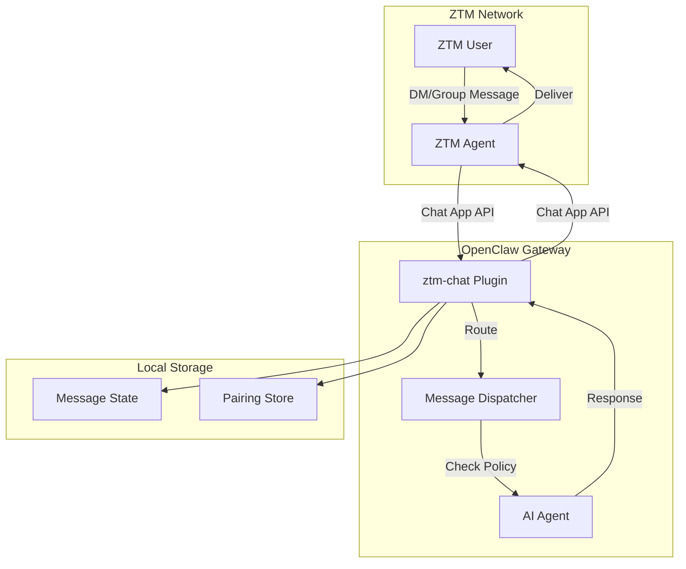
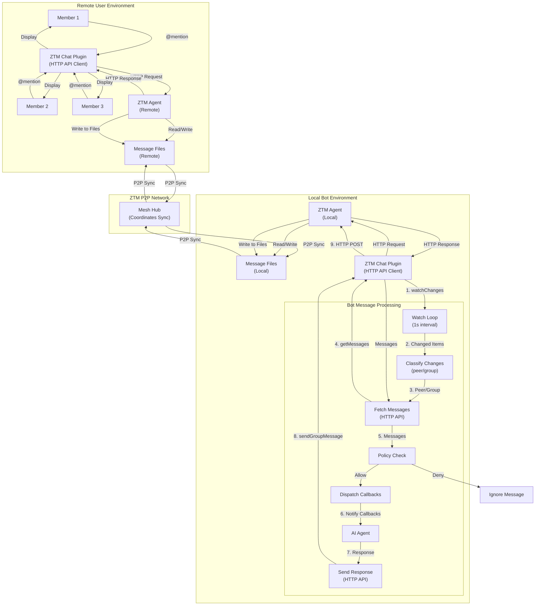
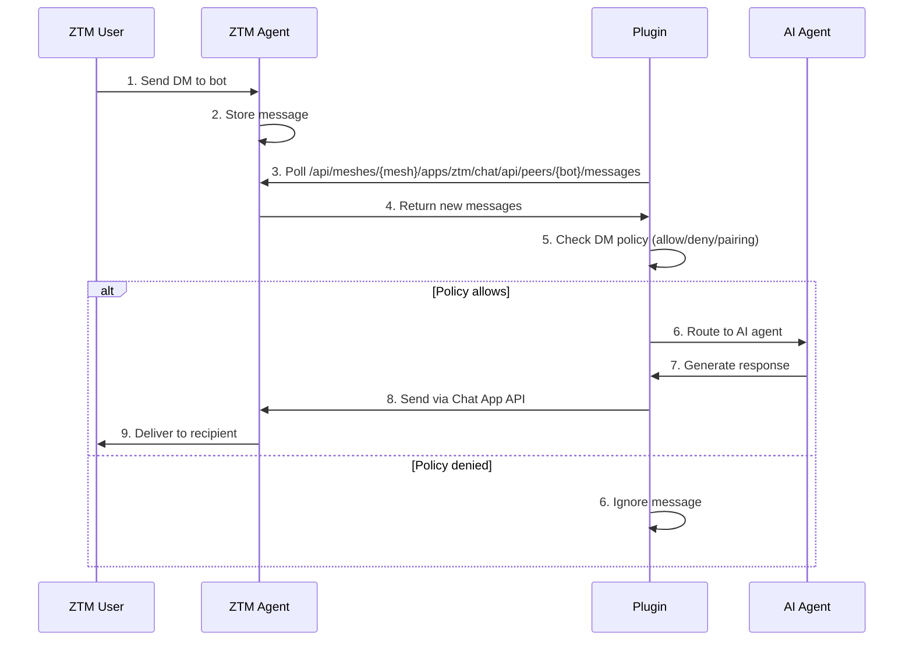
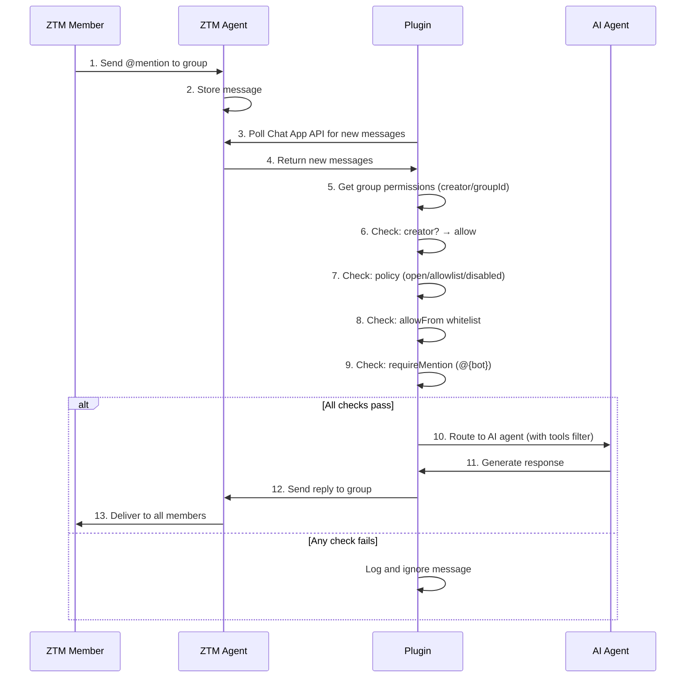
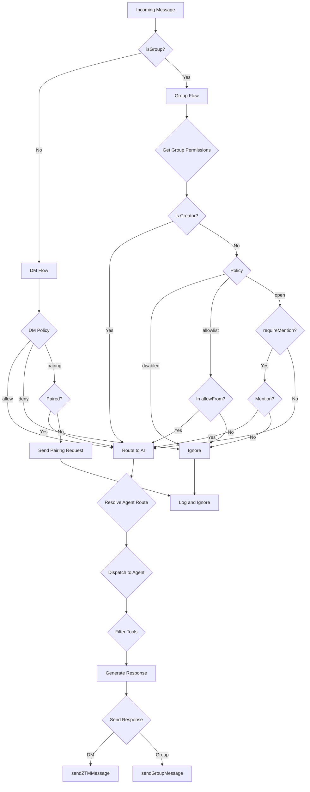

# ZTM Chat Channel Plugin for OpenClaw

[](https://openclaw.ai)
[](https://github.com/flomesh-io/ztm)
[](https://npmjs.com/package/@flomesh/ztm-chat)
[](https://github.com/clawparty-ai/openclaw-channel-plugin-ztm/actions)
[](https://codecov.io/gh/clawparty-ai/openclaw-channel-plugin-ztm)
[](https://www.typescriptlang.org/)
[](https://vitest.dev)
[](https://github.com/clawparty-ai/openclaw-channel-plugin-ztm/releases/latest)
[](LICENSE)

This plugin integrates OpenClaw with ZTM (Zero Trust Mesh) Chat, enabling decentralized P2P messaging through the ZTM network.

## Architecture



**Data Flow:**
1. User sends message to ZTM Agent
2. Plugin polls Chat App API for new messages
3. Dispatcher checks DM/Group policy
4. If allowed, route to AI Agent
5. AI Agent generates response
6. Plugin sends response via Chat App API
7. ZTM Agent delivers to user

## Features

- **Peer-to-Peer Messaging**: Send and receive messages with other ZTM users
- **Remote Connection**: Connect to ZTM Agent from anywhere via HTTP API
- **Secure**: Supports mTLS authentication with ZTM certificates
- **Decentralized**: Messages flow through the ZTM P2P network
- **Multi-Account**: Support for multiple ZTM bot accounts with isolated state
- **User Discovery**: Browse and discover other users in your ZTM mesh
- **Real-Time Updates**: Watch mechanism for message monitoring (1-second polling interval)
- **Message Deduplication**: Prevents duplicate message processing
- **Structured Logging**: Context-aware logger with sensitive data filtering
- **Interactive Wizard**: CLI-guided configuration setup
- **Group Chat Support**: Multi-user group conversations with permission control
- **Fine-Grained Access Control**: Per-group policies, mention gating, and tool restrictions

## Installation

### 1. Install ZTM CLI

Download ZTM from GitHub releases and install to `/usr/local/bin`:

```bash
# Download (example: v2.0.0 for Linux x86_64)
curl -L "https://github.com/flomesh-io/ztm/releases/download/v2.0.0/ztm-aio-v2.0.0-generic_linux-x86_64.tar.gz" -o /tmp/ztm.tar.gz

# Extract
tar -xzf /tmp/ztm.tar.gz -C /tmp

# Install to /usr/local/bin (requires sudo)
sudo mv /tmp/bin/ztm /usr/local/bin/ztm

# Cleanup
rm /tmp/ztm.tar.gz

# Verify
ztm version
```

### 2. Start ZTM Agent

```bash
ztm start agent
```

The agent will start listening on `http://localhost:7777` by default.

### 3. Install Plugin

#### Option A: Install from npm (recommended for users)

```bash
openclaw plugins install @flomesh/ztm-chat
```

#### Option B: Local development installation

```bash
# Install dependencies first
npm install

# Install from local path
openclaw plugins install -l .

# Or link for development
npm link
openclaw plugins install -l .
```

After installation, the plugin will be available as `ztm-chat` (or `ztm` as alias).

### 4. Run Configuration Wizard

```bash
openclaw onboard
```

Select **"ZTM Chat (P2P)"** from the channel list.

The wizard will guide you through:
1. **ZTM Agent URL** (default: `http://localhost:7777`)
2. **Permit Source Selection**
   - Permit Source: `server` (from permit server) or `file` (from local file)
   - Permit Server URL (when server): `https://clawparty.flomesh.io:7779/permit`
   - Permit File Path (when file): path to local permit.json
3. **Bot Username** (default: `openclaw-bot`)
4. **Security Settings**
   - DM Policy: `pairing` (recommended), `allow`, or `deny`
   - Allow From: Whitelist of usernames (or `*` for all)
5. **Group Chat Settings** (if enabled)
   - Enable Groups: Yes/No
   - Group Policy: `allowlist`, `open`, or `disabled`
   - Require Mention: Yes/No (default: Yes)
6. **Summary & Save**

### 5. Restart OpenClaw

```bash
openclaw gateway restart
```

## Group Chat

### Overview

ZTM Chat supports group conversations with fine-grained permission control. When `enableGroups` is enabled, the bot can:

- Receive and process messages from group chats
- Reply to group messages with @mention support
- Apply per-group access policies
- Restrict available tools based on group membership

### How It Works


| `allowlist` | Only allow whitelisted senders |
| `disabled` | Block all group messages |

### Mention Gating

When `requireMention` is enabled (default), the bot will only process messages that @mention the bot username:

```
# Bot username: my-bot

# These messages will be processed:
@my-bot can you help me?
Hey @my-bot what's up?

# These messages will be ignored:
hello everyone!
good morning
```

**Note:** `requireMention` applies to ALL users, including the group creator. This ensures even the group owner must explicitly mention the bot to trigger a response.

### Per-Group Configuration

You can configure different policies for different groups:

```yaml
channels:
  ztm-chat:
    accounts:
      my-bot:
        enableGroups: true
        groupPolicy: allowlist  # Default for unknown groups
        requireMention: true   # Global default (can be overridden per group)
        groupPermissions:
          alice/team:
            groupPolicy: open
            requireMention: false
          bob/project-x:
            groupPolicy: allowlist
            requireMention: true
            allowFrom: [bob, charlie, david]
          private/secret-group:
            groupPolicy: disabled
```

### Tool Restrictions

Control which tools are available in each group:

```yaml
channels:
  ztm-chat:
    accounts:
      my-bot:
        groupPermissions:
          alice/team:
            groupPolicy: open
            requireMention: false
            tools:
              allow:
                - group:messaging
                - group:sessions
                - group:runtime
            toolsBySender:
              admin:
                alsoAllow:
                  - exec
                  - fs
```

#### Tool Policy Options

| Option | Description |
|--------|-------------|
| `tools.allow` | Only allow these tools (deny all others) |
| `tools.deny` | Deny these tools (allow all others) |
| `toolsBySender.{user}.alsoAllow` | Additional tools for specific users |
| `toolsBySender.{user}.deny` | Deny tools for specific users |

#### Default Tools

By default, groups only have access to:
- `group:messaging` - Send/receive messages
- `group:sessions` - Session management

### Creator Privileges

Group creators have special privileges that allow them to bypass certain policy checks:

| Check | Creator Bypass? |
|-------|---------------|
| `groupPolicy` (disabled/allowlist/open) | ✅ Yes |
| `allowFrom` whitelist | ✅ Yes |
| `requireMention` | ❌ No (still required) |

This ensures the bot owner can always interact with their own groups while still requiring explicit @mentions to trigger responses.

## Usage

### Sending a Message

From any ZTM user, send a message to your bot:

```
Hello! Can you help me with something?
```

The bot will respond through OpenClaw's AI agent.

### Pairing Mode

By default, the bot uses **pairing mode** (`dmPolicy: "pairing"`):

1. **New users** must be approved before they can send messages
2. When an unapproved user sends a message, the bot sends them a pairing code
3. Approve users using the CLI with their pairing code

#### List Pending Requests

```bash
openclaw pairing list ztm-chat
```

#### Approve a Pairing Request

```bash
openclaw pairing approve ztm-chat <code>
```

#### Pairing Mode Policies

| Policy | Behavior |
|--------|----------|
| `allow` | Accept messages from all users (no approval needed) |
| `deny` | Reject messages from all users (except allowFrom list) |
| `pairing` | Require explicit approval for new users (recommended) |

## CLI Commands

### Onboarding Commands

```bash
# Interactive setup wizard (recommended)
openclaw onboard

# Select "ZTM Chat" from the channel list
# Follow the 6-step configuration wizard

# Manage existing configuration
openclaw onboard
# Select "ZTM Chat" -> "Manage" -> Choose option:
#   - Test Connection: Verify ZTM Agent connectivity
#   - Update Configuration: Re-run the wizard
#   - Remove: Display removal instructions
```

### Channel Commands

```bash
# Check channel status
openclaw channels status ztm-chat

# View configuration
openclaw channels describe ztm-chat

# Probe connection
openclaw channels status ztm-chat --probe

# Enable/disable channel
openclaw channels disable ztm-chat
openclaw channels enable ztm-chat

# List connected peers
openclaw channels directory ztm-chat peers

# List groups (if enabled)
openclaw channels directory ztm-chat groups
```

### Pairing Commands

```bash
# List pending pairing requests
openclaw pairing list ztm-chat

# Approve a pairing request
openclaw pairing approve ztm-chat <code>
```

## Configuration

### Configuration File

Configuration is stored in `openclaw.yaml` under `channels.ztm-chat`:

#### Mode 1: Server (from permit server)

```yaml
channels:
  ztm-chat:
    enabled: true
    accounts:
      my-bot:
        agentUrl: "http://localhost:7777"
        permitSource: "server"
        permitUrl: "https://clawparty.flomesh.io:7779/permit"
        meshName: "production-mesh"
        username: "my-bot"
        enableGroups: true
        dmPolicy: "pairing"
        allowFrom:
          - alice
          - trusted-team
        groupPolicy: "allowlist"
        requireMention: true
        groupPermissions:
          alice/team:
            creator: "alice"
            group: "team"
            groupPolicy: "open"
            requireMention: false
            allowFrom: []
            tools:
```

#### Mode 2: File (from local permit.json)

```yaml
channels:
  ztm-chat:
    enabled: true
    accounts:
      my-bot:
        agentUrl: "http://localhost:7777"
        permitSource: "file"
        permitFilePath: "/path/to/permit.json"
        meshName: "production-mesh"
        username: "my-bot"
        enableGroups: true
        dmPolicy: "pairing"
        allowFrom:
          - alice
          - trusted-team
        groupPolicy: "allowlist"
        requireMention: true
        groupPermissions:
          alice/team:
            creator: "alice"
            group: "team"
            groupPolicy: "open"
            requireMention: false
            allowFrom: []
            tools:
              allow:
                - group:messaging
                - group:sessions
                - group:runtime
            toolsBySender:
              admin:
                alsoAllow:
                  - exec
```

### Configuration Options

**Required:**

| Option | Type | Description |
|--------|------|-------------|
| `agentUrl` | string | ZTM Agent API URL |
| `permitSource` | string | Permit source: `"server"` (from permit server) or `"file"` (from local file) |
| `meshName` | string | Name of your ZTM mesh |
| `username` | string | Bot's ZTM username |

**Required (when permitSource is "server"):**

| Option | Type | Description |
|--------|------|-------------|
| `permitUrl` | string | Permit Server URL |

**Optional (when permitSource is "file"):**

| Option | Type | Default | Description |
|--------|------|---------|-------------|
| `permitFilePath` | string | - | Path to local permit.json file |

**Optional - Basic:**

| Option | Type | Default | Description |
|--------|------|---------|-------------|
| `enabled` | boolean | `true` | Enable/disable account |
| `enableGroups` | boolean | `false` | Enable group chat support |
| `dmPolicy` | string | `"pairing"` | DM policy: `allow`, `deny`, `pairing` |
| `allowFrom` | string[] | `[]` | List of approved usernames |
| `apiTimeout` | number | `30000` | API timeout in milliseconds (1000-300000) |

**Optional - Group:**

| Option | Type | Default | Description |
|--------|------|---------|-------------|
| `groupPolicy` | string | `"allowlist"` | Default group policy: `open`, `allowlist`, `disabled` |
| `requireMention` | boolean | `true` | Require @mention for group messages (global default) |
| `groupPermissions` | object | `{}` | Per-group permission overrides |

### Group Permission Options

| Option | Type | Description |
|--------|------|-------------|
| `groupPolicy` | string | Policy for this group: `open`, `allowlist`, `disabled` |
| `requireMention` | boolean | Require @mention to process message (default: `true`) |
| `allowFrom` | string[] | Whitelist of allowed senders |
| `tools.allow` | string[] | Only allow these tools |
| `tools.deny` | string[] | Deny these tools |
| `toolsBySender` | object | Sender-specific tool overrides |

### Environment Variables

| Variable | Description |
|----------|-------------|
| `ZTM_CHAT_LOG_LEVEL` | Logging level: `debug`, `info`, `warn`, `error` |

## Message Flow

### Direct Message (DM)



### Group Message



### Message Processing Pipeline



### Policy Decision Matrix

**DM Policy Check Order:**

| Step | Condition | Next Step |
|------|-----------|-----------|
| 1 | Empty sender | → Deny (ignore) |
| 2 | Sender in `allowFrom` config | → Allow (whitelisted) |
| 3 | Sender in pairing store | → Allow (whitelisted) |
| 4 | Policy = `allow` | → Allow (allowed) |
| 5 | Policy = `deny` | → Deny (denied) |
| 6 | Policy = `pairing` | → Send pairing request |

**Group Policy Check Order:**

| Step | Condition | Next Step |
|------|-----------|-----------|
| 1 | Empty sender | → Deny (ignore) |
| 2 | Sender = creator | → Step 6 (bypass policy) |
| 3 | groupPolicy = `disabled` | → Deny (denied) |
| 4 | groupPolicy = `allowlist` + not in allowFrom | → Deny (whitelisted) |
| 5 | groupPolicy = `open` | → Continue |
| 6 | requireMention = true + no @mention | → Deny (mention_required) |
| 7 | All checks passed | → Allow (creator/whitelisted/allowed) |

**Result Actions:**

| Action | Description |
|--------|-------------|
| `process` | Message allowed, route to AI agent |
| `ignore` | Message denied, log and discard |
| `pairing` | Send pairing request to user |

## ZTM API

The plugin uses the ZTM Agent API for identity/mesh operations and the Chat App API for messaging:

### Agent API (Identity & Mesh)

| Method | Path | Description |
|--------|------|-------------|
| GET | `/api/identity` | Get agent identity (certificate) |
| GET | `/api/meshes/{meshName}` | Get mesh connection status |
| POST | `/api/meshes/{meshName}` | Join mesh with permit data |

### Chat App API

| Method | Path | Description |
|--------|------|-------------|
| GET | `/api/meshes/{meshName}/apps/ztm/chat/api/users` | List all users in mesh |
| GET | `/api/meshes/{meshName}/apps/ztm/chat/api/chats` | Get all chats (DMs and groups) |
| GET | `/api/meshes/{meshName}/apps/ztm/chat/api/peers/{peer}/messages` | Get peer messages (with since/before) |
| POST | `/api/meshes/{meshName}/apps/ztm/chat/api/peers/{peer}/messages` | Send message to peer |
| GET | `/api/meshes/{meshName}/apps/ztm/chat/api/groups/{creator}/{group}/messages` | Get group messages |
| POST | `/api/meshes/{meshName}/apps/ztm/chat/api/groups/{creator}/{group}/messages` | Send message to group |

### Message API Parameters

| Parameter | Type | Description |
|-----------|------|-------------|
| `since` | number | Get messages after this timestamp (Unix ms) |
| `before` | number | Get messages before this timestamp (Unix ms) |
| `limit` | number | Maximum number of messages to return (default: 50) |

### Example API Calls

```bash
# Get agent identity (certificate)
curl http://localhost:7777/api/identity

# Get mesh status
curl http://localhost:7777/api/meshes/openclaw-mesh

# Join mesh (with permit data)
curl -X POST http://localhost:7777/api/meshes/openclaw-mesh \
  -H "Content-Type: application/json" \
  -d '{"ca":"...","agent":{"certificate":"..."},"bootstraps":["host:port"]}'

# List users
curl http://localhost:7777/api/meshes/openclaw-mesh/apps/ztm/chat/api/users

# Get peer messages (last 10)
curl "http://localhost:7777/api/meshes/openclaw-mesh/apps/ztm/chat/api/peers/alice/messages?limit=10"

# Send message to peer
curl -X POST http://localhost:7777/api/meshes/openclaw-mesh/apps/ztm/chat/api/peers/alice/messages \
  -H "Content-Type: application/json" \
  -d '{"text": "Hello!"}'

# Get group messages
curl "http://localhost:7777/api/meshes/openclaw-mesh/apps/ztm/chat/api/groups/alice/team/messages"

# Send message to group
curl -X POST http://localhost:7777/api/meshes/openclaw-mesh/apps/ztm/chat/api/groups/alice/team/messages \
  -H "Content-Type: application/json" \
  -d '{"text": "Hello everyone!"}'
```

## Troubleshooting

### Connection Failed

1. Verify ZTM Agent is running:
   ```bash
   curl http://localhost:7777/api/meshes
   ```

2. Check mesh name matches:
   ```bash
   curl http://localhost:7777/api/meshes
   ```

3. Check plugin logs:
   ```bash
   openclaw logs --level debug --channel ztm-chat
   ```

### No Messages Received

1. Check bot username is correct in configuration
2. Verify ZTM Agent is running:
   ```bash
   curl http://localhost:7777/api/meshes
   ```
3. Check mesh connectivity:
   ```bash
   openclaw channels status ztm-chat --probe
   ```

## Development

### Running Tests

```bash
npm install
npm test            # Run all tests
npm test:watch     # Watch mode
npm run test:coverage  # Run tests with coverage
```


### Debug Logging

```bash
ZTM_CHAT_LOG_LEVEL=debug openclaw restart
```