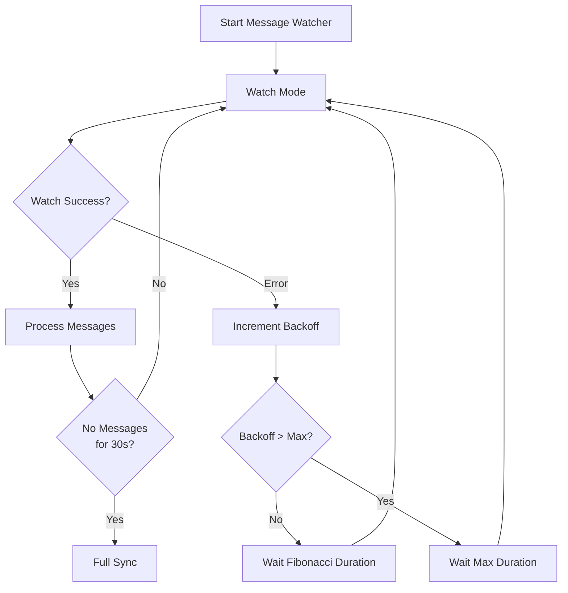

# ADR-002: Watch Mode with Fibonacci Backoff

## Status

Accepted

## Date

2026-02-20

## Context

The ZTM Chat plugin needs to fetch new messages from ZTM Agent. The original design used a dual-mode approach (Watch + Polling), but it has been simplified to use a single Watch mechanism with Fibonacci backoff for error recovery.

## Decision

Implement **Watch with Fibonacci backoff**:



### Fibonacci Backoff Sequence

The backoff follows the Fibonacci sequence: 1s, 1s, 2s, 3s, 5s, 8s, 13s, 21s... capped at 30s.

| Error Count | Backoff Duration |
|-------------|------------------|
| 1 | 1s |
| 2 | 1s |
| 3 | 2s |
| 4 | 3s |
| 5 | 5s |
| 6 | 8s |
| 7 | 13s |
| 8+ | 30s (max) |

### Core Mechanisms

| Mechanism | Implementation | Parameters |
|-----------|----------------|------------|
| **Watch interval** | Standard 1 second interval | `WATCH_INTERVAL_MS = 1000` |
| **Fibonacci backoff** | Backoff on errors using Fibonacci sequence | `WATCH_BACKOFF_MAX_MS = 30000` |
| **Initial sync** | Fetch all historical messages on startup | `performInitialSync()` |
| **Delayed full sync** | Supplementary sync after message silence | `FULL_SYNC_DELAY_MS = 30000` |
| **Concurrency control** | Semaphore limits concurrent processing | `MESSAGE_SEMAPHORE_PERMITS = 10` |
| **Timeout protection** | Auto-release on message processing timeout | `MESSAGE_PROCESS_TIMEOUT_MS = 30000` |

## Implementation Details

The watch with backoff is implemented in a single file:

- `src/messaging/watcher.ts` - Watch mode with Fibonacci backoff

Error backoff logic:
```typescript
// watcher.ts
const fibonacci = [1, 1, 2, 3, 5, 8, 13, 21];
const backoffIndex = Math.min(state.watchErrorCount - 1, fibonacci.length - 1);
const backoffMs = state.watchErrorCount > fibonacci.length
  ? WATCH_BACKOFF_MAX_MS
  : fibonacci[backoffIndex] * 1000;

await sleep(backoffMs);
```

## Alternatives Considered

| Alternative | Pros | Cons | Why Not Chosen |
|-------------|------|------|----------------|
| **Watch only (no backoff)** | Simple implementation | Can overwhelm failing API | Risk of request storms |
| **Exponential backoff** | Common pattern | Less gradual than Fibonacci | Fibonacci provides smoother recovery |
| **Dual-mode (old)** | Real-time + reliability fallback | Complex state management | Over-engineered for reliability needs |
| **WebSocket** | True real-time, bi-directional | Not supported by ZTM Agent | Not available |

### Key Trade-offs

- **Fibonacci vs Exponential**: Fibonacci provides more gradual backoff, allowing temporary failures to recover quickly while still protecting against sustained failures
- **Max backoff (30s)**: Ensures eventual recovery while preventing excessive wait times

## Related Decisions

- **ADR-010**: Multi-Layer Message Pipeline - Uses the same processing pipeline
- **ADR-003**: Watermark + LRU Cache - Deduplication works regardless of backoff state

## Consequences

### Positive

- **Simpler architecture**: Single watch mechanism instead of dual-mode
- **Gradual recovery**: Fibonacci backoff provides smooth recovery curve
- **Resource efficiency**: Backs off automatically on errors
- **Fault tolerance**: Max backoff prevents indefinite waiting
- **Deduplication**: Watermark mechanism ensures messages are not processed twice

### Negative

- **Higher latency on errors**: Backoff increases delay during API issues
- **Complex timing**: Fibonacci sequence requires careful implementation

## References

- `src/messaging/watcher.ts` - Watch with backoff implementation
- `src/messaging/message-processor-helpers.ts` - Shared processing logic
- `src/constants.ts` - Timing constants (`WATCH_INTERVAL_MS`, `WATCH_BACKOFF_MAX_MS`)
