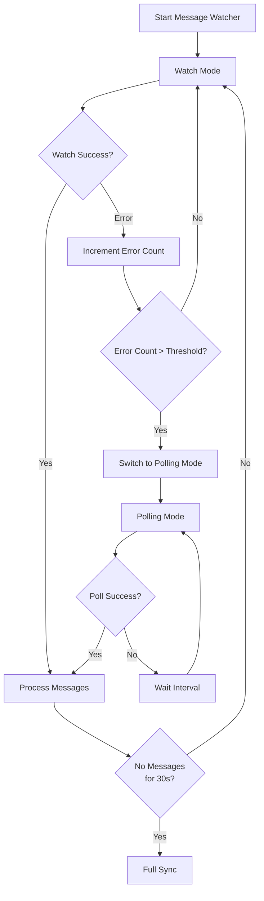

# ADR-002: Watch + Polling Dual-Mode Message Fetching

## Status

Accepted

## Date

2026-02-20

## Context

The ZTM Chat plugin needs to fetch new messages from ZTM Agent. Two approaches exist:

1. **Watch API (long-polling)**: Real-time push supported by ZTM Agent
2. **Polling**: Traditional periodic pull

Need to decide on an approach considering:
- **Real-time**: Users expect messages ASAP
- **Reliability**: ZTM Agent's Watch API may be unavailable
- **Resource efficiency**: Avoid unnecessary network requests

## Decision

Implement **Watch + Polling dual-mode** with Watch as primary and Polling as fallback:

### Core Mechanisms

| Mechanism | Implementation | Parameters |
|-----------|----------------|------------|
| **Error threshold** | Fall back after 5 consecutive Watch errors | `WATCH_ERROR_THRESHOLD = 5` |
| **Initial sync** | Fetch all historical messages on startup | `performInitialSync()` |
| **Delayed full sync** | Supplementary sync after message silence | `FULL_SYNC_DELAY_MS = 30000` |
| **Concurrency control** | Semaphore limits concurrent processing | `MESSAGE_SEMAPHORE_PERMITS = 10` |
| **Timeout protection** | Auto-release on message processing timeout | `MESSAGE_PROCESS_TIMEOUT_MS = 30000` |

### Timing Parameters

- Watch interval: 1000ms (1 second)
- Polling interval: 2000ms (2 seconds, default)
- Initial sync delay: 500ms
- Full sync delay: 30000ms (30s silence period)

## Consequences

### Positive

- **Real-time first**: Watch mode provides near real-time message delivery
- **Graceful degradation**: Auto-switch to Polling on Watch failure, ensuring no message loss
- **Fault tolerance**: Error count + threshold mechanism prevents frequent switching
- **Deduplication**: Watermark mechanism ensures messages are not processed twice

### Negative

- **Code complexity**: Need to maintain switching logic between two modes
- **State management complexity**: Need to share state between Watcher and Poller
- **Debugging difficulty**: Behavioral differences between modes may cause hard-to-reproduce issues

## References

- `src/messaging/watcher.ts` - Watch mode implementation
- `src/messaging/polling.ts` - Polling fallback implementation
- `src/messaging/message-processor-helpers.ts` - Shared processing logic
