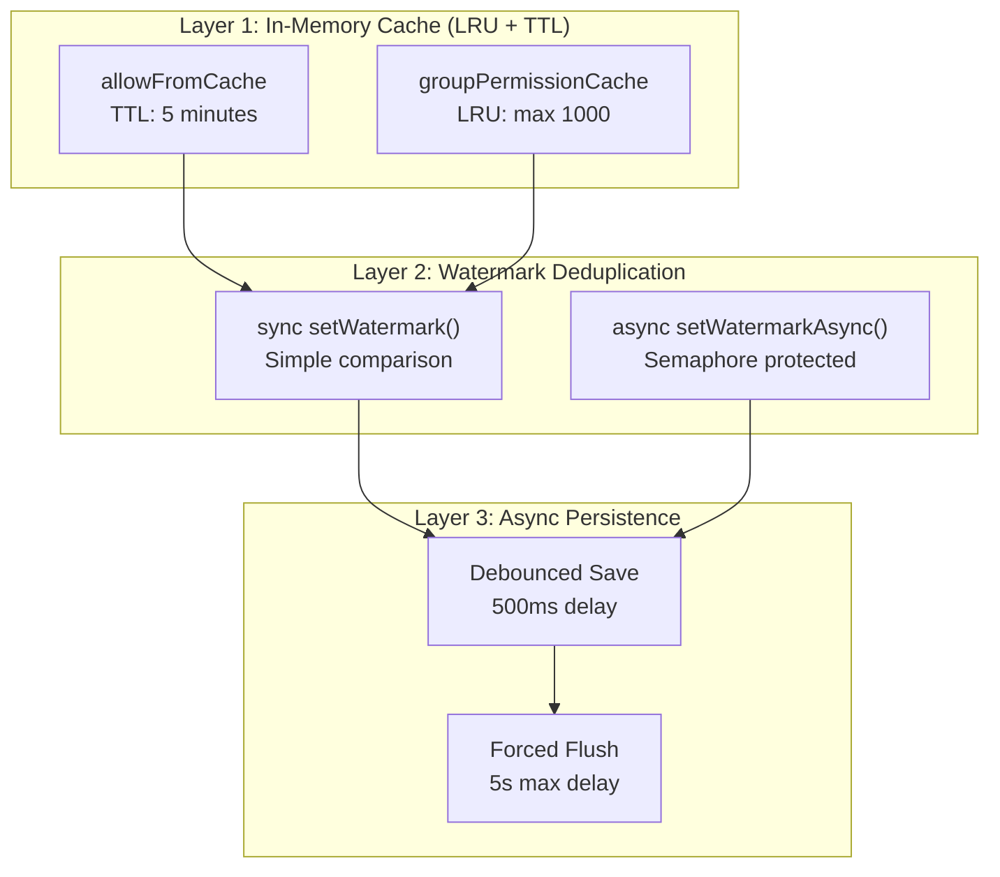

# ADR-003: Watermark + LRU Cache Hybrid State Management

## Status

Accepted

## Date

2026-02-20

## Context

The project needs to manage:
1. **Message deduplication**: Avoid reprocessing received messages
2. **Account state**: Connection state, config, peer info for each account
3. **Caching**: Frequently accessed data like allowFrom lists, group permissions

Need to balance:
- **Performance**: Reduce disk I/O, avoid redundant computations
- **Consistency**: Ensure state is not lost
- **Memory efficiency**: Prevent memory leaks

## Decision

Implement a three-layer state management architecture:



### Watermark Deduplication

```typescript
// Sync version: only allows timestamp to advance
setWatermark(accountId: string, key: string, time: number): void {
  const current = this.data.accounts[accountId]?.[key] ?? 0;
  if (time > current) {  // Key: timestamp only advances
    this.data.accounts[accountId][key] = time;
    this.scheduleSave();
  }
}

// Async version: Semaphore prevents race conditions
async setWatermarkAsync(...): Promise<void> {
  const sem = this.getAccountSemaphore(accountId);
  await sem.acquire();
  try {
    // ... update logic
  } finally {
    sem.release();
  }
}
```

### Caching Strategy

| Cache | Strategy | TTL/Limit |
|-------|----------|-----------|
| `allowFromCache` | Request coalescing | 5 minutes |
| `groupPermissionCache` | LRU | Max 1000 entries |
| API responses | No cache | N/A |

### Persistence Strategy

- **Delayed write**: 500ms debounce (`STATE_FLUSH_DEBOUNCE_MS`)
- **Forced flush**: 5s max delay (`STATE_FLUSH_MAX_DELAY_MS`)
- **Per-account isolation**: Each account has independent state file
- **Data cleanup**: Keep most recent peers when exceeding 100 peers

## Consequences

### Positive

- **Deduplication**: Watermark ensures each message is processed only once
- **High performance**: Memory cache reduces disk I/O
- **Crash-safe**: Forced flush mechanism prevents data loss
- **Cache stampede protection**: Request coalescing protects backend

### Negative

- **Memory usage**: Multi-layer cache increases memory usage
- **Consistency delay**: Async persistence may cause brief state inconsistency
- **Complexity**: Need to understand collaboration of three layers

## Alternatives Considered

| Alternative | Pros | Cons | Why Not Chosen |
|-------------|------|------|----------------|
| **Pure in-memory cache** | Fastest performance | Data loss on crash, no persistence | Unacceptable data loss risk |
| **Pure disk-based storage** | Persistent, simple | Slow I/O, poor performance | Unacceptable latency |
| **Redis cache** | Production-grade, distributed | External dependency, operational overhead | Overkill for single-process plugin |
| **node-cache** | Feature-rich, TTL support | External dependency (~100KB) | Avoid unnecessary dependencies |
| **Hybrid approach (chosen)** | Performance + persistence | More complex code | Best balance of requirements |

### Key Trade-offs

- **Debounce delay (500ms)**: Shorter = more I/O, longer = higher data loss risk
- **Max flush delay (5s)**: Shorter = more frequent writes, longer = more data at risk
- **LRU size (1000)**: Larger = more memory, smaller = more cache misses
- **TTL (5 min)**: Shorter = more frequent refreshes, longer = stale data

## Related Decisions

- **ADR-011**: Dual-Timer Persistence Strategy - Details the debounce + max-delay timers
- **ADR-012**: LRU + TTL Hybrid Caching - Details the cache implementation
- **ADR-009**: Request Coalescing Pattern - Details the cache stampede protection

## References

- `src/runtime/store.ts` - State persistence with dual-timer strategy
- `src/runtime/state.ts` - Account state management with coalescing
- `src/runtime/cache.ts` - LRU + TTL cache implementation
