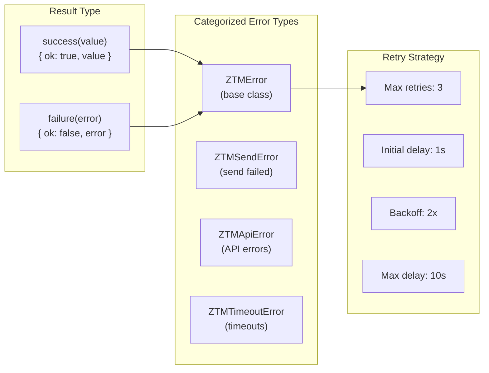

# ADR-004: Result Type + Categorized Errors + Exponential Backoff

## Status

Accepted

## Date

2026-02-20

## Context

The project needs robust error handling for:
- Network failures (API timeouts, connection errors)
- Business logic errors (validation, policy violations)
- System errors (file I/O, disk space)

Need to balance:
- **Type safety**: Catch errors at compile time where possible
- **Debugging**: Provide sufficient context for troubleshooting
- **Resilience**: Implement retry mechanisms for recoverable errors

## Decision

Implement a three-pronged error handling strategy:



### Result Type Pattern

```typescript
interface Result<T, E = Error> {
  readonly ok: boolean;
  readonly value?: T;
  readonly error?: E;
}

// Factory functions
success<T>(value: T): Result<T, never>
failure<T, E extends Error>(error: E): Result<T, E>

// Type guards
isSuccess<T, E>(result: Result<T, E>): result is { ok: true; value: T }
isFailure<T, E>(result: Result<T, E>): result is { ok: false; error: E }

// Utilities
unwrap<T, E>(result: Result<T, E>): T  // throws on failure
unwrapOr<T, E>(result: Result<T, E>, default: T): T
map<T, U, E>(result: Result<T, E>, fn: (t: T) => U): Result<U, E>
```

### Categorized Error Types

| Error Type | Use Case | Includes |
|------------|----------|----------|
| `ZTMError` | Base class | `context`, `cause` |
| `ZTMSendError` | Message send failures | `peer`, `message` |
| `ZTMWriteError` / `ZTMReadError` | File operation failures | `path`, `operation` |
| `ZTMApiError` | API communication errors | `url`, `statusCode` |
| `ZTMTimeoutError` | Timeout errors | `timeoutMs` |
| `ZTMRuntimeError` / `ZTMConfigError` | Runtime/config errors | `details` |

### Retry Strategy

```typescript
const DEFAULT_RETRY_CONFIG = {
  maxRetries: 3,
  initialDelay: RETRY_INITIAL_DELAY_MS (1000ms),
  maxDelay: RETRY_MAX_DELAY_MS (10000ms),
  backoffMultiplier: 2,  // Exponential: 1s → 2s → 4s
  timeout: RETRY_TIMEOUT_MS (30000ms)
};

// Retryable error判断
function isRetriableError(error: Error): boolean {
  // Excludes: authentication errors (never retry)
  // Includes: timeout, network, connection refused, etc.
}
```

## Consequences

### Positive

- **Type safety**: Result<T, E> forces explicit error handling at compile time
- **Rich context**: Categorized errors include sufficient debugging information
- **Resilience**: Exponential backoff prevents thundering herd
- **No exceptions for control flow**: Avoids try-catch overhead in happy path

### Negative

- **Boilerplate**: Each operation needs error handling code
- **Verbosity**: `if (isSuccess(result))` adds nesting
- **Learning curve**: Team needs to understand Result pattern
- **Not all errors are recoverable**: Need to decide which errors to retry

## References

- `src/types/common.ts` - Result type and utilities
- `src/types/errors.ts` - Error type definitions
- `src/utils/retry.ts` - Retry logic implementation
