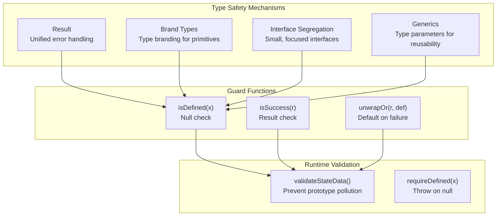

# ADR-005: Result Type Utilities + Interface Segregation + Generics

## Status

Accepted

## Date

2026-02-20

## Context

The project is built with TypeScript and needs comprehensive type safety to:
- Prevent runtime errors
- Enable IDE autocompletion
- Support refactoring with confidence

Need to balance:
- **Developer experience**: Type system should aid, not hinder
- **Build performance**: Complex types can slow compilation
- **Flexibility**: Avoid over-constraining types

## Decision

Implement a comprehensive type safety strategy:



### Result Type Utilities

| Function | Purpose |
|----------|---------|
| `success<T>(value)` | Create success result |
| `failure<T, E>(error)` | Create failure result |
| `isSuccess<T, E>(result)` | Type guard for success |
| `isFailure<T, E>(result)` | Type guard for failure |
| `unwrap<T, E>(result)` | Unwrap or throw |
| `unwrapOr<T, E>(result, default)` | Unwrap or return default |
| `map<T, U, E>(result, fn)` | Transform success value |
| `flatMap<T, U, E>(result, fn)` | Chain transformations |

### Brand Types

```typescript
// Prevents mixing up AccountId strings with regular strings
type AccountId = string & { __brand: 'AccountId' };
type PeerId = string & { __brand: 'PeerId' };

// Dependency keys
type DependencyKey<T> = symbol & { __brand: T };

// Usage
function getAccount(id: AccountId): Account { ... }
const id = "abc" as AccountId;  // Explicit coercion required
```

### Interface Segregation

```typescript
// Large, monolithic interface (AVOID)
interface IZTMApiClient {
  getChats(): Promise<any>;
  sendMessage(): Promise<any>;
  getMeshInfo(): Promise<any>;
  // ... 50 more methods
}

// Small, focused interfaces (PREFERRED)
interface IChatReader {
  getChats(): AsyncResult<unknown, Error>;
  getPeerMessages(peer: string): AsyncResult<unknown, Error>;
}

interface IChatSender {
  sendPeerMessage(...): AsyncResult<unknown, Error>;
  sendGroupMessage(...): AsyncResult<unknown, Error>;
}

interface IDiscovery {
  discoverPeers(): AsyncResult<unknown, Error>;
  getMeshInfo(): AsyncResult<unknown, Error>;
}

// Composition
interface IApiClient extends IChatReader, IChatSender, IDiscovery, IMetadata {}
```

### Runtime Validation

```typescript
// Prevents prototype pollution attacks
function validateStateData(data: unknown): StateData {
  if (!data || typeof data !== 'object') {
    throw new ZTMParseError('Invalid state data');
  }
  // Check for dangerous properties
  const dangerous = ['__proto__', 'constructor', 'prototype'];
  for (const key of dangerous) {
    if (key in data) {
      throw new ZTMParseError(`Dangerous property: ${key}`);
    }
  }
  return data as StateData;
}
```

## Consequences

### Positive

- **Compile-time error detection**: Many errors caught before runtime
- **Self-documenting code**: Types serve as documentation
- **Safe refactoring**: IDE can trace type changes
- **Prevents prototype pollution**: Runtime validation protects against attacks

### Negative

- **Type complexity**: Advanced types can be hard to read
- **Build time**: Complex generics slow compilation
- **Over-engineering risk**: Not all code needs heavy typing
- **Migration cost**: Adding types to existing JavaScript code is time-consuming

## Alternatives Considered

| Alternative | Pros | Cons | Why Not Chosen |
|-------------|------|------|----------------|
| **Runtime-only validation** | Simple, no build overhead | Errors caught at runtime only | Too late for production bugs |
| **Any types everywhere** | Fastest compilation | Zero type safety | Defeats purpose of TypeScript |
| **Zod schema validation** | Runtime + compile-time validation | External dependency, verbose | Overkill for our use case |
| **TypeScript strict mode only** | Standard, simple | Limited custom type enforcement | Doesn't prevent all bugs |
| **Comprehensive typing (chosen)** | Maximum safety, self-documenting | More verbose, slower builds | Worth it for production quality |

### Key Trade-offs

- **Brand types vs strings**: Brand types prevent mixing but require explicit casting
- **Interface segregation**: More interfaces = more files but better modularity
- **Runtime validation**: Adds overhead but prevents security vulnerabilities

## Related Decisions

- **ADR-001**: Dependency Injection Container - Uses brand types for dependency keys
- **ADR-004**: Result Type + Errors - Uses generics for type-safe error handling
- **ADR-013**: Functional Policy Engine - Uses type-safe return types for policy decisions

## References

- `src/types/common.ts` - Result types and utilities
- `src/di/container.ts` - Brand types for dependency keys
- `src/types/errors.ts` - Error type hierarchies
- `src/utils/validation.ts` - Runtime validation functions
