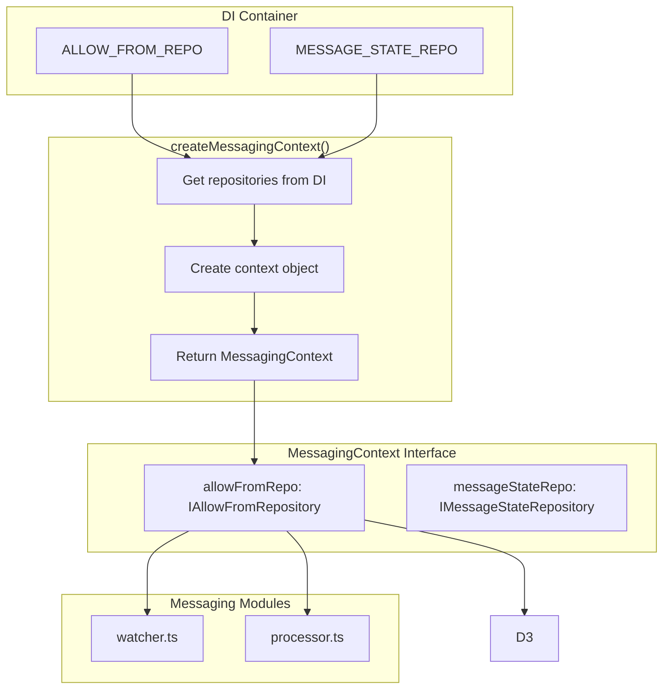

# ADR-006: Context Isolation Pattern

## Status

Accepted

## Date

2026-02-23

## Context

The messaging layer needs access to repositories (AllowFrom, MessageState) for processing messages. Several approaches were considered:

1. **Direct DI access**: Each messaging module imports the DI container directly
2. **Service Locator pattern**: Global registry for service lookup
3. **Context injection**: Pass all dependencies through function parameters
4. **Context isolation pattern**: Create a dedicated context interface with a factory

The challenge is balancing:
- **Testability**: Need to mock dependencies in tests
- **Coupling**: Avoid tight coupling between messaging layer and DI system
- **Clarity**: Make dependencies explicit and traceable

## Decision

Implement **Context Isolation Pattern** with `MessagingContext` interface and `createMessagingContext()` factory:



### Implementation

```typescript
// src/messaging/context.ts

export interface MessagingContext {
  /** AllowFrom repository for pairing approvals */
  allowFromRepo: IAllowFromRepository;
  /** Message state repository for persistence */
  messageStateRepo: IMessageStateRepository;
}

export function createMessagingContext(
  _runtime: PluginRuntime
): MessagingContext {
  // Get repositories from DI container
  const allowFromRepo = container.get(
    DEPENDENCIES.ALLOW_FROM_REPO
  ) as IAllowFromRepository;
  const messageStateRepo = container.get(
    DEPENDENCIES.MESSAGE_STATE_REPO
  ) as IMessageStateRepository;

  if (!allowFromRepo || !messageStateRepo) {
    throw new Error('Required repositories not available in container');
  }

  return { allowFromRepo, messageStateRepo };
}
```

### Usage Pattern

```typescript
// In gateway.ts or channel.ts
const context = createMessagingContext(runtime);
await startMessageWatcher(state, context);

// In watcher.ts
async function startMessageWatcher(
  state: AccountRuntimeState,
  context: MessagingContext
) {
  // Use context.repositories instead of direct DI access
  const allowFrom = await context.allowFromRepo.readAllowFrom(accountId);
}
```

## Alternatives Considered

| Alternative | Pros | Cons | Why Not Chosen |
|-------------|------|------|----------------|
| **Direct DI access** | Simple, explicit | Tight coupling, hard to test | Messaging layer becomes DI-aware |
| **Service Locator** | Decoupled, flexible | Hidden dependencies, anti-pattern | Creates implicit dependencies |
| **Pass all deps** | Explicit, traceable | Function signature bloat | Too many parameters to thread through |
| **Context object (chosen)** | Isolated, testable, clear | One extra abstraction layer | Best balance of concerns |

### Key Trade-offs

- **Factory function vs class**: Factory is simpler, class allows extension
- **Runtime parameter**: Required for PluginRuntime access, could be derived
- **Interface vs type**: Interface allows extension, type is simpler

## Related Decisions

- **ADR-001**: Dependency Injection Container - `MessagingContext` uses DI container internally
- **ADR-010**: Multi-Layer Message Pipeline - Context is passed through the pipeline layers

## Consequences

### Positive

- **Testability**: Easy to create mock contexts for unit tests
- **Isolation**: Messaging layer doesn't depend on DI container implementation
- **Explicit dependencies**: Context interface makes required deps clear
- **Single responsibility**: Factory function handles one concern

### Negative

- **Extra abstraction**: One more layer to understand and maintain
- **DI coupling in factory**: Factory still directly imports DI container
- **Runtime parameter**: Must pass PluginRuntime even if not used by context

## References

- `src/messaging/context.ts` - MessagingContext interface and factory
- `src/di/container.ts` - DI container used by factory
- `src/runtime/repository.ts` - Repository interfaces
