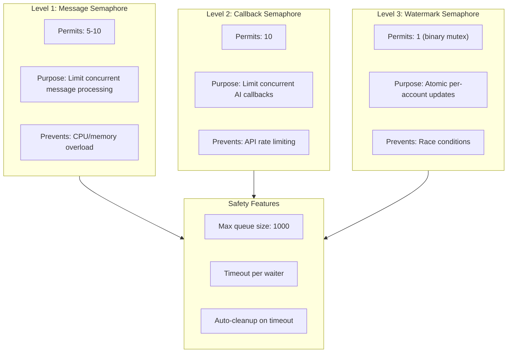

# ADR-007: Dual Semaphore Concurrency Control

## Status

Accepted

## Date

2026-02-23

## Context

The plugin needs multi-level concurrency control:

1. **Message processing**: Limit concurrent message handling to prevent overload
2. **Callback execution**: Limit concurrent AI agent callbacks
3. **Watermark updates**: Ensure atomic updates per-account

Challenges:
- Deadlock prevention when multiple semaphores interact
- Timeout handling to prevent starvation
- Bounded queues to prevent memory exhaustion

## Decision

Implement **Three-Level Semaphore Pattern** with different permits and purposes:



### Semaphore Implementation

```typescript
// src/utils/concurrency.ts

export class Semaphore {
  private permits: number;
  private waiters: Waiter[] = [];
  private readonly maxQueueSize: number;

  constructor(permits: number, maxQueueSize: number = 1000) {
    this.permits = permits;
    this.maxQueueSize = maxQueueSize;
  }

  async acquire(timeoutMs?: number): Promise<boolean> {
    // Fast path: permit available immediately
    if (this.permits > 0) {
      this.permits--;
      return true;
    }

    // Check queue capacity before adding waiter
    if (this.waiters.length >= this.maxQueueSize) {
      return false; // Queue full, reject request
    }

    // Add waiter with timeout
    const waiter = this.createWaiter(timeoutMs);
    this.waiters.push(waiter);
    return waiter.promise;
  }

  release(): void {
    const waiter = this.waiters.shift();
    if (waiter) {
      waiter.resolve(true);
    } else {
      this.permits++;
    }
  }

  async execute<T>(fn: () => Promise<T>, timeoutMs?: number): Promise<T> {
    const acquired = await this.acquire(timeoutMs);
    if (!acquired) {
      throw new Error(`Semaphore: failed to acquire permit`);
    }
    try {
      return await fn();
    } finally {
      this.release();
    }
  }
}
```

### Three-Level Usage

| Level | Constant | Permits | Purpose | Location |
|-------|----------|---------|---------|----------|
| 1 | `MESSAGE_SEMAPHORE_PERMITS` | 5-10 | Message processing | `watcher.ts` |
| 2 | `CALLBACK_SEMAPHORE_PERMITS` | 10 | AI callbacks | `state.callbackSemaphore` |
| 3 | Binary (1) | 1 | Watermark updates | `store.ts` per-account |

### Timeout-Safe Waiters

The implementation uses Promise internal state to prevent race conditions:

```typescript
// Key fix: Remove waiter FIRST, then resolve
// Timeout callback checks queue membership
release(): void {
  const waiter = this.waiters.shift(); // Atomic remove
  if (waiter) {
    waiter.resolve(true); // Now safe to resolve
  }
}
```

## Alternatives Considered

| Alternative | Pros | Cons | Why Not Chosen |
|-------------|------|------|----------------|
| **Single global semaphore** | Simple, no deadlocks | No granular control | Too coarse-grained |
| **p-limit library** | Feature-rich, tested | External dependency (~5KB) | Easy to implement ourselves |
| **AsyncMutex** | Simple for binary locks | No multi-permit support | Need both 1 and N permits |
| **Unbounded queue** | Never rejects requests | Memory exhaustion risk | Dangerous in production |
| **Bounded semaphore (chosen)** | Safe, flexible | Custom implementation | Best for our requirements |

### Key Trade-offs

- **Max queue size (1000)**: Larger = more pending work, smaller = more rejections
- **Permit counts**: Balance throughput vs resource usage
- **Timeout behavior**: Return false vs throw exception

## Related Decisions

- **ADR-003**: Watermark + LRU Cache - Watermark semaphore prevents race conditions
- **ADR-010**: Multi-Layer Message Pipeline - Message semaphore limits concurrent processing

## Consequences

### Positive

- **Deadlock-free**: No circular dependencies between semaphore levels
- **Memory-safe**: Bounded queues prevent unbounded growth
- **Starvation-free**: Timeout mechanism ensures progress
- **Testable**: Easy to mock and verify in tests

### Negative

- **Complexity**: Need to understand three levels and their interactions
- **Tuning required**: Permit counts need to be adjusted based on workload
- **Queue full handling**: Callers must handle false return from acquire()

## References

- `src/utils/concurrency.ts` - Semaphore implementation
- `src/messaging/watcher.ts` - Message semaphore usage
- `src/messaging/dispatcher.ts` - Callback semaphore usage
- `src/runtime/store.ts` - Watermark semaphore usage
