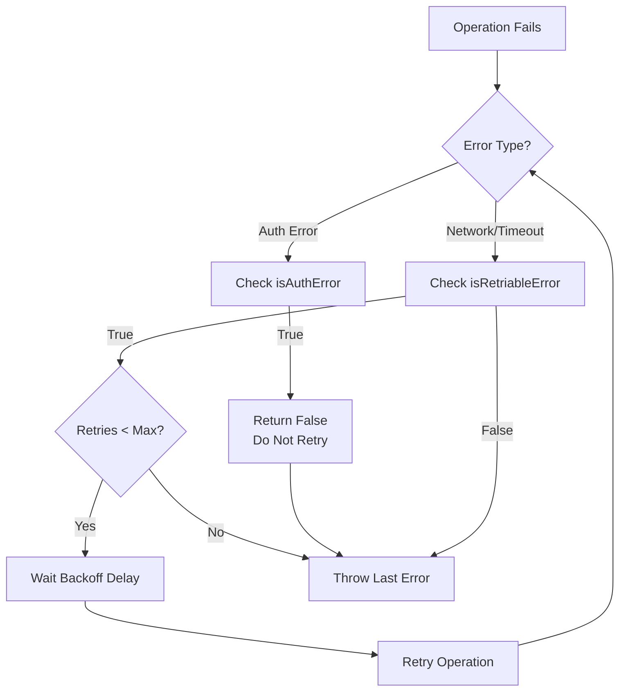

# ADR-008: Authentication Error Non-Retry Policy

## Status

Accepted

## Date

2026-02-23

## Context

The retry mechanism in `src/utils/retry.ts` needs to handle different error types appropriately:

- **Transient errors** (network timeout, connection refused): Should retry
- **Permanent errors** (authentication failure): Should NOT retry

Retrying authentication errors poses specific risks:
- **Account lockout**: Too many failed attempts may trigger security mechanisms
- **Wasted resources**: Retrying will always fail if credentials are invalid
- **Delayed feedback**: User waits longer before discovering the problem

## Decision

Implement **Authentication Error Non-Retry Policy** - never retry 401/403 errors:



### Implementation

```typescript
// src/utils/retry.ts

/**
 * Check if an error is an authentication/authorization error
 * These errors should NOT be retried as they indicate invalid credentials
 */
function isAuthError(error: Error): boolean {
  const errorMessage = error.message.toLowerCase();
  const errorName = error.name.toLowerCase();

  const authKeywords = [
    'unauthorized',
    'forbidden',
    'authentication',
    'auth',
    'credential',
    'token',
    'jwt',
    'bearer',
    'api key',
    'apikey',
    'invalid token',
    'expired token',
    'invalid credentials',
    'access denied',
  ];

  return errorName.includes('auth') || authKeywords.some(
    keyword => errorMessage.includes(keyword)
  );
}

/**
 * Check if an error is retriable
 */
export function isRetriableError(error: Error): boolean {
  // Authentication errors should never be retried
  if (isAuthError(error)) {
    return false;
  }

  return (
    errorName.includes('aborterror') ||
    errorMessage.includes('timeout') ||
    errorMessage.includes('fetch') ||
    errorMessage.includes('network') ||
    errorMessage.includes('econnrefused') ||
    errorMessage.includes('enotfound') ||
    errorMessage.includes('etimedout') ||
    errorMessage.includes('econnreset')
  );
}

// In retryAsync
if (!isRetriable(lastError)) {
  throw lastError; // Fail immediately for auth errors
}
```

### Retry Logic Flow

```typescript
export async function retryAsync<T>(
  fn: () => Promise<T>,
  options: RetryOptions = {}
): Promise<T> {
  const config: RetryConfig = { ...DEFAULT_RETRY_CONFIG, ...options };
  let lastError: Error | null = null;

  for (let attempt = 0; attempt <= config.maxRetries; attempt++) {
    try {
      return await fn();
    } catch (error) {
      lastError = error instanceof Error ? error : new Error(String(error));

      // Check if error is retriable - auth errors return false
      const isRetriable = isRetriableError(lastError);
      if (!isRetriable || attempt >= config.maxRetries) {
        throw lastError; // Fail immediately
      }

      // Wait before retry
      const delay = getRetryDelay(attempt + 1, config);
      await sleep(delay);
    }
  }

  throw lastError;
}
```

## Alternatives Considered

| Alternative | Pros | Cons | Why Not Chosen |
|-------------|------|------|----------------|
| **Retry all errors** | Simple, handles temporary auth issues | Account lockout risk, wasted resources | Security risk too high |
| **Limited auth retry (1x)** | Handles temporary auth glitches | Still risks lockout, false positives | Auth errors rarely transient |
| **Configurable retry** | Flexible per-error type | Complex config, hard to use | Over-engineering |
| **Never retry auth (chosen)** | Safe, clear behavior | May retry on real temporary issues | Auth errors are permanent 99.9% of time |
| **User notification** | Clear feedback on auth failure | Requires UI/notification system | Out of scope for retry layer |

### Key Trade-offs

- **False negatives**: Legitimate transient auth issues won't retry (very rare)
- **Detection method**: Keyword matching is imperfect but works for common cases
- **Error classification**: Need to maintain isRetriableError list

## Related Decisions

- **ADR-004**: Result Type + Categorized Errors - Uses categorized errors for retry logic
- **ADR-013**: Functional Policy Engine - Policy decisions are authoritative

## Consequences

### Positive

- **Security**: Prevents account lockout from repeated failed attempts
- **Efficiency**: Fails fast on permanent errors (invalid credentials)
- **Clear semantics**: Auth errors are treated differently from network errors
- **Resource savings**: No wasted retries on guaranteed-to-fail requests

### Negative

- **False negatives**: Rare temporary auth issues won't be retried
- **Maintenance**: Keyword list needs to be kept up-to-date
- **Partial coverage**: Only catches common auth error patterns

## References

- `src/utils/retry.ts` - Retry logic with auth error detection
- `src/api/request.ts` - HTTP request wrapper using retry
