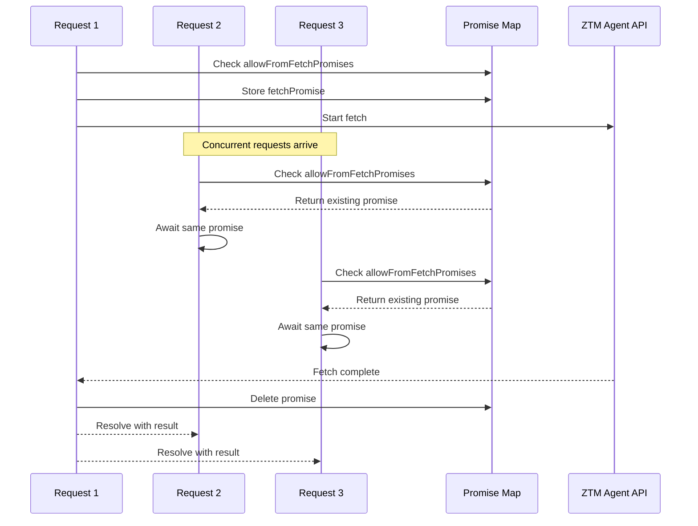

# ADR-009: Request Coalescing Pattern

## Status

Accepted

## Date

2026-02-23

## Context

The plugin caches frequently accessed data like `allowFrom` lists and group permissions. When cache expires, multiple concurrent requests may attempt to fetch the same data simultaneously:

**Problem**: Cache stampede - when cache expires, N concurrent requests all fetch the same resource

```
Time: 0s    Cache expires (TTL reached)
Time: 0.1s  Request A starts fetching allowFrom
Time: 0.15s Request B starts fetching allowFrom (duplicate!)
Time: 0.2s  Request C starts fetching allowFrom (duplicate!)
Time: 0.3s  All requests complete with same data
```

This wastes resources and can overwhelm the backend.

## Decision

Implement **Promise-Based Request Coalescing** - share in-flight promises:



### Implementation

```typescript
// src/runtime/state.ts - AccountStateManager

private allowFromFetchPromises = new Map<string, Promise<string[] | null>>();
private groupPermissionFetchPromises = new Map<string, Promise<GroupPermissions>>();

async getAllowFromCache(
  accountId: string,
  rt: PluginRuntime | (() => PluginRuntime)
): Promise<string[] | null> {
  const state = this.states.get(accountId);
  const now = Date.now();

  // Return cached value if still valid
  if (state.allowFromCache && now - state.allowFromCache.timestamp < ALLOW_FROM_CACHE_TTL_MS) {
    return state.allowFromCache.value;
  }

  // KEY: Check if there's already an in-flight request - coalesce requests
  const existingPromise = this.allowFromFetchPromises.get(accountId);
  if (existingPromise) {
    // Wait for the existing request to complete
    const result = await existingPromise;
    // Update cache with the result
    if (result !== null) {
      state.allowFromCache = { value: result, timestamp: now };
    }
    return result;
  }

  // Create new fetch promise and store it to coalesce concurrent requests
  const fetchPromise = (async (): Promise<string[] | null> => {
    try {
      const freshAllowFrom = await runtime.channel.pairing.readAllowFromStore('ztm-chat');
      state.allowFromCache = {
        value: freshAllowFrom,
        timestamp: Date.now(),
      };
      return freshAllowFrom;
    } catch (err) {
      this.deps.logger.error(
        `[${accountId}] readAllowFromStore failed: ${err instanceof Error ? err.message : String(err)}`
      );
      if (state.allowFromCache) {
        return state.allowFromCache.value;
      }
      return null;
    } finally {
      // KEY: Remove the promise after completion to allow future fetches
      this.allowFromFetchPromises.delete(accountId);
    }
  })();

  this.allowFromFetchPromises.set(accountId, fetchPromise);
  return fetchPromise;
}
```

### Coalescing Sources

| Data Structure | Promise Map | Coalescing Key |
|----------------|-------------|----------------|
| `allowFromCache` | `allowFromFetchPromises` | `accountId` |
| `groupPermissionCache` | `groupPermissionFetchPromises` | `creator/group` |

## Alternatives Considered

| Alternative | Pros | Cons | Why Not Chosen |
|-------------|------|------|----------------|
| **No coalescing** | Simple implementation | Thundering herd problem | Wastes resources |
| **Dedicated cache layer** | Centralized control | External dependency, complexity | Overkill for simple coalescing |
| **Mutex lock** | Prevents concurrent requests | Serializes all requests | Slower than sharing promise |
| **Stale-while-revalidate** | Always returns data | May serve stale data | Not acceptable for auth data |
| **Promise coalescing (chosen)** | Efficient, no external deps | Custom implementation | Best balance |

### Key Trade-offs

- **Promise cleanup timing**: Delete immediately vs delayed (we do immediately)
- **Map scope**: Per-account vs global (we use per-account for isolation)
- **Error handling**: Share errors or fail independently (we share errors)

## Related Decisions

- **ADR-003**: Watermark + LRU Cache - Coalescing protects cache from stampede
- **ADR-012**: LRU + TTL Hybrid Caching - TTL expiration triggers coalescing

## Consequences

### Positive

- **Prevents cache stampede**: Multiple concurrent requests share one fetch
- **Reduced backend load**: Only one request per expired cache entry
- **Better latency**: Waiters get results faster than sequential requests
- **No external dependencies**: Simple Map-based implementation

### Negative

- **Memory overhead**: Promises held in map until completion
- **Error sharing**: All waiters receive the same error if fetch fails
- **Promise cleanup**: Must ensure promises are deleted to prevent leaks
- **Stale risk**: Waiters may receive slightly stale data during race

## References

- `src/runtime/state.ts` - AccountStateManager with coalescing maps
- `src/runtime/cache.ts` - GroupPermissionLRUCache
- `src/constants.ts` - TTL constants (`ALLOW_FROM_CACHE_TTL_MS`)
