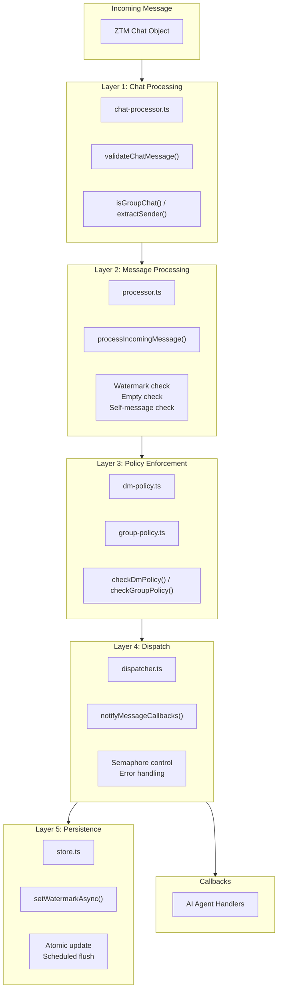

# ADR-010: Multi-Layer Message Processing Pipeline

## Status

Accepted

## Date

2026-02-23

## Context

Incoming messages from ZTM Agent need multiple processing steps:
- Validation (empty check, self-message check)
- Deduplication (watermark)
- Policy enforcement (DM policy, group policy)
- Callback dispatch
- Watermark update

The challenge is organizing this complexity while maintaining:
- **Separation of concerns**: Each step has a single responsibility
- **Testability**: Each layer can be tested independently
- **Reusability**: Both Watch and Polling modes use the same pipeline

## Decision

Implement **Five-Layer Message Processing Pipeline**:



### Layer Responsibilities

| Layer | File | Responsibility | Output |
|-------|------|----------------|--------|
| **1. Chat Processing** | `chat-processor.ts` | High-level orchestration, chat validation | Boolean (processed) |
| **2. Message Processing** | `processor.ts` | Watermark check, empty/self filtering, sanitization | `ZTMChatMessage \| null` |
| **3. Policy Enforcement** | `dm-policy.ts`, `group-policy.ts` | DM/group policy decisions | `MessageCheckResult` |
| **4. Dispatch** | `dispatcher.ts` | Callback execution with semaphore | Void |
| **5. Persistence** | `store.ts` | Watermark update (async) | Void |

### Code Flow

```typescript
// Layer 1: Chat Processing (chat-processor.ts)
export async function processAndNotifyChat(
  chat: ZTMChat,
  state: AccountRuntimeState,
  storeAllowFrom: string[]
): Promise<boolean> {
  const validation = validateChatMessage(chat, config);
  if (!validation.valid) return false;

  const isGroup = isGroupChat(chat);
  const sender = extractSender(chat);

  // Layer 2: Message Processing
  const normalized = processIncomingMessage(
    { time: chat.latest!.time, message: chat.latest!.message, sender },
    { config, storeAllowFrom, accountId }
  );

  if (normalized) {
    // Layer 4: Dispatch
    await notifyMessageCallbacks(state, normalized);
  }
}

// Layer 2: Message Processing (processor.ts)
export function processIncomingMessage(
  msg: { time: number; message: string; sender: string },
  context: ProcessMessageContext
): ZTMChatMessage | null {
  // Empty check
  if (msg.message.trim() === '') return null;

  // Self-message check
  if (msg.sender === config.username) return null;

  // Watermark check
  const watermark = getAccountMessageStateStore(accountId).getWatermark(accountId, watermarkKey);
  if (msg.time <= watermark) return null;

  // Layer 3: Policy Enforcement
  const check = checkDmPolicy(msg.sender, config, storeAllowFrom);
  if (!check.allowed) return null;

  // Return sanitized message
  return {
    id: `${msg.time}-${msg.sender}`,
    content: escapeHtml(msg.message),
    sender: escapeHtml(msg.sender),
    timestamp: new Date(msg.time),
    peer: escapeHtml(msg.sender),
  };
}

// Layer 4: Dispatch (dispatcher.ts)
export async function notifyMessageCallbacks(
  state: AccountRuntimeState,
  message: ZTMChatMessage
): Promise<void> {
  state.lastInboundAt = new Date();

  const tasks: Promise<boolean>[] = [];
  for (const callback of state.messageCallbacks) {
    tasks.push(executeCallbackWithSemaphore(callback, message, state));
  }

  const results = await Promise.all(tasks);

  // Layer 5: Persistence (on success)
  if (results.some(r => r)) {
    await getAccountMessageStateStore(state.accountId).setWatermarkAsync(
      state.accountId,
      watermarkKey,
      message.timestamp.getTime()
    );
  }
}
```

## Alternatives Considered

| Alternative | Pros | Cons | Why Not Chosen |
|-------------|------|------|----------------|
| **Monolithic handler** | Simple control flow | Hard to test, hard to maintain | Violates SRP |
| **Pipeline library** | Structured, feature-rich | External dependency, complex | Overkill for our needs |
| **Chain of responsibility** | Flexible, extensible | Implicit flow, harder to trace | Less predictable |
| **Event emitter** | Decoupled, async-friendly | No guaranteed order, hard to debug | Lost causal connection |
| **Layered pipeline (chosen)** | Clear, testable, reusable | More files to maintain | Best for our complexity |

### Key Trade-offs

- **Layer count**: 5 layers = more files vs better separation
- **Data transformation**: Each layer may transform data (adds tracing complexity)
- **Error handling**: Each layer must decide to continue or stop

## Related Decisions

- **ADR-002**: Watch + Polling Dual Mode - Both use the same pipeline
- **ADR-003**: Watermark + LRU Cache - Layer 2 and Layer 5 use watermarks
- **ADR-007**: Dual Semaphore Concurrency Control - Layer 4 uses callback semaphore

## Consequences

### Positive

- **Separation of concerns**: Each layer has a single, clear responsibility
- **Testability**: Each layer can be unit tested independently
- **Reusability**: Both Watch and Polling share the same pipeline
- **Maintainability**: Changes to one layer don't affect others

### Negative

- **File count**: 5+ files for message processing
- **Tracing difficulty**: Debugging requires understanding all layers
- **Data transformation**: Messages are transformed between layers
- **Performance overhead**: Multiple function calls per message

## References

- `src/messaging/chat-processor.ts` - Layer 1: Chat processing orchestration
- `src/messaging/processor.ts` - Layer 2: Message processing and validation
- `src/core/dm-policy.ts` - Layer 3: DM policy enforcement
- `src/core/group-policy.ts` - Layer 3: Group policy enforcement
- `src/messaging/dispatcher.ts` - Layer 4: Callback dispatch
- `src/runtime/store.ts` - Layer 5: Watermark persistence
- `src/messaging/message-processor-helpers.ts` - Shared utilities
