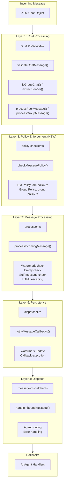

# ADR-010: Multi-Layer Message Processing Pipeline

## Status

Accepted

## Date

2026-02-23

## Context

Incoming messages from ZTM Agent need multiple processing steps:
- Validation (empty check, self-message check)
- Deduplication (watermark)
- Policy enforcement (DM policy, group policy)
- Callback dispatch
- Watermark update

The challenge is organizing this complexity while maintaining:
- **Separation of concerns**: Each step has a single responsibility
- **Testability**: Each layer can be tested independently
- **Reusability**: Watch mode uses a single pipeline
- **Consistency**: DM and Group messages follow the same flow

## Decision

Implement **Five-Layer Message Processing Pipeline**:



### Layer Responsibilities

| Layer | File | Responsibility | Output |
|-------|------|----------------|--------|
| **1. Chat Processing** | `chat-processor.ts`, `message-processor-helpers.ts` | High-level orchestration, chat validation, route selection | Boolean (processed) |
| **2. Message Processing** | `processor.ts` | Watermark check, empty/self filtering, HTML sanitization | `ZTMChatMessage \| null` |
| **3. Policy Enforcement** | `policy-checker.ts`, `dm-policy.ts`, `group-policy.ts` | Unified DM/group policy decisions | `PolicyCheckResult` |
| **4. Dispatch** | `message-dispatcher.ts` | Agent routing, inbound context creation | Void |
| **5. Persistence** | `dispatcher.ts` | Watermark update, callback execution | Void |

### Key Architecture Change (2026-03-06)

**Unified Policy Checking**:

- **Before**: DM policy checked in Layer 2 (`processIncomingMessage`), Group policy checked in Layer 4 (`handleInboundMessage`)
- **After**: All policy checking consolidated in Layer 3 (`policy-checker.ts`), executed BEFORE Layer 2

This fixes the critical bug where `dmPolicy:deny` was incorrectly applied to group messages.

### Code Flow

```typescript
// Layer 1: Chat Processing (message-processor-helpers.ts)
export function processPeerMessage(
  msg: { time: number; message: string; sender: string },
  state: AccountRuntimeState,
  storeAllowFrom: string[]
): ZTMChatMessage | null {
  // Skip self-messages
  if (msg.sender === state.config.username) return null;

  // Layer 3: Policy Enforcement (DM)
  const policyResult = checkMessagePolicy({
    sender: msg.sender,
    content: msg.message,
    config: state.config,
    accountId: state.accountId,
    storeAllowFrom,
  });

  if (!policyResult.allowed) return null;

  // Layer 2: Message Processing (skipPolicyCheck=true)
  return processIncomingMessage(msg, {
    config: state.config,
    storeAllowFrom,
    accountId: state.accountId,
    skipPolicyCheck: true, // Already checked policy above
  });
}

export function processGroupMessage(
  msg: { time: number; message: string; sender: string },
  state: AccountRuntimeState,
  storeAllowFrom: string[],
  groupInfo: { creator: string; group: string }
): ZTMChatMessage | null {
  // Skip self-messages
  if (msg.sender === state.config.username) return null;

  // Layer 3: Policy Enforcement (Group) - DM policy NOT applied
  const policyResult = checkMessagePolicy({
    sender: msg.sender,
    content: msg.message,
    config: state.config,
    accountId: state.accountId,
    storeAllowFrom,
    groupInfo, // Group info ensures DM policy is NOT checked
  });

  if (!policyResult.allowed) return null;

  // Layer 2: Message Processing (skipPolicyCheck=true)
  const normalized = processIncomingMessage(msg, {
    config: state.config,
    storeAllowFrom,
    accountId: state.accountId,
    groupInfo,
    skipPolicyCheck: true, // Already checked policy above
  });

  if (!normalized) return null;

  // Add group metadata
  return { ...normalized, isGroup: true, groupId: groupInfo.group, groupCreator: groupInfo.creator };
}

// Layer 2: Message Processing (processor.ts)
export function processIncomingMessage(
  msg: { time: number; message: string; sender: string },
  context: ProcessMessageContext
): ZTMChatMessage | null {
  // Empty check
  if (msg.message.trim() === '') return null;

  // Self-message check
  if (msg.sender === config.username) return null;

  // Watermark check
  const watermark = getAccountMessageStateStore(accountId).getWatermark(accountId, watermarkKey);
  if (msg.time <= watermark) return null;

  // DM policy check (only when skipPolicyCheck=false)
  if (!skipPolicyCheck) {
    const check = checkDmPolicy(msg.sender, config, storeAllowFrom);
    if (!check.allowed) return null;
  }

  // Return sanitized message
  return {
    id: `${msg.time}-${msg.sender}`,
    content: escapeHtml(msg.message),
    sender: escapeHtml(msg.sender),
    timestamp: new Date(msg.time),
    peer: escapeHtml(msg.sender),
  };
}

// Layer 3: Policy Enforcement (policy-checker.ts)
export function checkMessagePolicy(input: PolicyCheckInput): PolicyCheckResult {
  const { sender, content, config, accountId, storeAllowFrom = [], groupInfo } = input;

  // Group message: Check ONLY group policy (NOT DM policy)
  if (groupInfo) {
    const permissions = getGroupPermissionCached(accountId, groupInfo.creator, groupInfo.group, config);
    const groupResult = checkGroupPolicy(sender, content, permissions, config.username);
    return {
      allowed: groupResult.allowed,
      reason: groupResult.reason,
      action: groupResult.action as 'process' | 'ignore',
    };
  }

  // DM message: Check DM policy
  const dmResult = checkDmPolicy(sender, config, storeAllowFrom);
  return {
    allowed: dmResult.allowed,
    reason: dmResult.reason ?? 'denied',
    action: dmResult.action ?? 'ignore',
  };
}

// Layer 5: Persistence + Callbacks (dispatcher.ts)
export async function notifyMessageCallbacks(
  state: AccountRuntimeState,
  message: ZTMChatMessage
): Promise<void> {
  state.lastInboundAt = new Date();

  const tasks: Promise<boolean>[] = [];
  for (const callback of state.messageCallbacks) {
    tasks.push(executeCallbackWithSemaphore(callback, message, state));
  }

  const results = await Promise.all(tasks);

  // Update watermark (on success)
  if (results.some(r => r)) {
    await getAccountMessageStateStore(state.accountId).setWatermarkAsync(
      state.accountId,
      watermarkKey,
      message.timestamp.getTime()
    );
  }
}

// Layer 4: Dispatch (message-dispatcher.ts)
export async function handleInboundMessage(
  state: AccountRuntimeState,
  rt: ReturnType<typeof getZTMRuntime>,
  cfg: Record<string, unknown>,
  config: ZTMChatConfig,
  accountId: string,
  ctx: { log?: { info: (...args: unknown[]) => void } },
  msg: ZTMChatMessage
): Promise<void> {
  // Policy check removed - already done in Layer 3

  const { ctxPayload, matchedBy, agentId } = createInboundContext({
    rt,
    msg,
    config,
    accountId,
    cfg,
  });

  ctx.log?.info(`[${accountId}] Dispatching message from ${msg.sender} to AI agent (route: ${matchedBy})`);

  // ... rest of dispatch logic
}
```

### Message Flow Comparison

#### DM Message Flow

```
1. Message arrives from ZTM
2. processPeerMessage() validates self-message check
3. checkMessagePolicy() applies DM policy (Layer 3)
4. processIncomingMessage() normalizes (Layer 2, skipPolicyCheck=true)
5. notifyMessageCallbacks() updates watermark (Layer 5)
6. handleInboundMessage() dispatches to AI agent (Layer 4)
```

#### Group Message Flow

```
1. Message arrives from ZTM
2. processGroupMessage() validates self-message check
3. checkMessagePolicy() applies Group policy (Layer 3) - NOT DM policy
4. processIncomingMessage() normalizes (Layer 2, skipPolicyCheck=true)
5. notifyMessageCallbacks() updates watermark (Layer 5)
6. handleInboundMessage() dispatches to AI agent (Layer 4)
```

### Key Design Principles

1. **Unified Policy Checking**: Single `checkMessagePolicy()` function handles both DM and Group messages
2. **Separation of Concerns**: Each layer has a single, well-defined responsibility
3. **Policy Before Watermark**: Policy checks happen BEFORE watermark updates, preventing rejected messages from advancing the watermark
4. **Symmetric Behavior**: DM and Group messages follow the same pipeline structure

## Alternatives Considered

| Alternative | Pros | Cons | Why Not Chosen |
|-------------|------|------|----------------|
| **Monolithic handler** | Simple control flow | Hard to test, hard to maintain | Violates SRP |
| **Pipeline library** | Structured, feature-rich | External dependency, complex | Overkill for our needs |
| **Chain of responsibility** | Flexible, extensible | Implicit flow, harder to trace | Less predictable |
| **Event emitter** | Decoupled, async-friendly | No guaranteed order, hard to debug | Lost causal connection |
| **Layered pipeline (chosen)** | Clear, testable, reusable | More files to maintain | Best for our complexity |

### Key Trade-offs

- **Layer count**: 5 layers = more files vs better separation
- **Data transformation**: Each layer may transform data (adds tracing complexity)
- **Error handling**: Each layer must decide to continue or stop
- **Policy timing**: Policy checks before normalization (better correctness) vs inline (simpler flow)

## Related Decisions

- **ADR-002**: Watch Mode with Fibonacci Backoff
- **ADR-003**: Watermark + LRU Cache - Layer 2 and Layer 5 use watermarks
- **ADR-007**: Dual Semaphore Concurrency Control - Layer 5 uses callback semaphore
- **ADR-013**: Functional Policy Engine - Layer 3 uses functional policy patterns

## Consequences

### Positive

- **Separation of concerns**: Each layer has a single, clear responsibility
- **Testability**: Each layer can be unit tested independently
- **Reusability**: Watch mode uses a single pipeline
- **Maintainability**: Changes to one layer don't affect others
- **Correctness**: Policy checks happen before watermark updates
- **Consistency**: DM and Group messages follow symmetric flows

### Negative

- **File count**: 5+ files for message processing
- **Tracing difficulty**: Debugging requires understanding all layers
- **Data transformation**: Messages are transformed between layers
- **Performance overhead**: Multiple function calls per message

## Revisions

### 2026-03-06: Unified Policy Checking

**Problem**: Previous implementation had double policy checking for group messages:
- DM policy checked in `processIncomingMessage()` for ALL messages
- Group policy checked in `handleInboundMessage()` for group messages
- Result: `dmPolicy:deny` incorrectly rejected group messages

**Solution**:
- Created `policy-checker.ts` as unified Layer 3 module
- Moved policy checks before `processIncomingMessage()` calls
- Added `skipPolicyCheck` parameter to `processIncomingMessage()`
- Removed duplicate policy check from `handleInboundMessage()`

**Impact**:
- Fixes dmPolicy:deny bug
- Ensures watermark only updates for policy-approved messages
- Restores ADR-010 Layer 3 separation

## References

- `src/messaging/chat-processor.ts` - Layer 1: Chat processing orchestration
- `src/messaging/message-processor-helpers.ts` - Layer 1: DM/Group message routing
- `src/messaging/processor.ts` - Layer 2: Message processing and validation
- `src/core/policy-checker.ts` - Layer 3: Unified policy enforcement
- `src/core/dm-policy.ts` - Layer 3: DM policy implementation
- `src/core/group-policy.ts` - Layer 3: Group policy implementation
- `src/channel/message-dispatcher.ts` - Layer 4: Agent dispatch
- `src/messaging/dispatcher.ts` - Layer 5: Watermark persistence and callbacks
- `src/runtime/store.ts` - Layer 5: Watermark storage backend
