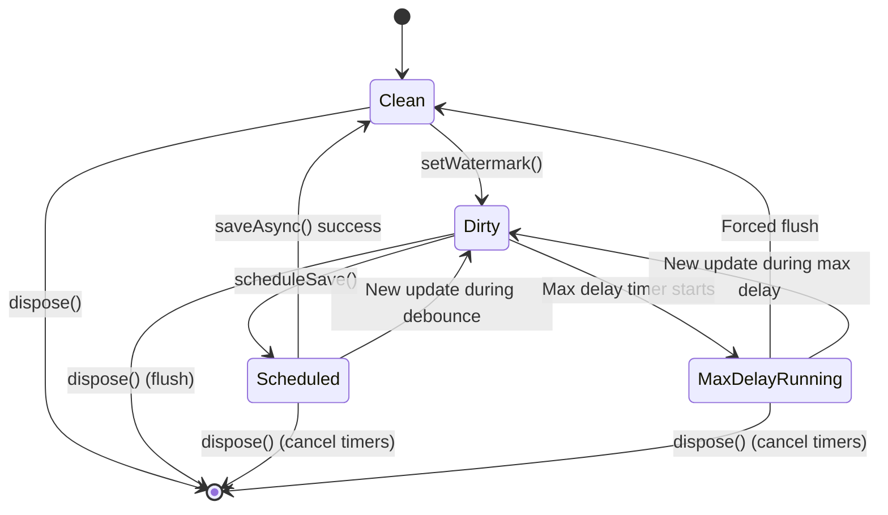

# ADR-011: Dual-Timer Persistence Strategy

## Status

Accepted

## Date

2026-02-23

## Context

The plugin needs to persist message watermarks to disk. Requirements:

1. **Performance**: Don't write on every message (excessive I/O)
2. **Data safety**: Don't lose too much data on crash
3. **Guaranteed flush**: Ensure data is eventually written

Single-timer approaches have trade-offs:
- **Only debounce**: If messages stop, data may never be flushed
- **Only interval**: Wasteful if no updates occur
- **Immediate write**: Poor performance under load

## Decision

Implement **Dual-Timer Persistence Strategy** with debounce + max-delay:



### Implementation

```typescript
// src/runtime/store.ts - MessageStateStoreImpl

export class MessageStateStoreImpl implements MessageStateStore {
  private dirty = false;
  private flushTimer: ReturnType<typeof setTimeout> | null = null;
  private maxDelayTimer: ReturnType<typeof setTimeout> | null = null;

  private scheduleSave(): void {
    this.dirty = true;

    // Timer 1: Debounce timer (500ms default)
    // Cancels previous timer, only writes after updates stop
    if (this.flushTimer) {
      clearTimeout(this.flushTimer);
    }
    this.flushTimer = setTimeout(async () => {
      this.flushTimer = null;
      await this.saveAsync();
    }, STATE_FLUSH_DEBOUNCE_MS);

    // Timer 2: Max-delay timer (5000ms default)
    // Ensures data is flushed even if updates keep coming
    if (!this.maxDelayTimer) {
      this.maxDelayTimer = setTimeout(async () => {
        this.maxDelayTimer = null;
        if (this.dirty) {
          await this.saveAsync();
        }
      }, STATE_FLUSH_MAX_DELAY_MS);
    }
  }

  private async saveAsync(): Promise<void> {
    if (!this.dirty) return;

    try {
      await this.fs.promises.mkdir(this.stateDir, { recursive: true });
      await this.fs.promises.writeFile(
        this.statePath,
        JSON.stringify(this.data, null, 2)
      );
      this.dirty = false;
    } catch {
      this.logger.warn('Failed to persist message state');
    }
  }

  flush(): void {
    if (this.flushTimer) clearTimeout(this.flushTimer);
    if (this.maxDelayTimer) clearTimeout(this.maxDelayTimer);
    this.save(); // Synchronous save for shutdown
  }
}
```

### Timer Behaviors

| Timer | Duration | Purpose | Behavior |
|-------|----------|---------|----------|
| **Debounce** | 500ms | Batch rapid updates | Resets on each update, writes when quiet |
| **Max-delay** | 5000ms | Guaranteed flush | One-shot, ensures flush even if active |

### Timeline Example

```
Time 0s    : setWatermark() → dirty=true → debounce scheduled (500ms)
Time 0.1s  : setWatermark() → dirty=true → debounce reset (now 600ms)
Time 0.2s  : setWatermark() → dirty=true → debounce reset (now 700ms)
Time 0.3s  : max-delay timer starts (will fire at 5.3s)
...
Time 0.7s  : No updates for 500ms → debounce fires → saveAsync()
Time 0.8s  : saveAsync() completes → dirty=false
...
Time 5.3s  : max-delay fires but dirty=false → no-op
```

## Alternatives Considered

| Alternative | Pros | Cons | Why Not Chosen |
|-------------|------|------|----------------|
| **Immediate write** | Always fresh | Poor performance, disk wear | Unacceptable overhead |
| **Only debounce** | Simple, efficient | May never flush if active | Data loss risk |
| **Only interval** | Predictable writes | Wasteful if no updates | Inefficient |
| **Write-behind cache** | Sophisticated | Complex, external dependency | Overkill |
| **Dual-timer (chosen)** | Performance + safety | Two timers to manage | Best balance |

### Key Trade-offs

- **Debounce delay (500ms)**: Shorter = more I/O, longer = more data at risk
- **Max delay (5000ms)**: Shorter = more frequent writes, longer = more data loss
- **Async writes**: Better performance vs risk of data loss on crash

## Related Decisions

- **ADR-003**: Watermark + LRU Cache - Dual-timer protects watermark data
- **ADR-011**: This ADR details the timer strategy mentioned in ADR-003

## Consequences

### Positive

- **Performance**: Batches rapid updates into single write
- **Safety**: Max-delay ensures flush even under continuous load
- **Graceful shutdown**: `flush()` cancels timers and writes immediately
- **Async**: Non-blocking writes don't block event loop

### Negative

- **Data loss window**: Up to 5 seconds of data may be lost on crash
- **Timer complexity**: Two timers add to code complexity
- **Memory residency**: Timers keep process in memory
- **Tuning required**: Delays may need adjustment for workload

## References

- `src/runtime/store.ts` - MessageStateStoreImpl with dual timers
- `src/constants.ts` - Timer constants (`STATE_FLUSH_DEBOUNCE_MS`, `STATE_FLUSH_MAX_DELAY_MS`)
