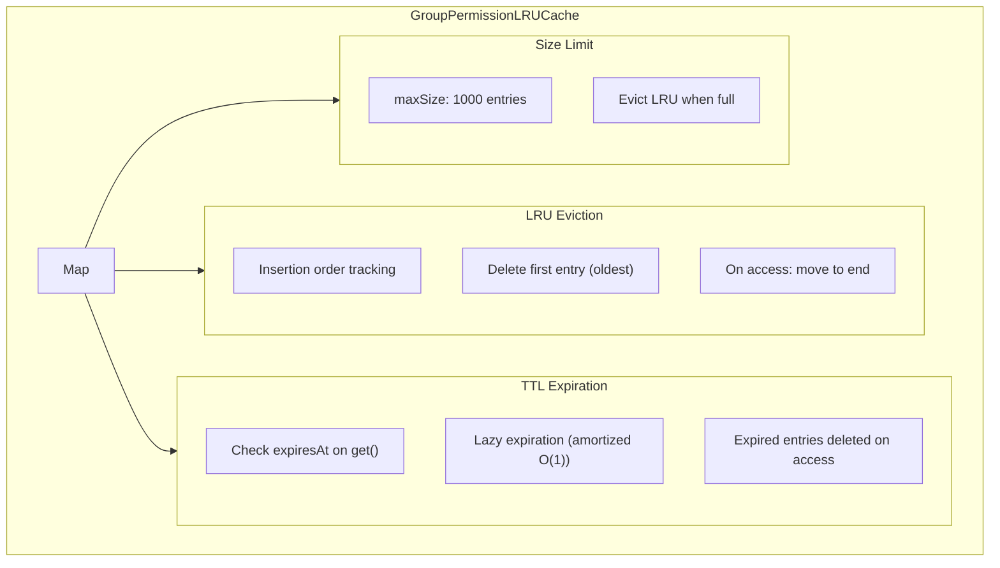

# ADR-012: LRU + TTL Hybrid Caching

## Status

Accepted

## Date

2026-02-23

## Context

The plugin caches group permissions to avoid repeated computation. Requirements:

1. **Size limit**: Prevent unbounded memory growth
2. **Stale data handling**: Evict entries after a time period
3. **Performance**: O(1) operations

Single-strategy caches have limitations:
- **Only LRU**: No time-based eviction, stale data persists
- **Only TTL**: No size limit, memory can grow unbounded
- **node-cache**: External dependency (~50KB)

## Decision

Implement **Hybrid LRU + TTL Cache** using JavaScript Map:



### Implementation

```typescript
// src/runtime/cache.ts

export class GroupPermissionLRUCache {
  // Map maintains insertion order: [oldest, ..., newest]
  private cache = new Map<string, { permissions: GroupPermissions; expiresAt: number }>();
  private maxSize: number;
  private ttlMs: number;

  constructor(maxSize: number = MAX_GROUP_PERMISSION_CACHE_SIZE, ttlMs: number = GROUP_PERMISSION_CACHE_TTL_MS) {
    this.maxSize = maxSize;
    this.ttlMs = ttlMs;
  }

  private isExpired(entry: { expiresAt: number }): boolean {
    return entry.expiresAt < Date.now();
  }

  // O(1) LRU eviction
  private evictLRU(): void {
    const firstKey = this.cache.keys().next().value;
    if (firstKey !== undefined) {
      this.cache.delete(firstKey);
    }
  }

  get(key: string): GroupPermissions | undefined {
    const entry = this.cache.get(key);
    if (!entry) return undefined;

    // Check TTL
    if (this.isExpired(entry)) {
      this.cache.delete(key);
      return undefined;
    }

    // O(1) LRU update: delete and re-insert moves entry to end
    this.cache.delete(key);
    this.cache.set(key, entry);
    return entry.permissions;
  }

  set(key: string, permissions: GroupPermissions): void {
    // If key exists, delete it first (will be re-added at end)
    if (this.cache.has(key)) {
      this.cache.delete(key);
    }

    // Evict LRU entries until we have room
    while (this.cache.size >= this.maxSize) {
      this.evictLRU();
    }

    const now = Date.now();
    this.cache.set(key, {
      permissions,
      expiresAt: now + this.ttlMs,
    });
  }
}
```

### Key Properties

| Property | Value | Purpose |
|----------|-------|---------|
| `maxSize` | 1000 | Limit memory usage |
| `ttlMs` | 300000 (5 min) | Prevent stale data |
| Data structure | Map | O(1) operations, insertion order |

### O(1) Operations

```typescript
// LRU update on get (move to end)
cache.delete(key);  // O(1)
cache.set(key, entry);  // O(1) - inserts at end

// LRU eviction
const firstKey = cache.keys().next().value;  // O(1)
cache.delete(firstKey);  // O(1)

// Size check
cache.size;  // O(1) property
```

## Alternatives Considered

| Alternative | Pros | Cons | Why Not Chosen |
|-------------|------|------|----------------|
| **node-cache** | Feature-rich, tested | External dependency (~50KB) | Avoid unnecessary dependencies |
| **Only LRU** | Simple, size-limited | No time-based expiration | Stale data problem |
| **Only TTL** | Time-based cleanup | No size limit | Memory leak risk |
| **lru-cache npm** | LRU + TTL included | External dependency | Easy to implement ourselves |
| **Custom hybrid (chosen)** | No dependencies, optimized | Custom code to maintain | Best fit |

### Key Trade-offs

- **Max size (1000)**: Larger = more cache hits, more memory
- **TTL (5 min)**: Longer = more stale data, shorter = more cache misses
- **Lazy expiration**: Simpler vs proactive (we chose lazy)

## Related Decisions

- **ADR-003**: Watermark + LRU Cache - GroupPermissionLRUCache is part of this system
- **ADR-009**: Request Coalescing Pattern - Coalescing triggers on cache expiration

## Consequences

### Positive

- **Memory bounded**: maxSize prevents unbounded growth
- **Fresh data**: TTL ensures entries expire
- **O(1) operations**: All operations are constant time
- **No dependencies**: Pure JavaScript implementation

### Negative

- **Lazy expiration**: Expired entries consume memory until accessed
- **TTL jitter**: Entries expire at different times based on access pattern
- **Custom code**: Maintenance burden vs using a library

## References

- `src/runtime/cache.ts` - GroupPermissionLRUCache implementation
- `src/constants.ts` - Cache constants (`MAX_GROUP_PERMISSION_CACHE_SIZE`, `GROUP_PERMISSION_CACHE_TTL_MS`)
