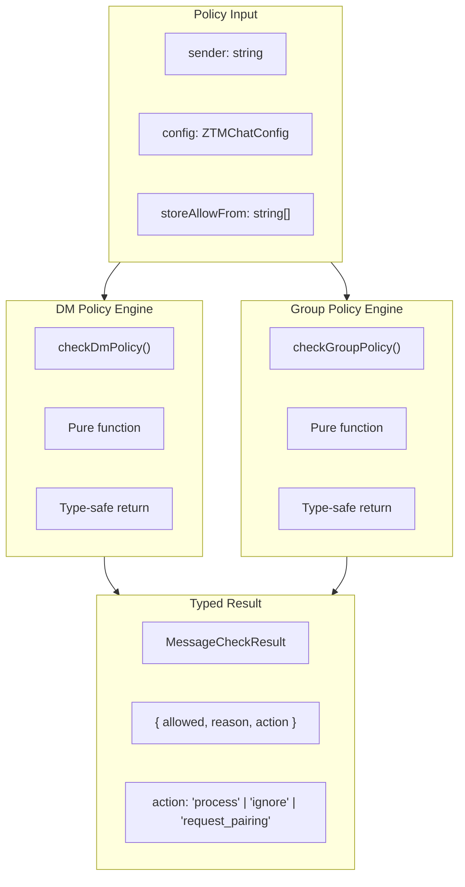

# ADR-013: Functional Policy Engine Design

## Status

Accepted

## Date

2026-02-23

## Context

The plugin needs policy enforcement for:
- **DM (Direct Message) policy**: allow, deny, pairing modes
- **Group policy**: open, allowlist, disabled modes
- **Tool restrictions**: Allow/deny lists per group

Requirements:
- **Security**: Policies must be enforced correctly
- **Testability**: Easy to test policy logic
- **Type safety**: Compile-time checking of policy returns

## Decision

Implement **Functional Policy Engine** with pure functions and typed returns:



### DM Policy Implementation

```typescript
// src/core/dm-policy.ts

export function checkDmPolicy(
  sender: string,
  config: ZTMChatConfig,
  storeAllowFrom: string[] = []
): MessageCheckResult {
  // Security: Reject empty sender
  if (!sender || !sender.trim()) {
    return { allowed: false, reason: 'denied', action: 'ignore' };
  }

  const normalizedSender = normalizeUsername(sender);

  // Check config whitelist
  if (isWhitelisted(normalizedSender, config.allowFrom)) {
    return { allowed: true, reason: 'whitelisted', action: 'process' };
  }

  // Check store whitelist (pairing approvals)
  if (isWhitelisted(normalizedSender, storeAllowFrom)) {
    return { allowed: true, reason: 'whitelisted', action: 'process' };
  }

  // Apply policy
  const policy = config.dmPolicy ?? 'pairing';
  switch (policy) {
    case 'allow':
      return { allowed: true, reason: 'allowed', action: 'process' };
    case 'deny':
      return { allowed: false, reason: 'denied', action: 'ignore' };
    case 'pairing':
      return { allowed: false, reason: 'pending', action: 'request_pairing' };
    default:
      return { allowed: true, reason: 'allowed', action: 'process' };
  }
}
```

### Group Policy Implementation

```typescript
// src/core/group-policy.ts

export function checkGroupPolicy(
  sender: string,
  content: string,
  permissions: GroupPermissions,
  botUsername: string
): GroupMessageCheckResult {
  if (!sender) {
    return { allowed: false, reason: 'denied', action: 'ignore' };
  }

  const isSenderCreator = isCreator(sender, permissions.creator);

  // Non-creator: check policy and whitelist
  if (!isSenderCreator) {
    switch (permissions.groupPolicy) {
      case 'disabled':
        return { allowed: false, reason: 'denied', action: 'ignore' };
      case 'allowlist':
        if (!isWhitelisted(sender, permissions.allowFrom)) {
          return { allowed: false, reason: 'whitelisted', action: 'ignore' };
        }
        break;
      case 'open':
        break;
      default:
        return { allowed: false, reason: 'denied', action: 'ignore' };
    }
  }

  // Mention check applies to ALL users (including creator)
  if (permissions.requireMention) {
    if (!hasMention(content, botUsername)) {
      return {
        allowed: false,
        reason: 'mention_required',
        action: 'ignore',
        wasMentioned: false,
      };
    }
  }

  return {
    allowed: true,
    reason: isSenderCreator ? 'creator' : permissions.groupPolicy === 'allowlist' ? 'whitelisted' : 'allowed',
    action: 'process',
    wasMentioned: hasMention(content, botUsername),
  };
}
```

### Type-Safe Returns

```typescript
// src/types/messaging.ts
export interface MessageCheckResult {
  allowed: boolean;
  reason: 'allowed' | 'denied' | 'pending' | 'whitelisted';
  action: 'process' | 'ignore' | 'request_pairing';
}

// src/types/group-policy.ts
export interface GroupMessageCheckResult {
  allowed: boolean;
  reason: 'allowed' | 'denied' | 'whitelisted' | 'creator' | 'mention_required';
  action: 'process' | 'ignore';
  wasMentioned?: boolean;
}
```

## Alternatives Considered

| Alternative | Pros | Cons | Why Not Chosen |
|-------------|------|------|----------------|
| **OOP policy classes** | Encapsulation, inheritance | Hidden state, harder to test | Pure functions simpler |
| **Rules engine** | Declarative, flexible | External dependency, overkill | Over-engineering |
| **Decorator pattern** | Composable, metadata-heavy | TypeScript decorators are experimental | Complexity vs benefit |
| **Configuration-only** | No code, data-driven | Limited expressiveness | Can't handle complex logic |
| **Functional (chosen)** | Testable, type-safe, simple | Verbosity | Best for our use case |

### Key Trade-offs

- **Pure functions**: No hidden state vs no caching (caching done elsewhere)
- **Typed returns**: More verbose vs compile-time safety
- **Reason strings**: Debugging help vs maintenance burden

## Related Decisions

- **ADR-004**: Result Type + Categorized Errors - Similar typed return pattern
- **ADR-005**: Type Safety Patterns - Type-safe returns integrate with overall strategy
- **ADR-010**: Multi-Layer Message Pipeline - Policy engine is Layer 3

## Consequences

### Positive

- **Testability**: Pure functions are easy to unit test
- **Type safety**: Compile-time checking prevents bugs
- **No hidden state**: Predictable behavior
- **Clear semantics**: Return values clearly indicate what to do

### Negative

- **Verbosity**: More code than config-only approach
- **Reason strings**: Must be kept in sync with code
- **No caching**: Functions don't cache (caching done by caller)

## References

- `src/core/dm-policy.ts` - DM policy implementation
- `src/core/group-policy.ts` - Group policy implementation
- `src/types/messaging.ts` - MessageCheckResult type
- `src/types/group-policy.ts` - GroupMessageCheckResult type
