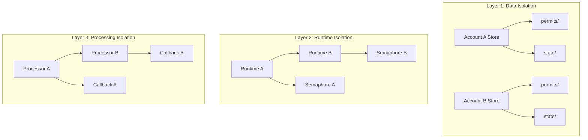

# ADR-014: Multi-Account Isolation Pattern

## Status

Accepted

## Date

2026-02-25

## Context

The ZTM Chat plugin supports managing multiple ZTM accounts within a single OpenClaw instance. Each account operates independently with its own:
- ZTM Agent connection
- Message state (watermarks)
- Pairing/allowlist
- Runtime resources

The system must ensure complete isolation between accounts to prevent:
- Cross-account message leakage
- State corruption from concurrent access
- Resource exhaustion from one account affecting others

### Current Implementation Evidence

The project has extensive test coverage for multi-account scenarios:
- `src/channel/multi-account-concurrent.integration.test.ts`
- `src/runtime/multi-account-files.integration.test.ts`
- `src/messaging/multi-account-isolation.test.ts`

## Decision

Implement multi-account isolation using a **three-layer isolation strategy**:



### Implementation Details

#### 1. Account-Based Directory Structure
```
data/ztm-chat/
├── permits/
│   ├── account-a/permit.json
│   └── account-b/permit.json
└── state/
    ├── account-a/watermarks.json
    └── account-b/watermarks.json
```

#### 2. Key-Based State Isolation
```typescript
// Account-scoped keys prevent cross-account access
const WATERMARK_KEY = (accountId: string, peerId: string) =>
  `${accountId}:watermark:${peerId}`;

// In store.ts - account-scoped operations
export function getAccountMessageStateStore(accountId: string): MessageStateStore {
  const store = accountStores.get(accountId);
  if (!store) {
    const newStore = new MessageStateStore(getStateFilePath(accountId));
    accountStores.set(accountId, newStore);
    return newStore;
  }
  return store;
}
```

#### 3. Runtime Singleton with Account Scope
```typescript
// runtime.ts - RuntimeManager maintains per-account state
class RuntimeManager {
  private runtimes = new Map<string, PluginRuntime>();

  getRuntime(accountId: string): PluginRuntime {
    if (!this.runtimes.has(accountId)) {
      this.runtimes.set(accountId, this.createRuntime(accountId));
    }
    return this.runtimes.get(accountId)!;
  }
}
```

#### 4. Semaphore-Based Concurrency Control
```typescript
// concurrency.ts - Per-account semaphores
const accountSemaphores = new Map<string, Semaphore>();

export function getAccountSemaphore(accountId: string): Semaphore {
  if (!accountSemaphores.has(accountId)) {
    accountSemaphores.set(accountId, new Semaphore(1));
  }
  return accountSemaphores.get(accountId)!;
}
```

## Alternatives Considered

| Alternative | Pros | Cons | Why Not Chosen |
|-------------|------|------|----------------|
| **Single Global State** | Simple implementation | No isolation, security risk | Inacceptable for multi-tenant scenario |
| **Process Isolation** | Complete isolation | Overhead, complex IPC | Too heavy for plugin architecture |
| **Namespace per Account (chosen)** | Clear boundaries, testable | Requires discipline | Best balance of safety and complexity |

## Key Trade-offs

- **Directory per account** vs key prefix: Directory provides cleaner file isolation but requires migration if account IDs change
- **Singleton RuntimeManager** vs factory: Singleton simplifies access but requires careful account scoping
- **Shared semaphores** vs per-account: Shared prevents resource exhaustion but adds coordination complexity

## Related Decisions

- **ADR-003**: Watermark LRU Cache - Uses account-scoped keys
- **ADR-007**: Three-Level Semaphore - Account-level concurrency control

## Consequences

### Positive

- **Complete isolation**: Each account's data is physically separated
- **Fault containment**: Failures in one account don't cascade to others
- **Clear debugging**: Account-specific logs and state files
- **Testability**: Easy to simulate multi-account scenarios

### Negative

- **File system overhead**: Multiple directories for many accounts
- **Memory usage**: Each account holds separate runtime state
- **Complexity**: Developers must always use account-scoped APIs

## References

- `src/runtime/store.ts` - Account-scoped message state store
- `src/runtime/state.ts` - Runtime manager with per-account tracking
- `src/channel/multi-account-concurrent.integration.test.ts` - Integration tests
- `src/utils/concurrency.ts` - Account-scoped semaphores
