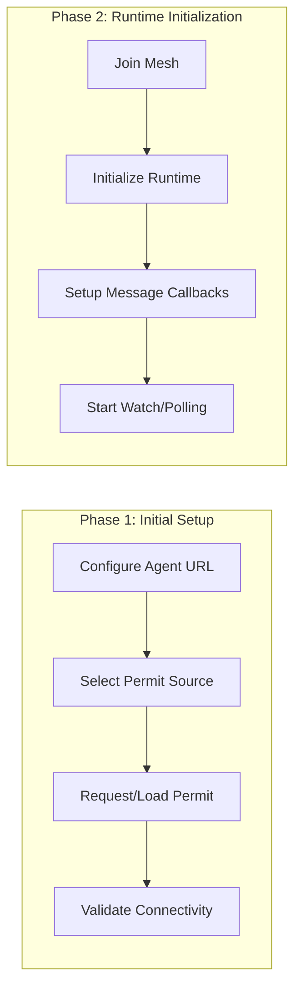
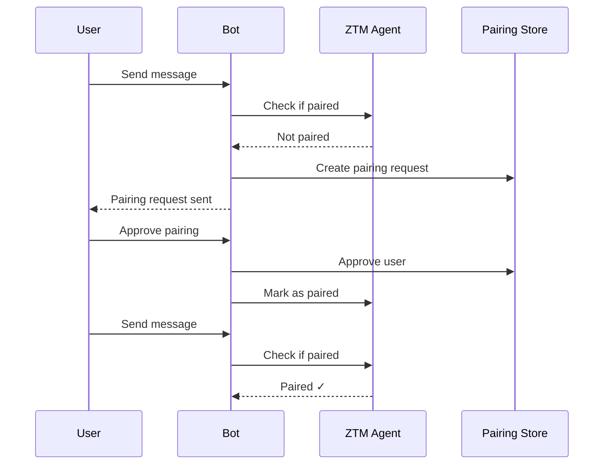

# ADR-015: Onboarding & Pairing Flow

## Status

Accepted

## Date

2026-02-25

## Context

The ZTM Chat plugin requires users to complete a multi-step onboarding process to establish connectivity with the ZTM network. This involves:
1. Configuring ZTM Agent URL
2. Obtaining a permit (authentication token)
3. Creating a bot account
4. Setting up security policies (DM/Group)

Additionally, the plugin implements a **pairing mode** where users must explicitly approve who can message the bot.

### Current Implementation Evidence

- `src/onboarding/onboarding.ts` - Interactive CLI wizard (650+ lines)
- `src/connectivity/permit.ts` - Permit request/loading/saving
- `src/channel/connectivity-manager.ts` - Connectivity validation
- **Note:** Pairing state is now managed by OpenClaw's pairing store (delegated)

## Decision

Implement a **two-phase onboarding architecture**:



### 1. Interactive Wizard Pattern

```typescript
// onboarding.ts - Wizard with step-based navigation
export class ZTMChatWizard {
  async run(): Promise<WizardResult | null> {
    // Step 1: Agent URL
    await this.stepAgentUrl();
    // Step 2: Permit Source
    await this.stepPermitSource();
    // Step 3: User Selection
    await this.stepUserSelection();
    // Step 4: Security Settings
    await this.stepSecuritySettings();
    // Step 5: Group Chat Settings
    await this.stepGroupSettings();
    // Step 6: Summary & Save
    return this.summary();
  }
}
```

### 2. Permit Acquisition Strategies

```typescript
// connectivity-manager.ts - Dual permit source support
export async function loadOrRequestPermit(
  config: ZTMChatConfig,
  permitPath: string,
  ctx: { log?: { info: (...args: unknown[]) => void } }
): Promise<PermitData> {
  if (config.permitSource === 'file') {
    // Load from file
    return loadPermitFromFile(config.permitFilePath);
  }

  // Auto mode: Check if permit.json exists
  const permitExists = fs.existsSync(permitPath);
  if (!permitExists) {
    // Request from permit server
    const publicKey = await getIdentity(config.agentUrl);
    const permitData = await requestPermit(config.permitUrl, publicKey, config.username);
    savePermitData(permitData, permitPath);
    return permitData;
  }

  return loadPermitFromFile(permitPath);
}
```

### 3. Pairing Mode Implementation



## Alternatives Considered

| Alternative | Pros | Cons | Why Not Chosen |
|-------------|------|------|----------------|
| **Silent Auto-Config** | No user interaction | No flexibility, hidden state | Pairing requires user consent |
| **Config File Only** | Simple | Error-prone, no validation | Permit acquisition is complex |
| **Wizard + Pairing (chosen)** | Clear UX, secure | More code | Best user experience with security |

## Key Trade-offs

- **Interactive wizard** vs YAML config: Wizard provides better UX but requires more code
- **Pairing approval** vs allowlist: Pairing is more secure but requires user action
- **Permit server** vs file: Server is easier but requires network; file is offline but manual

## Related Decisions

- **ADR-013**: Functional Policy Engine - Pairing policy implementation
- **ADR-002**: Watch + Polling - Message source initialization

## Consequences

### Positive

- **Clear user journey**: Step-by-step wizard reduces configuration errors
- **Security by default**: Pairing mode prevents unauthorized messages
- **Flexible authentication**: Supports both server and file-based permits
- **Offline capability**: File-based permits work without network

### Negative

- **Complexity**: Multiple code paths for permit acquisition
- **State management**: Pairing approvals must persist across restarts
- **Error handling**: Network failures during onboarding require recovery

## References

- `src/onboarding/onboarding.ts` - Full wizard implementation
- `src/connectivity/permit.ts` - Permit management
- `src/channel/connectivity-manager.ts` - Connectivity validation
- **Note:** Pairing state is now managed by OpenClaw's pairing store
