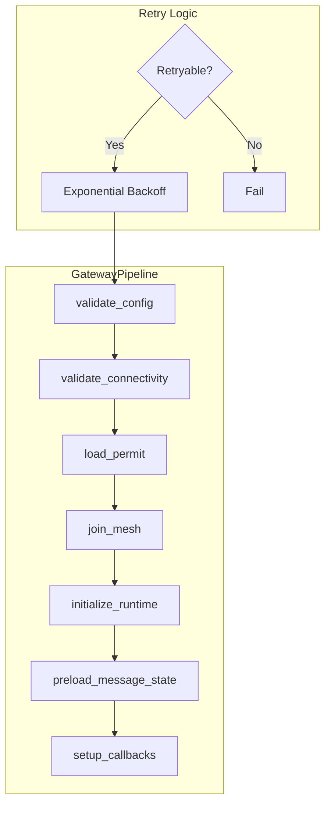

# ADR-016: Gateway Pipeline Architecture

## Status

Accepted

## Date

2026-02-25

## Context

The ZTM Chat plugin's gateway (account initialization) involves multiple sequential steps:
1. Validate configuration
2. Validate agent connectivity
3. Load or request permit
4. Join mesh network
5. Initialize runtime
6. Preload message state
7. Setup callbacks

Each step may fail and needs configurable retry behavior. The system must:
- Track step execution status
- Support retry policies per step
- Provide cleanup on shutdown

### Current Implementation Evidence

- `src/channel/gateway-pipeline.ts` - Core pipeline implementation
- `src/channel/gateway-pipeline.types.ts` - Type definitions
- `src/channel/gateway-steps.ts` - Individual step implementations
- `src/channel/gateway-retry.ts` - Retry policy definitions

## Decision

Implement a **stepped pipeline pattern with exponential backoff**:



### Core Pipeline Implementation

```typescript
// gateway-pipeline.ts - Pipeline orchestrator
export class GatewayPipeline {
  async execute(): Promise<CleanupFn> {
    for (const step of this.steps) {
      await this.executeStep(step);
    }
    return this.createCleanupFunction();
  }

  private async executeStep(step: PipelineStep): Promise<void> {
    const { maxAttempts, initialDelayMs, maxDelayMs, backoffMultiplier, isRetryable } =
      step.retryPolicy;
    let lastError: Error | undefined;
    let delay = initialDelayMs;

    for (let attempt = 1; attempt <= maxAttempts; attempt++) {
      try {
        await step.execute(this.ctx);
        return;
      } catch (error) {
        lastError = error as Error;
        if (!isRetryable(lastError) || attempt === maxAttempts) {
          throw new Error(`Step ${step.name} failed: ${lastError.message}`);
        }
        await this.sleep(delay);
        delay = Math.min(delay * backoffMultiplier, maxDelayMs);
      }
    }
  }
}
```

### Step Definition Pattern

```typescript
// gateway-pipeline.types.ts
export interface PipelineStep {
  name: string;
  execute: (ctx: StepContext) => Promise<void>;
  retryPolicy: RetryPolicy;
}

export interface RetryPolicy {
  maxAttempts: number;
  initialDelayMs: number;
  maxDelayMs: number;
  backoffMultiplier: number;
  isRetryable: (error: Error) => boolean;
}
```

### Default Retry Policy

```typescript
// gateway-retry.ts
export const DEFAULT_RETRY_POLICY: RetryPolicy = {
  maxAttempts: 3,
  initialDelayMs: 1000,
  maxDelayMs: 10000,
  backoffMultiplier: 2,
  isRetryable: (error: Error) => {
    // Retry on network errors, timeouts
    // Don't retry on config errors, auth failures
    return isNetworkError(error) || isTimeoutError(error);
  },
};
```

## Alternatives Considered

| Alternative | Pros | Cons | Why Not Chosen |
|-------------|------|------|----------------|
| **Async Queue** | Parallel execution | Complex ordering | Steps have dependencies |
| **State Machine** | Formal transitions | Overkill | Simple sequential is enough |
| **Pipeline with Retry (chosen)** | Clear, testable, flexible | Linear flow | Best fit for sequential steps |

## Key Trade-offs

- **Retry per step** vs global retry: Per-step allows fine-grained control
- **Exponential backoff** vs fixed delay: Prevents thundering herd
- **Sync cleanup** vs async: Async is more robust but requires careful ordering

## Related Decisions

- **ADR-004**: Result Type + Errors - Error categorization for retry decisions
- **ADR-011**: Dual-Timer Persistence - Timer cleanup in pipeline shutdown

## Consequences

### Positive

- **Clear failure isolation**: Each step reports its own failures
- **Configurable resilience**: Different retry policies per step
- **Graceful shutdown**: Cleanup function releases all resources
- **Testability**: Each step can be tested independently

### Negative

- **Sequential execution**: No parallelization of independent steps
- **Debugging complexity**: Failed retry requires understanding backoff
- **State tracking**: Pipeline state must survive partial failures

## References

- `src/channel/gateway-pipeline.ts` - Full pipeline implementation
- `src/channel/gateway-pipeline.types.ts` - Type definitions
- `src/channel/gateway-steps.ts` - Step implementations
- `src/channel/gateway-retry.ts` - Retry policies
