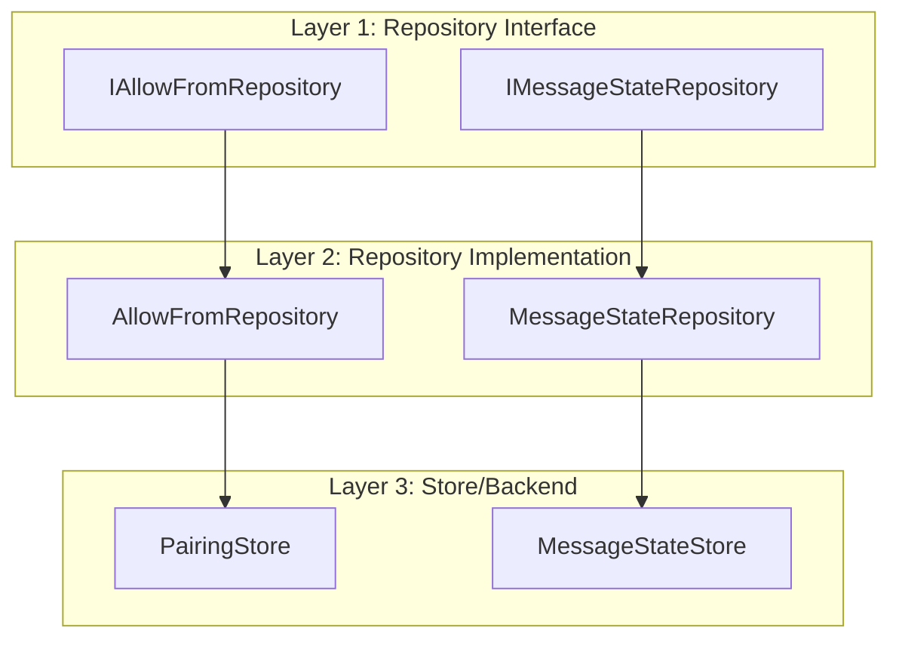

# ADR-017: Repository & Persistence Layer

## Status

Accepted

## Date

2026-02-25

## Context

The ZTM Chat plugin requires persistent storage for:
- **Message watermarks**: Track processed messages to prevent duplicates
- **Pairing approvals**: Store which users are allowed to message the bot
- **Permit data**: Cache authentication tokens
- **Runtime state**: Account status, connectivity info

The system must ensure:
- Data persists across restarts
- Each account's data is isolated
- Sync and async operations are supported
- Memory is managed efficiently

### Current Implementation Evidence

- `src/runtime/repository.ts` - Repository interfaces
- `src/runtime/repository-impl.ts` - Repository implementations
- `src/runtime/store.ts` - MessageStateStore with file persistence
- `src/runtime/persistence.integration.test.ts` - Persistence tests
- **Note:** Pairing state is now managed by OpenClaw's pairing store (delegated)

## Decision

Implement a **three-layer persistence architecture**:



### Repository Interface Pattern

```typescript
// repository.ts - Abstract repository interfaces
export interface IAllowFromRepository {
  getAllowFrom(accountId: string, runtime: PluginRuntime): Promise<string[] | null>;
  clearCache(accountId: string): void;
}

export interface IMessageStateRepository {
  getWatermark(accountId: string, key: string): number;
  setWatermark(accountId: string, key: string, time: number): void;
  flush(): void;
}
```

### Message State Store Implementation

```typescript
// store.ts - File-backed message state store
export class MessageStateStore {
  private watermarks: Map<string, number> = new Map();
  private filePath: string;

  constructor(filePath: string) {
    this.filePath = filePath;
    this.loadFromFile();
  }

  private loadFromFile(): void {
    try {
      if (fs.existsSync(this.filePath)) {
        const data = JSON.parse(fs.readFileSync(this.filePath, 'utf-8'));
        this.watermarks = new Map(Object.entries(data.watermarks || {}));
      }
    } catch (error) {
      logger.warn(`Failed to load watermark file: ${error}`);
    }
  }

  async flushAsync(): Promise<void> {
    const data = JSON.stringify({ watermarks: Object.fromEntries(this.watermarks) });
    await fs.promises.writeFile(this.filePath, data, 'utf-8');
  }
}
```

### Account-Scoped Access

```typescript
// store.ts - Per-account store management
const accountStores = new Map<string, MessageStateStore>();

export function getAccountMessageStateStore(accountId: string): MessageStateStore {
  if (!accountStores.has(accountId)) {
    const filePath = getStateFilePath(accountId);
    accountStores.set(accountId, new MessageStateStore(filePath));
  }
  return accountStores.get(accountId)!;
}
```

## Alternatives Considered

| Alternative | Pros | Cons | Why Not Chosen |
|-------------|------|------|----------------|
| **Database (SQLite)** | Queryable, ACID | External dependency | Overkill for key-value needs |
| **In-Memory Only** | Fast, simple | No persistence | Restart loses all state |
| **File-based Stores (chosen)** | No deps, portable, testable | Slower than memory | Best balance |

## Key Trade-offs

- **Sync vs async flush**: Async prevents blocking but adds complexity
- **Lazy loading**: Saves memory but first access is slower
- **In-memory caching**: Fast reads but requires sync with disk

## Related Decisions

- **ADR-003**: Watermark LRU Cache - In-memory cache layer
- **ADR-014**: Multi-Account Isolation - Account-scoped file paths

## Consequences

### Positive

- **No external dependencies**: File-based storage requires no DB
- **Testability**: Easy to mock stores for unit tests
- **Portability**: Data is human-readable JSON
- **Account isolation**: Files are scoped by account ID

### Negative

- **File I/O overhead**: Disk operations are slower than memory
- **Concurrency**: File locking required for multi-process
- **Migration**: Schema changes require migration logic

## References

- `src/runtime/repository.ts` - Repository interfaces
- `src/runtime/repository-impl.ts` - Implementations
- `src/runtime/store.ts` - MessageStateStore
- **Note:** Pairing state is now managed by OpenClaw's pairing store
