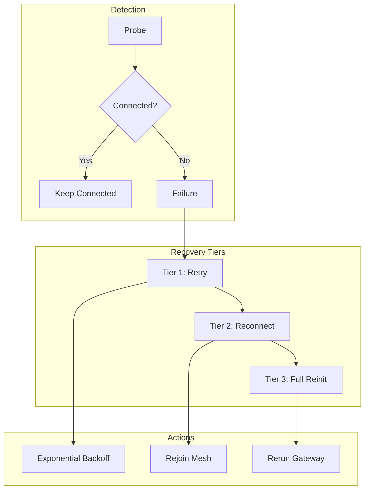

# ADR-018: Connectivity Recovery Strategy

## Status

Accepted

## Date

2026-02-25

## Context

The ZTM Chat plugin operates in a distributed network environment where network interruptions are inevitable. The system must handle:
- **Agent connectivity loss**: ZTM Agent becomes unreachable
- **Mesh disconnection**: Bot is disconnected from the mesh network
- **Permit expiration**: Authentication tokens expire
- **Network flakiness**: Temporary network issues

The system must:
- Detect connectivity issues promptly
- Attempt automatic recovery
- Maintain message integrity during recovery
- Provide observability into connection state

### Current Implementation Evidence

- `src/connectivity/mesh.ts` - Mesh connectivity operations
- `src/connectivity/recovery-real.integration.test.ts` - Recovery tests
- `src/e2e/network-resilience.e2e.test.ts` - Network resilience tests
- `src/channel/connectivity-manager.ts` - Connectivity validation

## Decision

Implement a **three-tier connectivity recovery strategy**:



### 1. Probe-Based Health Check

```typescript
// connectivity-manager.ts - Account probing
export async function probeAccount({
  config,
  _timeoutMs = PROBE_TIMEOUT_MS,
}: {
  config: ZTMChatConfig;
  _timeoutMs?: number;
}): Promise<{
  ok: boolean;
  error: string | null;
  meshConnected: boolean;
  meshInfo?: ZTMMeshInfo;
}> {
  const apiClient = createZTMApiClient(config);
  const meshResult = await apiClient.getMeshInfo();

  if (!meshResult.ok || !meshResult.value) {
    return {
      ok: false,
      error: meshResult.error?.message ?? 'Unknown error',
      meshConnected: false,
    };
  }

  return {
    ok: true,
    error: null,
    meshConnected: meshResult.value.connected,
    meshInfo: meshResult.value,
  };
}
```

### 2. Mesh Reconnection

```typescript
// mesh.ts - Join mesh with permit
export async function joinMesh(
  agentUrl: string,
  meshName: string,
  endpointName: string,
  permitData: PermitData
): Promise<boolean> {
  try {
    const response = await fetch(`${agentUrl}/api/mesh/join`, {
      method: 'POST',
      headers: {
        'Content-Type': 'application/json',
      },
      body: JSON.stringify({
        mesh: meshName,
        endpoint: endpointName,
        permit: permitData.token,
      }),
    });

    return response.ok;
  } catch (error) {
    logger.error(`Failed to join mesh: ${error}`);
    return false;
  }
}
```

### 3. Gateway Reinitialization

```typescript
// gateway.ts - Full gateway restart
export async function restartGateway(accountId: string): Promise<void> {
  // 1. Stop current runtime
  await stopRuntime(accountId);

  // 2. Clear state
  clearAccountState(accountId);

  // 3. Re-run gateway pipeline
  await runGatewayPipeline(accountId);
}
```

## Alternatives Considered

| Alternative | Pros | Cons | Why Not Chosen |
|-------------|------|------|----------------|
| **Passive (no recovery)** | Simple | Poor UX | Users expect auto-recovery |
| **Aggressive (instant restart)** | Fast recovery | Resource intensive | May worsen network issues |
| **Probe + Graduated (chosen)** | Balanced, observable | More code | Best user experience |

## Key Trade-offs

- **Probe frequency**: Frequent probes detect issues faster but increase load
- **Retry limits**: More retries = better recovery but longer failures
- **Reinit cost**: Full reinit is thorough but expensive

## Related Decisions

- **ADR-016**: Gateway Pipeline - Pipeline supports re-execution
- **ADR-008**: Auth Error Non-Retry - Auth failures need re-auth, not retry

## Consequences

### Positive

- **Resilience**: System recovers from common network issues
- **Observability**: Probes provide connection status visibility
- **Graceful degradation**: Multiple recovery tiers handle different scenarios

### Negative

- **Complexity**: Multiple code paths for different failure modes
- **Latency**: Recovery takes time, messages may be delayed
- **State consistency**: Recovery may cause temporary message duplication

## References

- `src/connectivity/mesh.ts` - Mesh connectivity
- `src/connectivity/recovery-real.integration.test.ts` - Recovery tests
- `src/channel/connectivity-manager.ts` - Account probing
- `src/channel/gateway.ts` - Gateway lifecycle
