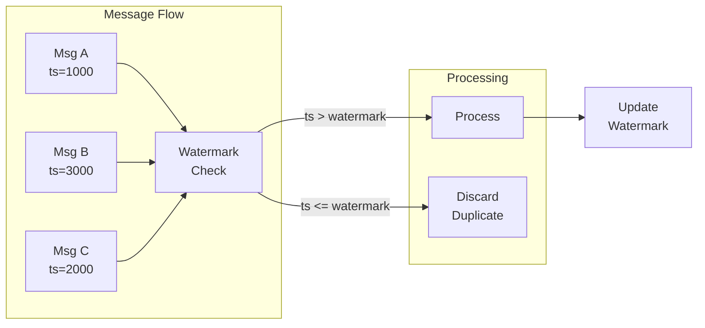

# ADR-019: Message Ordering & Sequencing

## Status

## Date

2026-02-25

## Context

ZTM is a peer-to-peer network where messages may arrive out of order due to:
- Network latency variations
- Multiple message sources (Watch API + error recovery)
- Concurrent message processing
- Distributed network topology

The system must ensure:
- Messages are processed in timestamp order
- Duplicate messages are detected and filtered
- No messages are lost during reordering
- Processing performance is maintained

### Current Implementation Evidence

- `src/messaging/ordering.test.ts` - Ordering tests
- `src/messaging/message-ordering.test.ts` - Additional ordering tests
- `src/messaging/processor.ts` - Watermark-based deduplication
- `src/messaging/concurrent-handling.test.ts` - Concurrent handling tests

## Decision

Implement a **watermark-based message ordering strategy**:



### Watermark-Based Deduplication

```typescript
// processor.ts - Watermark check
export async function processIncomingMessage(
  message: ZTMChatMessage,
  accountId: string,
  ctx: MessagingContext
): Promise<ProcessResult> {
  const stateStore = getAccountMessageStateStore(accountId);
  const key = getMessageKey(message);

  // Get current watermark for this sender
  const watermark = stateStore.getWatermark(accountId, key);

  // Skip if message is older than watermark (duplicate)
  if (message.timestamp <= watermark) {
    return { processed: false, reason: 'duplicate', messageId: message.id };
  }

  // Process the message
  await processMessage(message, accountId, ctx);

  // Update watermark to message timestamp
  stateStore.setWatermark(accountId, key, message.timestamp);
  await stateStore.flushAsync();

  return { processed: true, messageId: message.id };
}
```

### Per-Sender Watermark Keys

```typescript
// message-processor-helpers.ts
export function getMessageKey(message: ZTMChatMessage): string {
  if (message.type === 'group') {
    // Group messages: key = group ID
    return `group:${message.groupId}`;
  } else {
    // DM messages: key = peer ID
    return `peer:${message.peerId}`;
  }
}
```

## Alternatives Considered

| Alternative | Pros | Cons | Why Not Chosen |
|-------------|------|------|----------------|
| **Sequence Numbers** | Exact ordering | Requires server support | ZTM doesn't provide |
| **Buffer & Sort** | Perfect ordering | Memory overhead, latency | Too expensive |
| **Watermark (chosen)** | Simple, memory-efficient | Approximate ordering | Best for P2P networks |

## Key Trade-offs

- **Per-sender keys** vs global watermark: Per-sender prevents blocking across senders
- **Timestamp precision**: Millisecond precision handles most cases
- **Async flush** vs sync: Async improves throughput but risks losing recent updates on crash

## Related Decisions

- **ADR-003**: Watermark LRU Cache - Caching layer for watermarks
- **ADR-010**: Five-Layer Pipeline - Deduplication in processing layer

## Consequences

### Positive

- **Memory efficient**: Only stores latest watermark per sender
- **Fast processing**: O(1) watermark lookup
- **Simple implementation**: No buffering or sorting complexity

### Negative

- **Approximate ordering**: Only prevents backwards processing, not perfect ordering
- **Clock dependency**: Relies on sender timestamps being reasonable
- **Gap handling**: Lost messages between watermarks are not recovered

## References

- `src/messaging/processor.ts` - Message processing with watermarks
- `src/messaging/message-processor-helpers.ts` - Key generation
- `src/runtime/store.ts` - MessageStateStore for watermark persistence
- `src/messaging/ordering.test.ts` - Ordering tests
