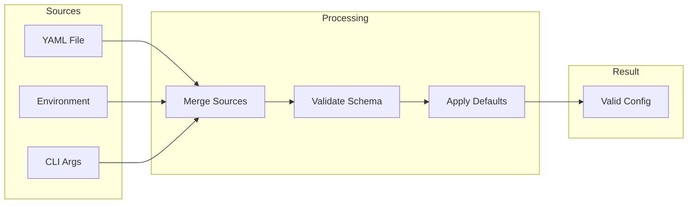

# ADR-020: Configuration Schema & Validation

## Status

Accepted

## Date

2026-02-25

## Context

The ZTM Chat plugin requires configuration for:
- **Connection**: Agent URL, mesh name, username
- **Security**: DM policy, group policy, allowlist
- **Behavior**: Polling intervals, timeouts, feature flags

Configuration comes from multiple sources:
- `openclaw.yaml` file
- Environment variables
- CLI arguments

The system must:
- Validate configuration at load time
- Provide sensible defaults
- Support configuration updates
- Prevent invalid states

### Current Implementation Evidence

- `src/config/schema.ts` - TypeBox schema definitions
- `src/config/validation.ts` - Validation logic
- `src/config/defaults.ts` - Default values
- `src/config/validation.test.ts` - Validation tests

## Decision

Implement a **schema-driven configuration pattern**:



### TypeBox Schema Definition

```typescript
// schema.ts - Configuration schema with TypeBox
import { Type, TypeObject, TypeString, TypeUnion, TypeBoolean } from '@sinclair/typebox';

export const ZTMChatConfigSchema = TypeObject({
  // Connection
  agentUrl: TypeString({ format: 'uri' }),
  meshName: TypeString({ minLength: 1, maxLength: 100 }),
  username: TypeString({ minLength: 1, maxLength: 50 }),

  // Authentication
  permitSource: TypeUnion([
    Type.Literal('server'),
    Type.Literal('file'),
  ]),
  permitUrl: TypeString({ format: 'uri' }),
  permitFilePath: TypeString({ minLength: 1 }),

  // Security
  dmPolicy: TypeUnion([
    Type.Literal('pairing'),
    Type.Literal('allow'),
    Type.Literal('deny'),
  ]),
  allowFrom: Type.Optional(Type.Array(TypeString())),
  groupPolicy: TypeUnion([
    Type.Literal('allowlist'),
    Type.Literal('open'),
    Type.Literal('disabled'),
  ]),
  requireMention: TypeBoolean(),

  // Behavior
  enableGroups: TypeBoolean(),
});
```

### Validation with Error Aggregation

```typescript
// validation.ts - Comprehensive validation
export function validateConfig(config: unknown): ValidationResult {
  const errors: ValidationError[] = [];

  // 1. Type validation
  const typeResult = TypeBox.Validate(ZTMChatConfigSchema, config);
  if (!typeResult.success) {
    errors.push(...typeResult.errors.map(e => ({
      path: e.path,
      message: e.message,
    })));
  }

  // 2. Semantic validation
  const typedConfig = config as ZTMChatConfig;

  if (typedConfig.permitSource === 'file' && !typedConfig.permitFilePath) {
    errors.push({ path: 'permitFilePath', message: 'Required when permitSource is file' });
  }

  if (typedConfig.permitSource === 'server' && !typedConfig.permitUrl) {
    errors.push({ path: 'permitUrl', message: 'Required when permitSource is server' });
  }

  if (typedConfig.dmPolicy === 'deny' && !typedConfig.allowFrom?.length) {
    errors.push({ path: 'allowFrom', message: 'Required when dmPolicy is deny' });
  }

  return {
    valid: errors.length === 0,
    errors,
  };
}
```

### Default Value Application

```typescript
// defaults.ts - Sensible defaults
export const DEFAULT_CONFIG = {
  permitSource: 'server' as const,
  permitUrl: 'https://clawparty.flomesh.io:7779/permit',
  meshName: 'openclaw-mesh',
  dmPolicy: 'pairing' as const,
  groupPolicy: 'allowlist' as const,
  requireMention: true,
  enableGroups: false,
};

export function applyDefaults(config: Partial<ZTMChatConfig>): ZTMChatConfig {
  return {
    ...DEFAULT_CONFIG,
    ...config,
  };
}
```

## Alternatives Considered

| Alternative | Pros | Cons | Why Not Chosen |
|-------------|------|------|----------------|
| **Zod** | TypeScript inference | Another dependency | TypeBox is lighter |
| **io-ts** | Powerful | Complex API | Overkill for our needs |
| **TypeBox (chosen)** | Built-in validation, JSON Schema | Less flexible | Best fit, already used |
| **Manual validation** | Full control | Error-prone, verbose | Not maintainable |

## Key Trade-offs

- **Schema vs runtime**: Schema catches type errors, runtime catches semantic errors
- **Fail-fast vs collect-all**: Collect-all provides better error messages
- **Strict vs lenient**: Lenient allows partial configs but may cause runtime issues

## Related Decisions

- **ADR-005**: Type Safety Patterns - TypeBox for compile-time safety
- **ADR-013**: Functional Policy Engine - Policy config validation

## Consequences

### Positive

- **Early failure**: Invalid config fails at load time, not runtime
- **Clear errors**: Path-based error messages point to exact issues
- **Self-documenting**: Schema serves as documentation
- **Default handling**: Sensible defaults reduce user configuration

### Negative

- **Schema maintenance**: Changes require updating schema
- **Validation overhead**: Startup time includes validation
- **Error complexity**: Complex nested configs have many potential errors

## References

- `src/config/schema.ts` - TypeBox schemas
- `src/config/validation.ts` - Validation logic
- `src/config/defaults.ts` - Default values
- `src/config/validation.test.ts` - Comprehensive tests
