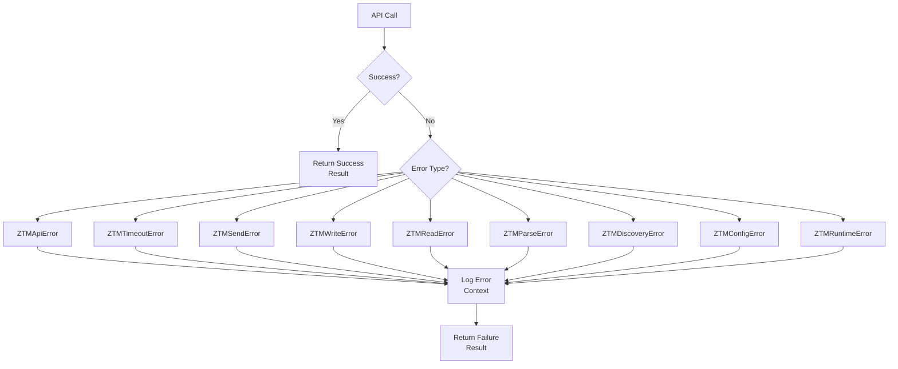

# Error Code Reference

This document provides a complete listing of all error codes in the ZTM Chat Plugin, including their meanings, causes, and solutions.

## Error Code Overview

| Error Class | Error Code | Description | Severity |
|-------------|------------|-------------|----------|
| ZTMApiError | API_001 | API Communication Failed | High |
| ZTMTimeoutError | API_002 | API Request Timeout | Medium |
| ZTMSendError | MSG_001 | Message Send Failed | High |
| ZTMWriteError | MSG_002 | Message Write Failed | High |
| ZTMReadError | MSG_003 | Message Read Failed | Medium |
| ZTMParseError | MSG_004 | Message Parse Failed | Medium |
| ZTMDiscoveryError | DISC_001 | User/Peer Discovery Failed | Low |
| ZTMConfigError | CFG_001 | Configuration Invalid | High |
| ZTMRuntimeError | RT_001 | Runtime Not Initialized | High |

## Error Flow Diagram



## Detailed Error Descriptions

### API_001: ZTMApiError

**Description:** ZTM Agent API communication failed

**Common Causes:**
- ZTM Agent service is not running
- Network connection issues
- Incorrect API path
- Server internal error

**Context Properties:**
```typescript
{
  method: string;        // HTTP method (GET, POST, etc.)
  path: string;         // API path
  statusCode?: number;  // HTTP status code
  statusText?: string;  // HTTP status text
  attemptedAt: string;  // Attempt time (ISO)
}
```

**Example Error Message:**
```
ZTM API error: POST /api/meshes/test-mesh/apps/ztm/chat/api/peers/alice/messages - 500 Internal Server Error
```

**Troubleshooting Steps:**
1. Verify ZTM Agent service is running
2. Check `agentUrl` configuration is correct
3. Check ZTM Agent logs for details
4. Verify network connectivity

---

### API_002: ZTMTimeoutError

**Description:** API request timed out

**Common Causes:**
- ZTM Agent response is slow
- High network latency
- Request load is too high

**Context Properties:**
```typescript
{
  method: string;     // HTTP method
  path: string;      // API path
  timeoutMs: number; // Timeout in milliseconds
  attemptedAt: string;
}
```

**Example Error Message:**
```
ZTM API timeout: GET /api/meshes exceeded 30000ms
```

**Troubleshooting Steps:**
1. Check ZTM Agent performance
2. Increase `apiTimeout` configuration value
3. Check network conditions

---

### MSG_001: ZTMSendError

**Description:** Message send failed

**Common Causes:**
- Peer does not exist or is unreachable
- Message content is invalid
- Insufficient permissions
- Network issues

**Context Properties:**
```typescript
{
  peer: string;             // Target username
  messageTime: number;      // Message timestamp
  contentPreview?: string;   // Message content preview
  attemptedAt: string;
}
```

**Example Error Message:**
```
Failed to send message to alice at 1771574980794: ZTM API error: ...
```

**Troubleshooting Steps:**
1. Verify target user exists in Mesh
2. Check `discoverUsers()` return list
3. Verify DM policy configuration

---

### MSG_002: ZTMWriteError

**Description:** Message file write failed

**Common Causes:**
- Disk space is full
- File permission issues
- Storage path does not exist

**Context Properties:**
```typescript
{
  peer: string;       // Target username
  messageTime: number;
  filePath: string;   // Failed file path
  attemptedAt: string;
}
```

**Troubleshooting Steps:**
1. Check `messagePath` configuration
2. Verify sufficient disk space
3. Check filesystem permissions

---

### MSG_003: ZTMReadError

**Description:** Message read failed

**Common Causes:**
- Message file does not exist
- File permission issues
- Storage path configuration incorrect

**Context Properties:**
```typescript
{
  peer: string;              // Source username
  operation: 'read' | 'list' | 'parse';
  filePath?: string;         // File path
  attemptedAt: string;
}
```

**Troubleshooting Steps:**
1. Check `messagePath` configuration
2. Verify message file exists
3. Verify file permissions

---

### MSG_004: ZTMParseError

**Description:** Message file parse failed

**Common Causes:**
- Message file is corrupted
- File content is incomplete
- Encoding issues

**Context Properties:**
```typescript
{
  peer: string;
  filePath: string;
  parseDetails?: string; // Parse details
  attemptedAt: string;
}
```

**Troubleshooting Steps:**
1. Check message file integrity
2. Verify file format is valid JSON
3. Check ZTM Agent logs

---

### DISC_001: ZTMDiscoveryError

**Description:** User/Peer discovery failed

**Common Causes:**
- Mesh connection issues
- Storage access issues
- User list is empty

**Context Properties:**
```typescript
{
  operation: 'discoverUsers' | 'discoverPeers' | 'scanStorage';
  source?: string;
  attemptedAt: string;
}
```

**Troubleshooting Steps:**
1. Verify Mesh is connected (`getMeshInfo()`)
2. Check Mesh status
3. Verify storage path is accessible

---

### CFG_001: ZTMConfigError

**Description:** Configuration invalid

**Common Causes:**
- Required field is missing
- Field type is incorrect
- Value is out of allowed range

**Context Properties:**
```typescript
{
  field: string;     // Invalid field name
  value?: unknown;    // Field value
  reason: string;   // Failure reason
}
```

**Example Error Message:**
```
Invalid ZTM configuration for agentUrl: must be a valid URL (got: invalid-url)
```

**Common Configuration Errors:**

| Field | Error Reason | Correct Format |
|-------|--------------|----------------|
| `agentUrl` | Not a valid URL | `http://localhost:3000` |
| `dmPolicy` | Not a valid value | `allow` \| `deny` \| `pairing` |
| `apiTimeout` | Less than 1000 | `>= 1000` |

---

### RT_001: ZTMRuntimeError

**Description:** Runtime not initialized

**Common Causes:**
- Calling API before account starts
- Runtime was unexpectedly reset

**Context Properties:**
```typescript
{
  operation: string;  // Failed operation
  reason: string;      // Failure reason
}
```

**Troubleshooting Steps:**
1. Verify account started correctly
2. Check `startAccountGateway()` was called successfully
3. Verify account status

---

## HTTP Status Code Mapping

Status codes in ZTMApiError:

| Status Code | Meaning | Common Cause |
|-------------|---------|--------------|
| 400 | Bad Request | Invalid request parameters |
| 401 | Unauthorized | Authentication failed |
| 403 | Forbidden | Insufficient permissions |
| 404 | Not Found | Resource does not exist |
| 408 | Request Timeout | Request timeout |
| 429 | Too Many Requests | Rate limiting |
| 500 | Internal Server Error | ZTM Agent internal error |
| 502 | Bad Gateway | ZTM Agent unreachable |
| 503 | Service Unavailable | ZTM Agent temporarily unavailable |

## Error Handling Best Practices

### 1. Use Type Guards

```typescript
import { ZTMApiError, ZTMSendError, isSuccess } from './types';

const result = await client.sendPeerMessage('alice', message);

if (!isSuccess(result)) {
  if (result.error instanceof ZTMSendError) {
    // Handle send error
    console.log('Failed to send to:', result.error.context.peer);
  } else if (result.error instanceof ZTMApiError) {
    // Handle API error
    console.log('API Error:', result.error.context.statusCode);
  }
}
```

### 2. Extract Context Information

```typescript
function logError(result: Result<unknown, ZTMError>) {
  if (!isSuccess(result)) {
    const { context, message } = result.error;
    console.error('Error:', message);
    console.error('Context:', JSON.stringify(context, null, 2));
  }
}
```

### 3. Retry Strategy

```typescript
async function withRetry<T>(
  fn: () => Promise<Result<T, ZTMError>>,
  maxRetries = 3
): Promise<Result<T, ZTMError>> {
  for (let i = 0; i < maxRetries; i++) {
    const result = await fn();
    if (isSuccess(result)) return result;

    // Only retry on retriable errors
    if (result.error instanceof ZTMTimeoutError ||
        result.error instanceof ZTMApiError) {
      await new Promise(r => setTimeout(r, 1000 * (i + 1)));
      continue;
    }
    return result;
  }
  return result;
}
```

## Error Monitoring Recommendations

1. **Log All Errors**: Persist errors and their context to logs
2. **Monitor Error Rates**: Track frequency of each error type
3. **Set Alerts**: Configure alert thresholds for high-frequency errors
4. **Correlate Analysis**: Associate errors with user operations for reproduction
