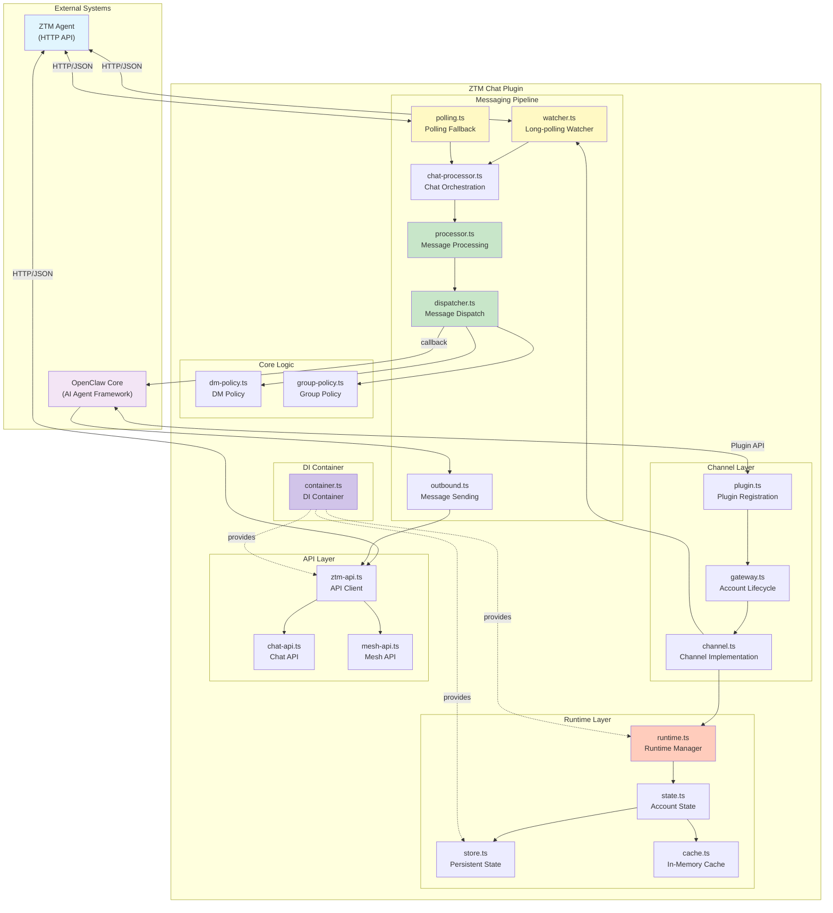
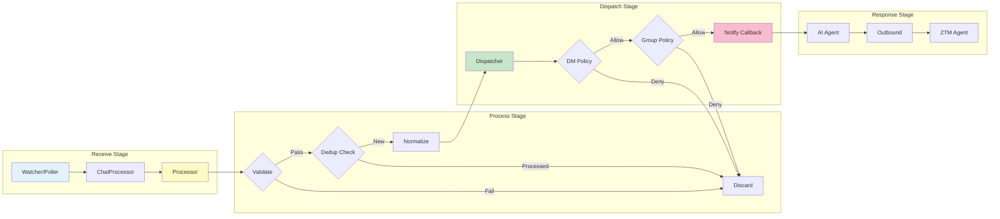
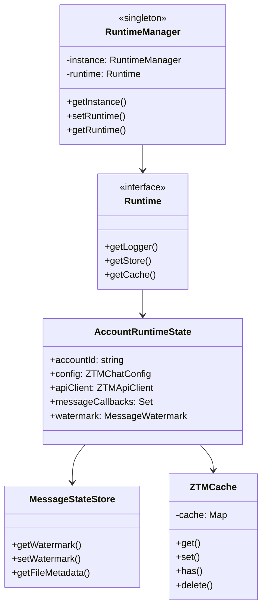
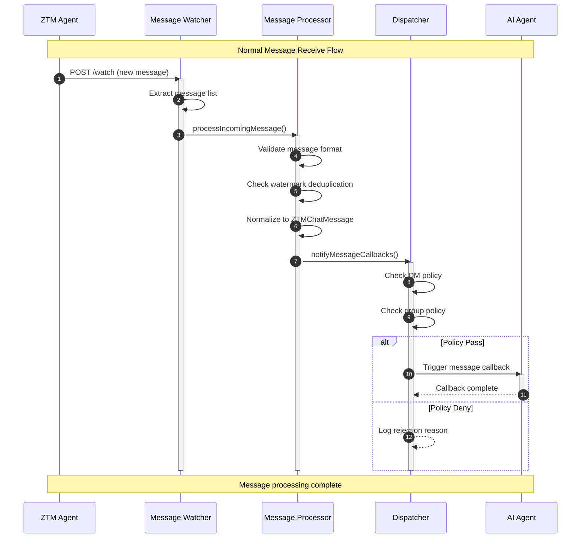
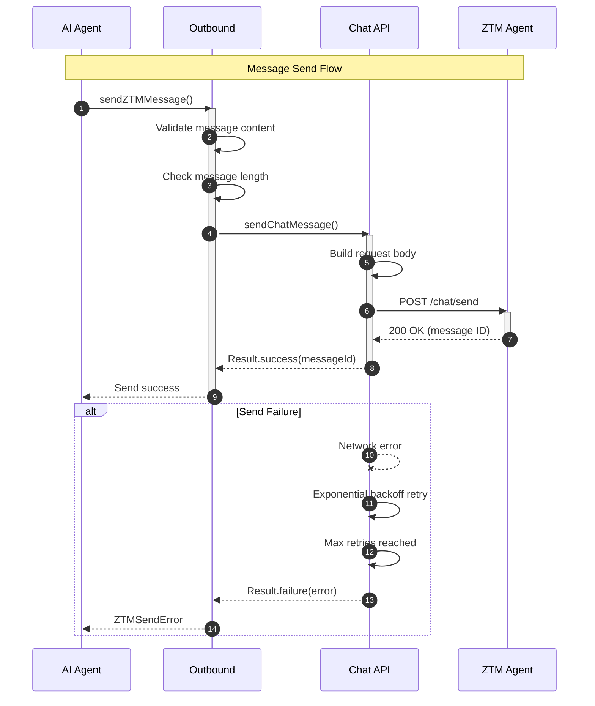
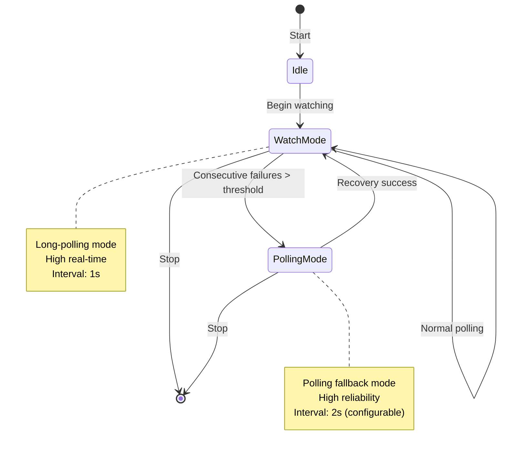
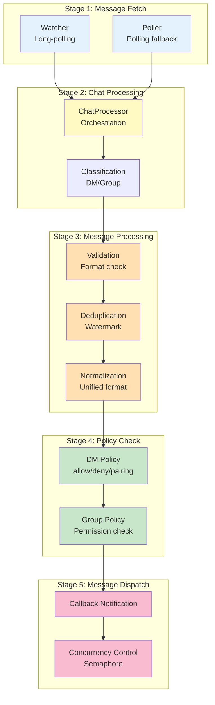
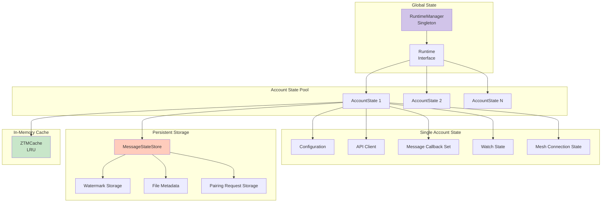
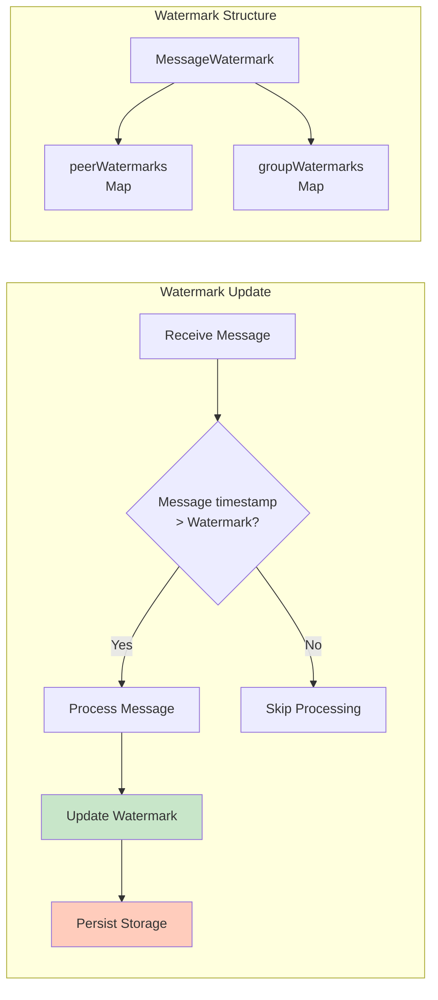
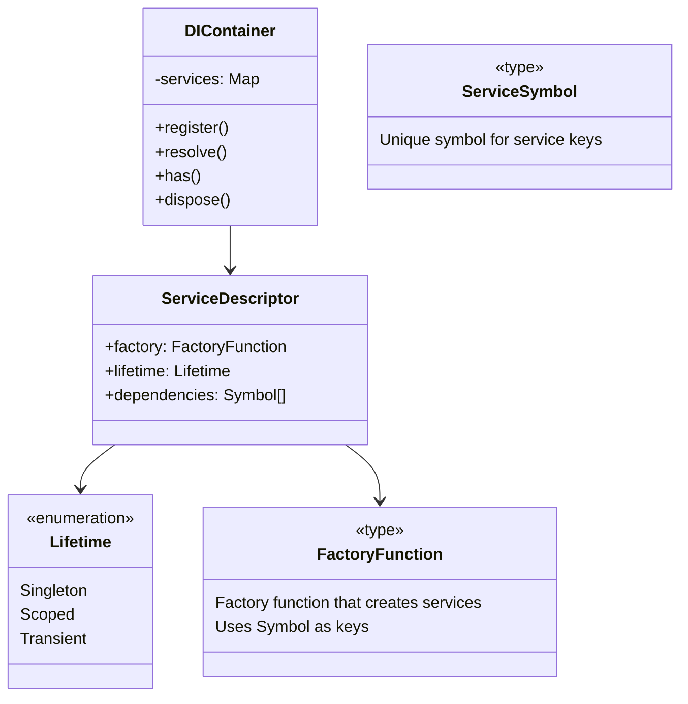

# System Architecture

This document provides a detailed explanation of the ZTM Chat Channel Plugin system architecture.

## Table of Contents

- [System Overview](#system-overview)
- [Core Components](#core-components)
- [Data Flow](#data-flow)
- [Message Processing Pipeline](#message-processing-pipeline)
- [State Management](#state-management)
- [Dependency Injection](#dependency-injection)
- [Error Handling](#error-handling)
- [Security Considerations](#security-considerations)

## System Overview



## Core Components

### 1. Channel Layer

| Component | Responsibility | Main Interfaces |
|-----------|----------------|-----------------|
| `plugin.ts` | Register plugin with OpenClaw | `registerPlugin()` |
| `gateway.ts` | Manage account lifecycle | `startAccountGateway()`, `stopAccountGateway()` |
| `channel.ts` | Implement channel interface | `onMessage()`, `sendMessage()` |
| `config.ts` | Resolve account configuration | `resolveZTMChatAccount()` |
| `state.ts` | Manage account state | `getOrCreateAccountState()` |

### 2. Messaging Pipeline



### 3. Runtime Layer



## Data Flow

### Message Receive Flow



### Message Send Flow



### Watch + Polling Mode Switching



## Message Processing Pipeline

### Processing Stages Detail



### Message Processing Helper Functions

| Function | Location | Purpose |
|----------|----------|---------|
| `classifyChatType()` | `message-processor-helpers.ts` | Classify DM/Group messages |
| `getGroupInfo()` | `message-processor-helpers.ts` | Extract group information |
| `buildMessagingContext()` | `message-processor-helpers.ts` | Build processing context |

## State Management

### State Hierarchy



### Watermark Mechanism



## Dependency Injection

### DI Container Architecture



### Service Registration Examples

| Symbol | Service | Lifetime | Dependencies |
|--------|---------|----------|--------------|
| `ZTM_RUNTIME` | `Runtime` | Singleton | - |
| `LOGGER` | `Logger` | Singleton | - |
| `STATE_STORE` | `MessageStateStore` | Scoped | `LOGGER` |
| `API_CLIENT` | `ZTMApiClient` | Scoped | `LOGGER` |
| `CACHE` | `ZTMCache` | Scoped | - |

## Error Handling

### Error Type Hierarchy


### Result Pattern

```typescript
// Success result
const success = success(data);

// Failure result
const failure = failure(new ZTMApiError("..."));

// Type guard
if (isSuccess(result)) {
  console.log(result.data);
} else {
  console.error(result.error);
}
```

## Security Considerations

### Input Validation

| Input Type | Validation Rules | Location |
|------------|------------------|----------|
| Message content | Length ≤ 10KB, no malicious scripts | `processor.ts` |
| Peer ID | Format validation, length limit | `validation.ts` |
| File paths | Path traversal check | `paths.ts` |
| Config values | Schema validation | `config/validation.ts` |

### Log Sanitization

```typescript
// Automatically redact sensitive information
sanitizeLog({
  token: "secret-123",  // → "[REDACTED]"
  message: "hello",     // → "hello"
  password: "pass123"   // → "[REDACTED]"
});
```

---

**Related Documentation:**
- [Architecture Decision Records (ADR)](adr/README.md)
- [API Reference](api/README.md)
- [Developer Quick Start](developer-quickstart.md)
