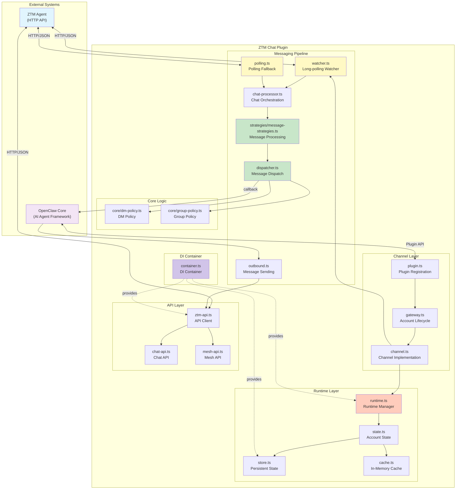
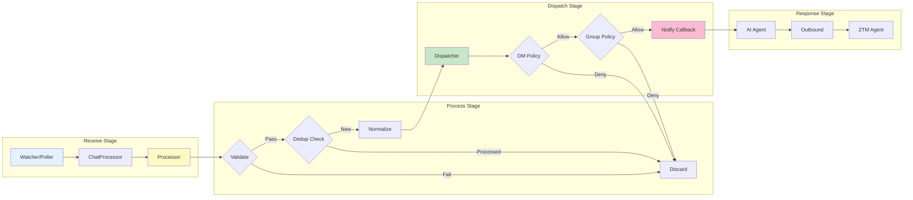
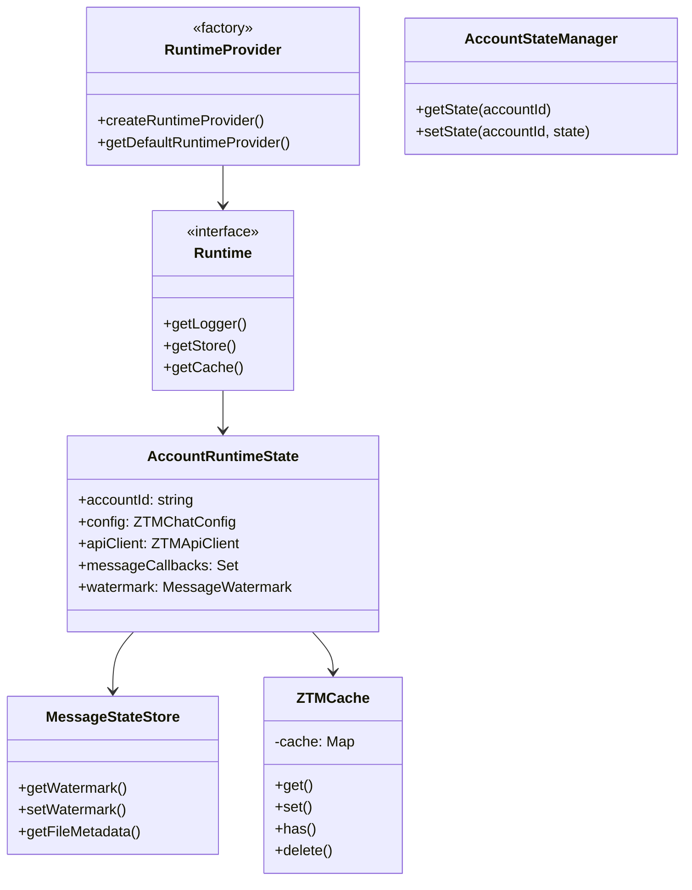
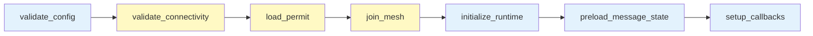
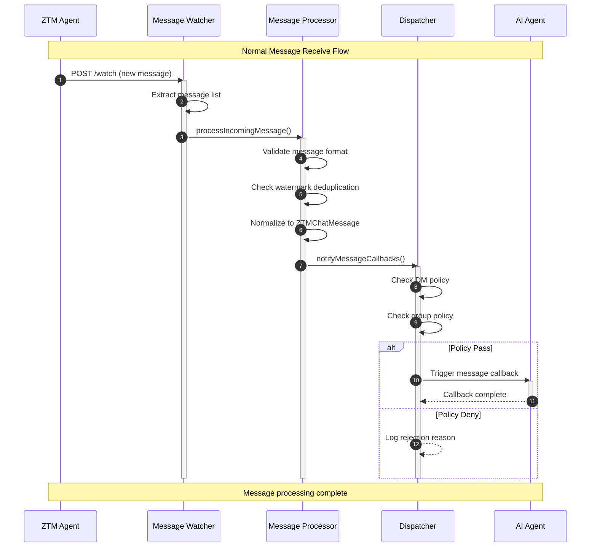
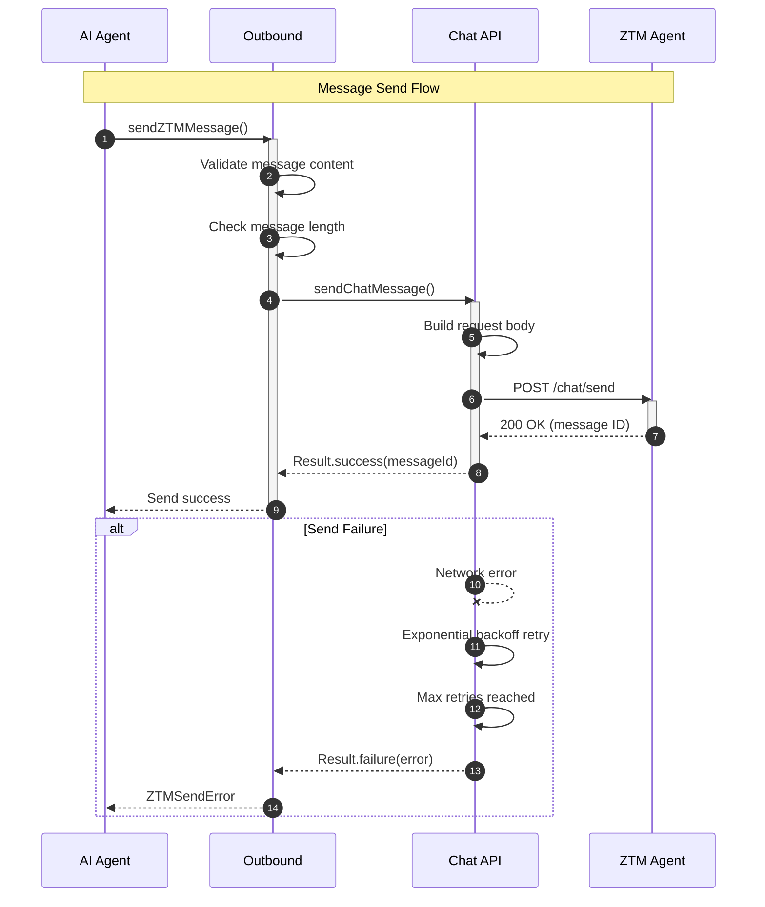
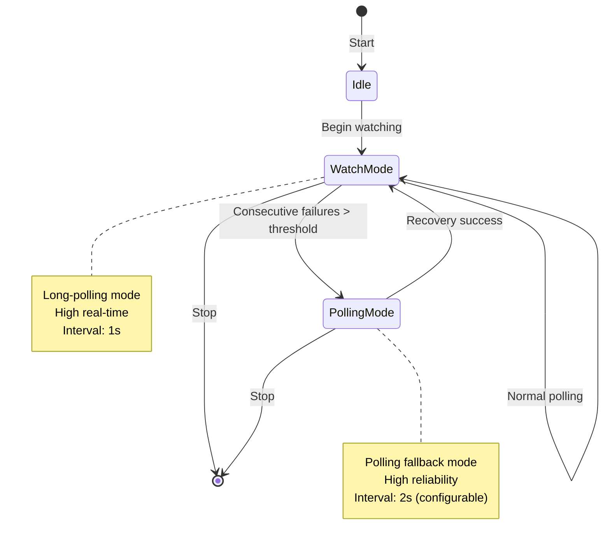
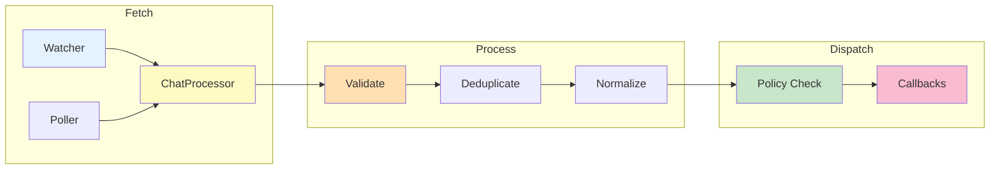
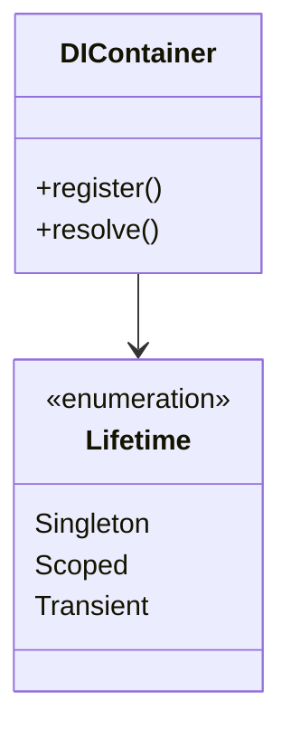
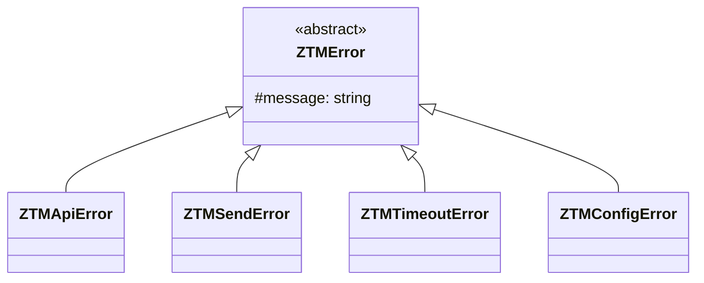

# System Architecture

This document provides a detailed explanation of the ZTM Chat Channel Plugin system architecture.

## Table of Contents

- [System Overview](#system-overview)
- [Component Layers](#component-layers)
- [Core Workflows](#core-workflows)
- [Cross-Cutting Concerns](#cross-cutting-concerns)
- [References](#references)

## System Overview

The ZTM Chat Channel Plugin is a TypeScript-based integration between OpenClaw (AI Agent Framework) and ZTM (Zero Trust Mesh) Chat, enabling decentralized P2P messaging for AI agents. The system is designed with isolation, fault tolerance, and scalability as core principles.

### Architecture Principles

| Principle | Description | Implementation |
|-----------|-------------|----------------|
| **Account Isolation** | Each account maintains completely isolated state | Separate AccountRuntimeState per account with isolated API clients, callbacks, and watermarks |
| **Fault Tolerance** | System continues operating despite partial failures | Exponential backoff retry, watch/polling fallback, graceful degradation |
| **Message Ordering** | Prevents duplicate processing across restarts | Persistent watermark tracking with atomic updates |
| **Concurrency Control** | Prevents resource exhaustion under load | Semaphore-based limiting for message processing and callbacks |
| **Progressive Enhancement** | Works across OpenClaw versions | Dual configuration format (accounts + bindings) for compatibility |

### System Architecture



### Key Design Decisions

1. **Account-Based Multi-Tenancy**: The system supports multiple ZTM accounts simultaneously, each with isolated configuration, state, and message processing pipelines. This enables a single OpenClaw instance to manage multiple bot identities across different meshes.

2. **Watch + Polling Hybrid**: The primary message reception mechanism uses ZTM's Watch API for real-time notifications. When watch errors accumulate beyond a threshold (configurable, default 5), the system automatically falls back to polling mode for reliability.

3. **Watermark-Based Deduplication**: Each message source (peer or group) maintains a watermark timestamp of the last processed message. This prevents reprocessing messages after restarts and handles ZTM's append-only message storage model.

4. **Request Coalescing for Cache**: When multiple concurrent requests need the same cached data (e.g., allowFrom list), the system coalesces them into a single fetch operation, preventing cache stampede during high traffic.

### Document Map

This architecture document provides a high-level overview. For detailed information, see:

| Topic | Detailed In |
|-------|-------------|
| **Component API** | [docs/modules/](modules/) - Per-module API documentation |
| **Architecture Decisions** | [docs/adr/](adr/) - 24 ADRs covering key design choices |
| **Configuration** | [docs/configuration/reference.md](configuration/reference.md) |
| **Security** | [docs/security/overview.md](security/overview.md) |
| **Testing** | [docs/testing/](testing/) - Test strategies and fixtures |
| **API Reference** | [docs/api/](api/) - Complete API documentation |
| **Developer Guide** | [docs/developer-quickstart.md](developer-quickstart.md) |

## Component Layers

### 1. Channel Layer

The Channel Layer serves as the entry point for OpenClaw integration, handling plugin registration and account lifecycle management.

| Component | File Location | Responsibility | Key Functions |
|-----------|---------------|----------------|---------------|
| `plugin.ts` | `src/channel/plugin.ts` | Register plugin with OpenClaw | `registerPlugin()` - Declares ztm-chat channel with account lifecycle hooks |
| `gateway.ts` | `src/channel/gateway.ts` | Manage account lifecycle | `startAccountGateway()`, `stopAccountGateway()`, `probeAccountGateway()`, `sendTextGateway()` |
| `config.ts` | `src/channel/config.ts` | Resolve account configuration | `resolveZTMChatAccount()` - Extracts config from OpenClaw config |
| `state.ts` | `src/channel/state.ts` | Manage account runtime state | `getOrCreateAccountState()`, `removeAccountState()`, `initializeRuntime()` |

**Account Lifecycle Flow**:

1. **Startup**: `startAccountGateway()` executes the Gateway Pipeline with 7 sequential steps
2. **Runtime**: Account state holds API client, callbacks, watch controllers, and mesh connection status
3. **Shutdown**: `stopAccountGateway()` clears intervals, aborts watch, and flushes state
4. **Cleanup**: `removeAccountState()` disposes all resources and removes account from memory

**Gateway Pipeline Steps** (executed in order):

| Step | Description | Retryable | Failure Impact |
|------|-------------|-----------|----------------|
| `validate_config` | Validates required fields (agentUrl, username, meshName) | No | Blocks startup - configuration error |
| `validate_connectivity` | Tests HTTP connection to ZTM Agent | Yes (3x) | Temporary - retry with backoff |
| `load_permit` | Loads permit from file or requests from server | Yes (3x) | Temporary - retry with backoff |
| `join_mesh` | Connects to ZTM mesh network | Yes (3x) | Temporary - retry with backoff |
| `initialize_runtime` | Creates API client and initializes state | No | Blocks startup - initialization failure |
| `preload_message_state` | Loads watermarks from persistent storage | No | Non-blocking - starts fresh if missing |
| `setup_callbacks` | Registers message callbacks and starts watch | No | Delays message reception - can be recovered |

### 2. Messaging Pipeline

The Messaging Pipeline handles message reception, processing, policy enforcement, and dispatch to AI agents. It uses a hybrid watch/polling mechanism for reliable message delivery.

#### Pipeline Stages



#### Component Details

| Component | File Location | Responsibility | Configuration |
|-----------|---------------|----------------|---------------|
| **Watcher** | `src/messaging/watcher.ts` | Long-poll for new messages via Watch API | 1s interval, 5 error threshold → polling fallback |
| **Poller** | `src/messaging/polling.ts` | Fallback polling when watch fails | 2s interval (configurable) |
| **Processor** | `src/messaging/strategies/message-strategies.ts` | Strategy pattern for message processing (helpers in `message-processor-helpers.ts`) | Peer/Group strategies with unified entry point |
| **Dispatcher** | `src/messaging/dispatcher.ts` | Execute callbacks with semaphore control | 10 concurrent callbacks |
| **Outbound** | `src/messaging/outbound.ts` | Send messages to peers/groups | Retry with exponential backoff |

#### Message Processing Details

**Step 1 - Validation**: Messages are validated for:
- Non-empty content (whitespace-only rejected)
- Maximum length 10KB (prevents memory exhaustion)
- Not from bot itself (self-message filtering)
- Required fields present (time, message, sender)

**Step 2 - Deduplication**: Watermark mechanism prevents reprocessing:
- Watermark key format: `peer:{username}` or `group:{creator}/{groupId}`
- Messages with timestamp ≤ watermark are skipped
- Watermark advances only forward (monotonically increasing)
- Atomic updates prevent race conditions in concurrent scenarios

**Step 3 - Normalization**: Messages are converted to `ZTMChatMessage` format:
- HTML escaping for sender and content (XSS prevention)
- Standardized ID format: `{timestamp}-{sender}`
- Consistent timestamp as Date object
- Peer and senderId fields populated

**Step 4 - Policy Enforcement**: Two-stage policy check:
1. **DM Policy** (`core/dm-policy.ts`): Controls direct message acceptance
2. **Group Policy** (`core/group-policy.ts`): Controls group message permissions

**Step 5 - Callback Dispatch**: Processed messages trigger registered callbacks:
- Semaphore controls concurrency (default: 10 permits)
- Errors are caught and logged without stopping other callbacks
- Watermark updates only if at least one callback succeeds
- Callback statistics tracked for monitoring

### 3. Runtime Layer

The Runtime Layer manages account state, persistent storage, and in-memory caching. It uses the AccountStateManager class for explicit state ownership with clear lifecycle management.



#### Runtime Components

| Component | File Location | Purpose | Key Features |
|-----------|---------------|---------|--------------|
| **AccountStateManager** | `src/runtime/state.ts` | Manages account lifecycle and state | Singleton pattern, request coalescing, periodic cleanup |
| **MessageStateStore** | `src/runtime/store.ts` | Persistent watermark storage | Debounced writes, async loading, size limits |
| **GroupPermissionLRUCache** | `src/runtime/cache.ts` | In-memory permission cache | TTL-based expiration, max size enforcement |

#### AccountRuntimeState Structure

Each account maintains a comprehensive state object:

| Field | Type | Description | Lifecycle |
|-------|------|-------------|-----------|
| `accountId` | string | Unique account identifier | Immutable |
| `config` | ZTMChatConfig | Account configuration | Set during initialization |
| `chatReader` / `chatSender` | API interfaces | ZTM API client interfaces | Created on start, cleared on stop |
| `messageCallbacks` | Set | Registered message handlers | Cleared on stop |
| `callbackSemaphore` | Semaphore | Controls callback concurrency | 10 permits, prevents overload |
| `watchInterval` | Interval | Watch loop timer | Cleared on stop |
| `watchAbortController` | AbortController | Signals watch shutdown | Created per start |
| `watchErrorCount` | number | Consecutive watch errors | Reset on success, triggers polling |
| `pendingPairings` | Map | Pending pairing approvals | Cleaned every 5 minutes |
| `allowFromCache` | Cached value | Approved users cache | 30s TTL, request coalescing |
| `groupPermissionCache` | LRU Cache | Group permissions cache | 60s TTL, max 500 entries |
| `messageRetries` | Map | Scheduled retry timers | Cleared on stop |

#### State Persistence

**Watermark Storage** (`MessageStateStore`):
- Per-account state files in JSON format
- Structure: `{ accounts: { accountId: { watermarkKey: timestamp } } }`
- Debounced writes (1s) to avoid excessive I/O
- Max delay flush (5s) to prevent data loss on crash
- Per-account semaphores for atomic updates
- Automatic cleanup when peer count exceeds 1000
- Async loading to avoid blocking event loop

**Cache Coalescing**:
When multiple concurrent requests need the same cached data:
1. First request creates fetch promise and stores it
2. Subsequent requests await the same promise
3. All requests receive the same result
4. Promise is removed after completion

This prevents "cache stampede" where cache expiration triggers many simultaneous fetch operations.

## OpenClaw Integration

The ZTM Chat plugin integrates with OpenClaw as a channel plugin, providing account lifecycle management and message routing.

### Plugin Registration

```typescript
// Register ZTM Chat channel with OpenClaw
registerPlugin({
  channel: 'ztm-chat',
  accountLifecycle: {
    start: startAccountGateway,
    stop: stopAccountGateway
  }
});
```

### Bindings Mechanism (OpenClaw 2026.2.26+)

OpenClaw 2026.2.26 introduced a bindings mechanism for routing inbound messages to different agents:

**Key Rules**:
1. Bindings without `accountId` only match the `default` account
2. Use `accountId: "*"` to match all accounts on the channel
3. Non-default accounts require corresponding bindings

**Configuration**:
```yaml
channels:
  ztm-chat:
    accounts:
      default: {...}    # For backward compatibility
      my-bot: {...}    # Named account

bindings:
  - agentId: main
    match:
      channel: ztm-chat
      accountId: my-bot
```

### Progressive Compatibility

The plugin generates configuration compatible with both old and new OpenClaw versions:

| Configuration | Purpose | Status |
|--------------|---------|--------|
| `accounts.{accountId}` | Account configuration | ✅ Generated |
| `bindings[].accountId` | Bindings mechanism | ✅ Generated |
| `accounts.default` | Legacy default account | ❌ Not generated (causes duplicate messages) |

This approach ensures:
- **No duplicate messages**: Removing `accounts.default` prevents duplicate message delivery
- **New OpenClaw support**: `bindings[].accountId` works with OpenClaw >= 2026.2.26
- **Backward compatibility**: Account config `accounts.{accountId}` works with older versions

**See also**: [ADR-024 - Bindings Migration](adr/ADR-024-ztm-chat-bindings-migration.md)

### ChannelPlugin Adapters (OpenClaw 2026.2.26+)

OpenClaw 2026.2.27 introduced adapter interfaces that extend channel plugin capabilities. The ZTM Chat plugin implements three adapters:

| Adapter | Interface | Purpose |
|---------|-----------|---------|
| **Onboarding** | `ChannelOnboardingAdapter` | Standardized onboarding flow and configuration |
| **Heartbeat** | `ChannelHeartbeatAdapter` | Connection health checking and recipient resolution |
| **AgentTools** | `ChannelAgentToolFactory` | Custom AI agent tools for ZTM status queries |

#### Onboarding Adapter

The onboarding adapter provides standardized configuration management:

```typescript
import { ztmChatOnboardingAdapter } from './channel/onboarding.js';

export const ztmChatPlugin: ChannelPlugin<ResolvedZTMChatAccount> = {
  // ... other properties
  onboarding: ztmChatOnboardingAdapter,
};
```

**Features**:
- `getStatus()` - Query current onboarding status
- `configure()` - Update channel configuration
- `dmPolicy` - DM policy getter/setter
- `disable()` - Disable channel account

#### Heartbeat Adapter

The heartbeat adapter enables connection health monitoring:

```typescript
import { ztmChatHeartbeatAdapter } from './channel/heartbeat.js';

export const ztmChatPlugin: ChannelPlugin<ResolvedZTMChatAccount> = {
  // ... other properties
  heartbeat: ztmChatHeartbeatAdapter,
};
```

**Features**:
- `checkReady()` - Verify ZTM Agent connectivity to mesh network
- `resolveRecipients()` - Resolve heartbeat notification recipients

#### Agent Tools Factory

The agent tools factory provides custom tools for AI agents:

```typescript
import { createZTMChatAgentTools } from './channel/tools.js';

export const ztmChatPlugin: ChannelPlugin<ResolvedZTMChatAccount> = {
  // ... other properties
  agentTools: createZTMChatAgentTools,
};
```

**Available Tools**:
- `ztm_status` - Get ZTM connection status
- `ztm_mesh_info` - Get detailed mesh network information
- `ztm_peers` - List all peers in the mesh

**See also**:
- [Heartbeat Adapter](channel/heartbeat.md)
- [Agent Tools](channel/tools.md)

---

## Gateway Pipeline

The Gateway Pipeline orchestrates account initialization using the Pipeline pattern with 7 sequential steps, each with configurable retry policies for fault tolerance.

### Pipeline Steps

| Step | Description | Retryable | Purpose |
|------|-------------|-----------|---------|
| `validate_config` | Validates required fields | No | Configuration validation |
| `validate_connectivity` | Tests HTTP connection to ZTM Agent | Yes | Network connectivity |
| `load_permit` | Loads permit from file or server | Yes | Mesh authentication |
| `join_mesh` | Connects to ZTM mesh network | Yes | P2P messaging setup |
| `initialize_runtime` | Creates API client and state | No | Runtime initialization |
| `preload_message_state` | Loads persisted watermarks | No | Message deduplication |
| `setup_callbacks` | Registers callbacks and starts watch | No | Message reception |

### Pipeline Flow



### Retry Policies

| Policy | Use Case | Max Attempts | Backoff |
|--------|----------|--------------|---------|
| **NO_RETRY** | Configuration validation | 1 | N/A |
| **NETWORK** | Network operations | 3 | Exponential (2x) |
| **API** | API calls | 2 | Linear (1x) |
| **WATCHER** | Watch setup | 2 | Linear (1x) |

**See also**: [ADR-016 - Gateway Pipeline Architecture](adr/ADR-016-gateway-pipeline-architecture.md) for detailed implementation.

---

## Onboarding & Configuration

The ZTM Chat plugin requires users to complete a multi-step onboarding process to establish connectivity with the ZTM network.

### Key Configuration Options

| Option | Description | Required |
|--------|-------------|----------|
| `agentUrl` | ZTM Agent URL | Yes |
| `username` | Bot username | Yes |
| `meshName` | Mesh network name | Yes |
| `permitSource` | 'file' or 'server' | Yes |
| `dmPolicy` | 'allow' / 'deny' / 'pairing' | Yes |
| `groupPolicy` | 'open' / 'allowlist' / 'disabled' | Yes |

**See also**:
- [Onboarding Flow Guide](onboarding-flow.md) - Complete onboarding documentation
- [ADR-015 - Onboarding Flow](adr/ADR-015-onboarding-flow.md)

---

## Data Flow

### Message Receive Flow



### Message Send Flow



### Watch + Polling Mode Switching



---

## Message Processing Pipeline

The Message Processing Pipeline transforms raw ZTM messages into normalized, policy-checked messages ready for AI agent consumption.

### Processing Overview



### Stage Summary

| Stage | Purpose | Key Mechanism |
|-------|---------|---------------|
| **Fetch** | Receive messages | Long-poll watcher + polling fallback |
| **Process** | Validate & normalize | Strategy pattern for peer/group messages |
| **Dispatch** | Policy check & notify | DM policy + Group policy + Semaphore control |

### Watermark Deduplication

- **Key format**: `peer:{username}` or `group:{creator}/{groupId}`
- **Behavior**: Skip messages with timestamp ≤ watermark
- **Update**: Atomic, monotonically increasing, debounced write

### Policy Enforcement

**DM Policy**:
- `allow` - Accept all messages
- `deny` - Block unknown users
- `pairing` - Require approval (expires after 1 hour)

**Group Policy**:
- `open` - Allow all messages
- `allowlist` - Whitelist only
- `disabled` - Block non-creator

**See also**:
- [ADR-010 - Multi-layer Message Pipeline](adr/ADR-010-multi-layer-message-pipeline.md)
- [ADR-002 - Watch/Polling Dual-Mode](adr/ADR-002-watch-polling-dual-mode.md)
- [modules/messaging.md](modules/messaging.md)


## State Management

The State Management layer provides persistent storage, in-memory caching, and account lifecycle management.

### Key Components

| Component | Purpose | Location |
|-----------|---------|----------|
| **AccountStateManager** | Account lifecycle & state | `src/runtime/state.ts` |
| **MessageStateStore** | Watermark persistence | Per-account JSON files |
| **ZTMCache** | In-memory caching | LRU with TTL |
| **Repository Pattern** | Data access abstraction | Interface-based |

**See also**: [Runtime Module Documentation](modules/runtime.md)

### Watermark Storage

- **Format**: `{ accounts: { accountId: { watermarkKey: timestamp } } }`
- **Location**: `{stateDir}/ztm-chat-{accountId}.json`
- **Update**: Debounced write (1s delay, 5s max)
- **Cleanup**: Auto-cleanup when peer count > 1000

### Cache Strategy

| Cache | Purpose | TTL | Max Size |
|-------|---------|-----|----------|
| **allowFromCache** | Approved users | 30s | N/A (request coalescing) |
| **groupPermissionCache** | Group permissions | 60s | 500 entries (LRU) |
| **pendingPairings** | Pairing requests | 1 hour | 100 entries |

**See also**:
- [ADR-017 - Repository Persistence Layer](adr/ADR-017-repository-persistence-layer.md)
- [ADR-011 - Dual Timer Persistence](adr/ADR-011-dual-timer-persistence.md)
- [ADR-012 - LRU TTL Hybrid Caching](adr/ADR-012-lru-ttl-hybrid-caching.md)
- [modules/runtime.md](modules/runtime.md)

## Cross-Cutting Concerns

This section covers architectural concerns that affect multiple parts of the system.

### Dependency Injection

The DI Container provides centralized service management with lazy initialization.



| Symbol | Service | Lifetime |
|--------|---------|----------|
| `ZTM_RUNTIME` | Runtime | Singleton |
| `LOGGER` | Logging | Singleton |
| `API_CLIENT_FACTORY` | API Client Factory | Singleton |
| `MESSAGE_STATE_REPO` | Watermark storage | Scoped |

**See also**: [ADR-001 - DI Container](adr/ADR-001-dependency-injection-container.md)

---

### Error Handling

Error handling uses a hierarchical error type structure with the Result pattern.



**Error Categories**:

| Type | Use Case | Retryable |
|------|----------|-----------|
| **ZTMApiError** | API failures | If 5xx |
| **ZTMSendError** | Send failures | If network |
| **ZTMTimeoutError** | Timeout | Yes |
| **ZTMConfigError** | Invalid config | No |

**Retry Strategy**: Exponential backoff with max 3 attempts.

**See also**: [docs/api/errors.md](api/errors.md), [ADR-004](adr/ADR-004-result-error-handling.md)

---

### Security

The plugin implements multiple security layers:

| Layer | Protection |
|-------|-----------|
| **Input Validation** | Schema validation, length limits, format checks |
| **Content Security** | HTML escaping, message length limits |
| **Log Sanitization** | Automatic redaction of sensitive fields |
| **State Validation** | Prototype pollution prevention |
| **Network Security** | HTTPS enforcement, timeout protection |

**See also**: [docs/security/overview.md](security/overview.md)

---

### Concurrency Control

Two distinct semaphores for different purposes:

| Semaphore | Purpose | Permits |
|-----------|---------|---------|
| **MESSAGE_SEMAPHORE** | Message processing | 5 |
| **CALLBACK_SEMAPHORE** | Callback execution | 10 |

**See also**: [ADR-007 - Dual Semaphore](adr/ADR-007-dual-semaphore-concurrency.md)

---

## References

- [Architecture Decision Records (ADR)](adr/README.md)
- [API Reference](api/README.md)
- [Developer Quick Start](developer-quickstart.md)
