# System Architecture

This document provides a detailed explanation of the ZTM Chat Channel Plugin system architecture.

## Table of Contents

- [System Overview](#system-overview)
- [Core Components](#core-components)
- [OpenClaw Integration](#openclaw-integration)
- [Gateway Pipeline](#gateway-pipeline)
- [Onboarding & Configuration](#onboarding--configuration)
- [Data Flow](#data-flow)
- [Message Processing Pipeline](#message-processing-pipeline)
- [State Management](#state-management)
- [Dependency Injection](#dependency-injection)
- [Error Handling](#error-handling)
- [Security Considerations](#security-considerations)

## System Overview

The ZTM Chat Channel Plugin is a TypeScript-based integration between OpenClaw (AI Agent Framework) and ZTM (Zero Trust Mesh) Chat, enabling decentralized P2P messaging for AI agents. The system is designed with isolation, fault tolerance, and scalability as core principles.

### Architecture Principles

| Principle | Description | Implementation |
|-----------|-------------|----------------|
| **Account Isolation** | Each account maintains completely isolated state | Separate AccountRuntimeState per account with isolated API clients, callbacks, and watermarks |
| **Fault Tolerance** | System continues operating despite partial failures | Exponential backoff retry, watch/polling fallback, graceful degradation |
| **Message Ordering** | Prevents duplicate processing across restarts | Persistent watermark tracking with atomic updates |
| **Concurrency Control** | Prevents resource exhaustion under load | Semaphore-based limiting for message processing and callbacks |
| **Progressive Enhancement** | Works across OpenClaw versions | Dual configuration format (accounts + bindings) for compatibility |

### System Architecture

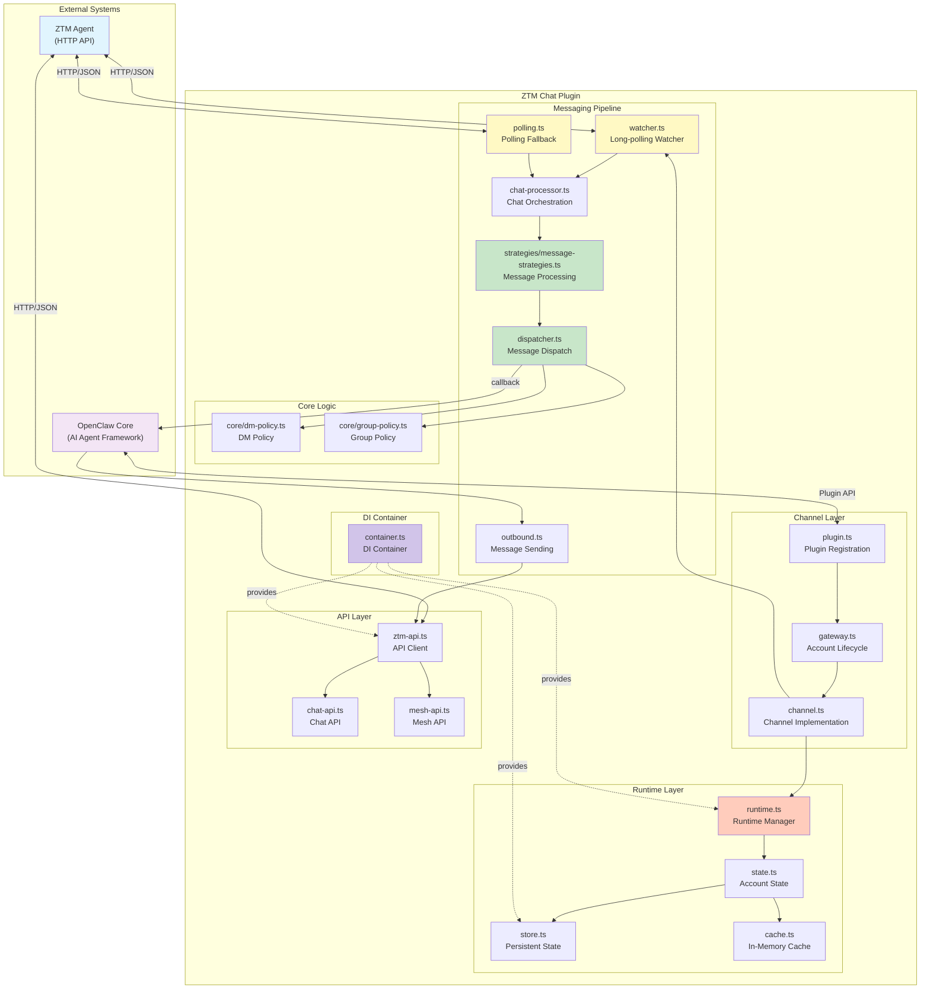

### Key Design Decisions

1. **Account-Based Multi-Tenancy**: The system supports multiple ZTM accounts simultaneously, each with isolated configuration, state, and message processing pipelines. This enables a single OpenClaw instance to manage multiple bot identities across different meshes.

2. **Watch + Polling Hybrid**: The primary message reception mechanism uses ZTM's Watch API for real-time notifications. When watch errors accumulate beyond a threshold (configurable, default 5), the system automatically falls back to polling mode for reliability.

3. **Watermark-Based Deduplication**: Each message source (peer or group) maintains a watermark timestamp of the last processed message. This prevents reprocessing messages after restarts and handles ZTM's append-only message storage model.

4. **Request Coalescing for Cache**: When multiple concurrent requests need the same cached data (e.g., allowFrom list), the system coalesces them into a single fetch operation, preventing cache stampede during high traffic.

## Core Components

### 1. Channel Layer

The Channel Layer serves as the entry point for OpenClaw integration, handling plugin registration and account lifecycle management.

| Component | File Location | Responsibility | Key Functions |
|-----------|---------------|----------------|---------------|
| `plugin.ts` | `src/channel/plugin.ts` | Register plugin with OpenClaw | `registerPlugin()` - Declares ztm-chat channel with account lifecycle hooks |
| `gateway.ts` | `src/channel/gateway.ts` | Manage account lifecycle | `startAccountGateway()`, `stopAccountGateway()`, `probeAccountGateway()`, `sendTextGateway()` |
| `config.ts` | `src/channel/config.ts` | Resolve account configuration | `resolveZTMChatAccount()` - Extracts config from OpenClaw config |
| `state.ts` | `src/channel/state.ts` | Manage account runtime state | `getOrCreateAccountState()`, `removeAccountState()`, `initializeRuntime()` |

**Account Lifecycle Flow**:

1. **Startup**: `startAccountGateway()` executes the Gateway Pipeline with 7 sequential steps
2. **Runtime**: Account state holds API client, callbacks, watch controllers, and mesh connection status
3. **Shutdown**: `stopAccountGateway()` clears intervals, aborts watch, and flushes state
4. **Cleanup**: `removeAccountState()` disposes all resources and removes account from memory

**Gateway Pipeline Steps** (executed in order):

| Step | Description | Retryable | Failure Impact |
|------|-------------|-----------|----------------|
| `validate_config` | Validates required fields (agentUrl, username, meshName) | No | Blocks startup - configuration error |
| `validate_connectivity` | Tests HTTP connection to ZTM Agent | Yes (3x) | Temporary - retry with backoff |
| `load_permit` | Loads permit from file or requests from server | Yes (3x) | Temporary - retry with backoff |
| `join_mesh` | Connects to ZTM mesh network | Yes (3x) | Temporary - retry with backoff |
| `initialize_runtime` | Creates API client and initializes state | No | Blocks startup - initialization failure |
| `preload_message_state` | Loads watermarks from persistent storage | No | Non-blocking - starts fresh if missing |
| `setup_callbacks` | Registers message callbacks and starts watch | No | Delays message reception - can be recovered |

### 2. Messaging Pipeline

The Messaging Pipeline handles message reception, processing, policy enforcement, and dispatch to AI agents. It uses a hybrid watch/polling mechanism for reliable message delivery.

#### Pipeline Stages

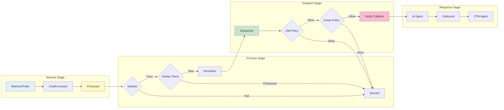

#### Component Details

| Component | File Location | Responsibility | Configuration |
|-----------|---------------|----------------|---------------|
| **Watcher** | `src/messaging/watcher.ts` | Long-poll for new messages via Watch API | 1s interval, 5 error threshold → polling fallback |
| **Poller** | `src/messaging/polling.ts` | Fallback polling when watch fails | 2s interval (configurable) |
| **Processor** | `src/messaging/strategies/message-strategies.ts` | Strategy pattern for message processing | Peer/Group strategies with unified entry point |
| **Dispatcher** | `src/messaging/dispatcher.ts` | Execute callbacks with semaphore control | 10 concurrent callbacks |
| **Outbound** | `src/messaging/outbound.ts` | Send messages to peers/groups | Retry with exponential backoff |

#### Message Processing Details

**Step 1 - Validation**: Messages are validated for:
- Non-empty content (whitespace-only rejected)
- Maximum length 10KB (prevents memory exhaustion)
- Not from bot itself (self-message filtering)
- Required fields present (time, message, sender)

**Step 2 - Deduplication**: Watermark mechanism prevents reprocessing:
- Watermark key format: `peer:{username}` or `group:{creator}/{groupId}`
- Messages with timestamp ≤ watermark are skipped
- Watermark advances only forward (monotonically increasing)
- Atomic updates prevent race conditions in concurrent scenarios

**Step 3 - Normalization**: Messages are converted to `ZTMChatMessage` format:
- HTML escaping for sender and content (XSS prevention)
- Standardized ID format: `{timestamp}-{sender}`
- Consistent timestamp as Date object
- Peer and senderId fields populated

**Step 4 - Policy Enforcement**: Two-stage policy check:
1. **DM Policy** (`core/dm-policy.ts`): Controls direct message acceptance
2. **Group Policy** (`core/group-policy.ts`): Controls group message permissions

**Step 5 - Callback Dispatch**: Processed messages trigger registered callbacks:
- Semaphore controls concurrency (default: 10 permits)
- Errors are caught and logged without stopping other callbacks
- Watermark updates only if at least one callback succeeds
- Callback statistics tracked for monitoring

### 3. Runtime Layer

The Runtime Layer manages account state, persistent storage, and in-memory caching. It uses the AccountStateManager class for explicit state ownership with clear lifecycle management.

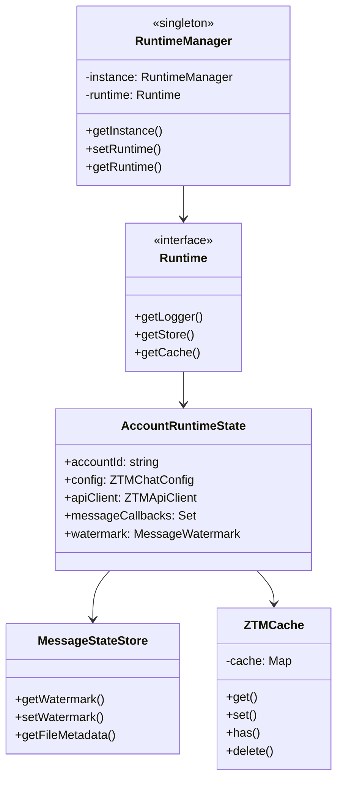

#### Runtime Components

| Component | File Location | Purpose | Key Features |
|-----------|---------------|---------|--------------|
| **AccountStateManager** | `src/runtime/state.ts` | Manages account lifecycle and state | Singleton pattern, request coalescing, periodic cleanup |
| **MessageStateStore** | `src/runtime/store.ts` | Persistent watermark storage | Debounced writes, async loading, size limits |
| **GroupPermissionLRUCache** | `src/runtime/cache.ts` | In-memory permission cache | TTL-based expiration, max size enforcement |

#### AccountRuntimeState Structure

Each account maintains a comprehensive state object:

| Field | Type | Description | Lifecycle |
|-------|------|-------------|-----------|
| `accountId` | string | Unique account identifier | Immutable |
| `config` | ZTMChatConfig | Account configuration | Set during initialization |
| `chatReader` / `chatSender` | API interfaces | ZTM API client interfaces | Created on start, cleared on stop |
| `messageCallbacks` | Set | Registered message handlers | Cleared on stop |
| `callbackSemaphore` | Semaphore | Controls callback concurrency | 10 permits, prevents overload |
| `watchInterval` | Interval | Watch loop timer | Cleared on stop |
| `watchAbortController` | AbortController | Signals watch shutdown | Created per start |
| `watchErrorCount` | number | Consecutive watch errors | Reset on success, triggers polling |
| `pendingPairings` | Map | Pending pairing approvals | Cleaned every 5 minutes |
| `allowFromCache` | Cached value | Approved users cache | 30s TTL, request coalescing |
| `groupPermissionCache` | LRU Cache | Group permissions cache | 60s TTL, max 500 entries |
| `messageRetries` | Map | Scheduled retry timers | Cleared on stop |

#### State Persistence

**Watermark Storage** (`MessageStateStore`):
- Per-account state files in JSON format
- Structure: `{ accounts: { accountId: { watermarkKey: timestamp } } }`
- Debounced writes (1s) to avoid excessive I/O
- Max delay flush (5s) to prevent data loss on crash
- Per-account semaphores for atomic updates
- Automatic cleanup when peer count exceeds 1000
- Async loading to avoid blocking event loop

**Cache Coalescing**:
When multiple concurrent requests need the same cached data:
1. First request creates fetch promise and stores it
2. Subsequent requests await the same promise
3. All requests receive the same result
4. Promise is removed after completion

This prevents "cache stampede" where cache expiration triggers many simultaneous fetch operations.

## OpenClaw Integration

The ZTM Chat plugin integrates with OpenClaw as a channel plugin, providing account lifecycle management and message routing.

### Plugin Registration

```typescript
// Register ZTM Chat channel with OpenClaw
registerPlugin({
  channel: 'ztm-chat',
  accountLifecycle: {
    start: startAccountGateway,
    stop: stopAccountGateway
  }
});
```

### Bindings Mechanism (OpenClaw 2026.2.26+)

OpenClaw 2026.2.26 introduced a bindings mechanism for routing inbound messages to different agents:

**Key Rules**:
1. Bindings without `accountId` only match the `default` account
2. Use `accountId: "*"` to match all accounts on the channel
3. Non-default accounts require corresponding bindings

**Configuration**:
```yaml
channels:
  ztm-chat:
    accounts:
      default: {...}    # For backward compatibility
      my-bot: {...}    # Named account

bindings:
  - agentId: main
    match:
      channel: ztm-chat
      accountId: my-bot
```

### Progressive Compatibility

The plugin generates both configurations to ensure compatibility across OpenClaw versions:

- `accounts.default` - For OpenClaw < 2026.2.26
- `bindings` - For OpenClaw >= 2026.2.26

This approach ensures backward and forward compatibility without requiring user migration.

---

## Gateway Pipeline

The Gateway Pipeline orchestrates account initialization using the Pipeline pattern with 7 sequential steps. Each step has configurable retry policies for fault tolerance.

### Pipeline Steps

| Step | Description | Retryable | Retry Config | Failure Impact |
|------|-------------|-----------|--------------|----------------|
| `validate_config` | Validates required fields (agentUrl, username, meshName) | No | N/A | Blocks startup - configuration error |
| `validate_connectivity` | Tests HTTP connection to ZTM Agent | Yes | 3 attempts, 1s delay | Temporary - retry with backoff |
| `load_permit` | Loads permit from file or requests from server | Yes | 3 attempts, 1s delay | Temporary - retry with backoff |
| `join_mesh` | Connects to ZTM mesh network | Yes | 3 attempts, 1s delay | Temporary - retry with backoff |
| `initialize_runtime` | Creates API client and initializes state | No | N/A | Blocks startup - initialization failure |
| `preload_message_state` | Loads watermarks from persistent storage | No | N/A | Non-blocking - starts fresh if missing |
| `setup_callbacks` | Registers message callbacks and starts watch | No | N/A | Delays message reception - can be recovered |

### Retry Policy

The Gateway Pipeline uses predefined retry policies for different step types. Each policy specifies maximum attempts, delay timing, backoff behavior, and which errors are retryable.

#### Policy Types

| Policy | Steps Using It | Max Attempts | Initial Delay | Max Delay | Backoff |
|--------|---------------|--------------|---------------|-----------|---------|
| **NO_RETRY** | `validate_config`, `preload_message_state` | 1 | 0ms | 0ms | N/A |
| **NETWORK** | `validate_connectivity`, `join_mesh` | 3 | 1000ms | 10000ms | 2x (exponential) |
| **API** | `load_permit`, `initialize_runtime` | 2 | 1000ms | 2000ms | 1x (linear) |
| **WATCHER** | `setup_callbacks` | 2 | 500ms | 1000ms | 1x (linear) |

#### Backoff Calculation

For each retry attempt, the delay is calculated as:

```
delay = min(initialDelayMs × (backoffMultiplier ^ (attempt - 1)), maxDelayMs)
```

**Example - NETWORK Policy** (exponential backoff):
- Attempt 1: `min(1000 × 2^0, 10000)` = **1000ms** (1s)
- Attempt 2: `min(1000 × 2^1, 10000)` = **2000ms** (2s)
- Attempt 3: `min(1000 × 2^2, 10000)` = **4000ms** (4s)

**Example - API Policy** (linear backoff):
- Attempt 1: `min(1000 × 1^0, 2000)` = **1000ms** (1s)
- Attempt 2: `min(1000 × 1^1, 2000)` = **1000ms** (1s)

**Example - WATCHER Policy** (quick linear backoff):
- Attempt 1: `min(500 × 1^0, 1000)` = **500ms** (0.5s)
- Attempt 2: `min(500 × 1^1, 1000)` = **500ms** (0.5s)

#### Error Classification by Policy

**NETWORK Policy Errors** (triggers 3 attempts with exponential backoff):
- `ECONNREFUSED` - Connection refused by server
- `ETIMEDOUT` - Connection timeout
- `ECONNRESET` - Connection reset by peer
- `connect timeout` - Unable to establish connection
- `network` - Generic network-related errors

**API Policy Errors** (triggers 2 attempts with linear backoff):
- Error messages containing `api`
- Error messages containing `failed to`

**WATCHER Policy Errors** (triggers 2 attempts with quick backoff):
- Error messages containing `watch`

**Non-Retryable Errors** (immediate failure):
- Configuration validation failures
- Invalid credentials
- Permission denied errors
- Any error not matching retryable patterns

### Pipeline Flow

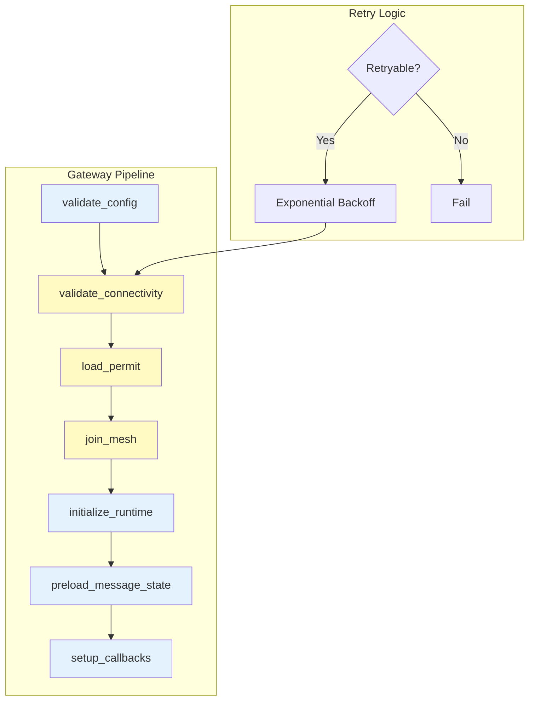

### Step Definitions

The 7 pipeline steps are defined in `src/channel/gateway-steps.ts` via the `createGatewaySteps()` function:

```typescript
export function createGatewaySteps(_ctx: StepContext): PipelineStep[] {
  return [
    { name: 'validate_config', execute: ..., retryPolicy: RETRY_POLICIES.NO_RETRY },
    { name: 'validate_connectivity', execute: ..., retryPolicy: RETRY_POLICIES.NETWORK },
    { name: 'load_permit', execute: ..., retryPolicy: RETRY_POLICIES.API },
    { name: 'join_mesh', execute: ..., retryPolicy: RETRY_POLICIES.NETWORK },
    { name: 'initialize_runtime', execute: ..., retryPolicy: RETRY_POLICIES.API },
    { name: 'preload_message_state', execute: ..., retryPolicy: RETRY_POLICIES.NO_RETRY },
    { name: 'setup_callbacks', execute: ..., retryPolicy: RETRY_POLICIES.WATCHER },
  ];
}
```

Each step contains:
- **name**: Unique identifier for logging
- **execute**: Async function performing the step logic
- **retryPolicy**: One of the 4 predefined retry policies

### Concurrency Control

The system uses **two distinct semaphores** for different purposes:

| Semaphore | Purpose | Permits | Location |
|-----------|---------|---------|----------|
| **MESSAGE_SEMAPHORE** | Limits concurrent message processing operations | 5 | Watcher/Poller message processing |
| **CALLBACK_SEMAPHORE** | Limits concurrent callback executions | 10 | Message dispatcher |

**Why Two Semaphores?**
- Message processing involves I/O (fetching from ZTM API) - limited to prevent overwhelming the API
- Callback execution involves AI agent processing - limited to prevent resource exhaustion
- Different limits allow tuning based on each operation's resource characteristics

### Step Implementations

**validate_config**: Uses TypeBox schema validation to ensure:
- `agentUrl` is a valid HTTP/HTTPS URL
- `meshName` matches pattern `^[a-zA-Z0-9_-]+$` (1-64 chars)
- `username` matches pattern `^[a-zA-Z0-9_-]+$` (1-64 chars)
- `permitSource` is either 'server' or 'file'

**validate_connectivity**: Probes ZTM Agent health endpoint:
- Sends GET request to `{agentUrl}/health`
- Timeout: 10 seconds (configurable)
- Success: Agent is reachable and responding
- Failure: Retry with backoff or fail if non-retryable

**load_permit**: Acquires mesh permit based on `permitSource`:
- **file mode**: Reads JSON from `permitFilePath`
- **server mode**: Requests from `permitUrl` with mesh name
- Permit contains authentication token for mesh access
- Failure to load permit blocks mesh connection

**join_mesh**: Connects to the ZTM mesh network:
- Uses permit to authenticate with mesh
- Waits for connection state to be "connected"
- Retries up to 3 times with 1s delay between attempts
- Mesh connection enables P2P messaging

**initialize_runtime**: Creates the account runtime state:
- Instantiates ZTMApiClient with config
- Creates AccountRuntimeState with empty state
- Initializes semaphore for concurrency control
- Sets up cache structures (allowFrom, group permissions)

**preload_message_state**: Loads persisted watermarks:
- Reads from `{stateDir}/ztm-chat-{accountId}.json`
- If file missing or corrupt, starts fresh (no history)
- Async loading prevents blocking startup
- Watermarks prevent duplicate message processing

**setup_callbacks**: Completes initialization:
- Creates message callback function
- Registers callback with messageCallbacks Set
- Starts message watcher (watch or polling mode)
- Sets up periodic cleanup interval (5 minutes)
- Returns cleanup function for shutdown

### Cleanup on Shutdown

The pipeline returns a cleanup function that releases resources in order:

| Resource | Cleanup Action | Purpose |
|----------|----------------|---------|
| Cleanup interval | `clearInterval()` | Stops periodic pairing cleanup |
| Message callbacks | `clear()` | Removes all callback references |
| Watch abort controller | `abort()` | Signals watch loop to stop |
| Watch timer | `clearTimeout()` | Stops scheduled watch iterations |
| Runtime state | `flush()` | Persists pending watermark updates |
| Account state | `remove()` | Removes account from memory |

---

## Onboarding & Configuration

The ZTM Chat plugin requires users to complete a multi-step onboarding process to establish connectivity with the ZTM network.

### Two-Phase Onboarding

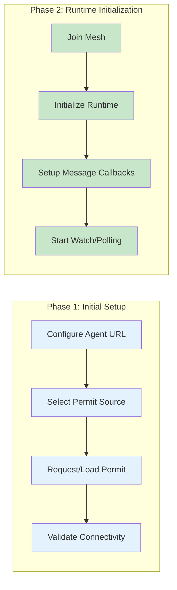

### Interactive Wizard

The plugin provides an interactive CLI wizard (`ZTMChatWizard`) for guided configuration:

| Step | Description |
|------|-------------|
| stepAgentUrl | Configure ZTM Agent URL |
| stepPermitSource | Select permit source (file/server) |
| stepUserSelection | Choose bot username |
| stepSecuritySettings | Configure DM policy |
| stepGroupSettings | Configure group policy |

### Permit Acquisition

| Mode | Description | Use Case |
|------|-------------|----------|
| file | Load permit from local JSON file | Offline/direct transfer |
| server | Request permit from permit server | Automated deployment |

### Pairing Mode

When DM policy is set to `pairing`, users must be approved before sending messages:

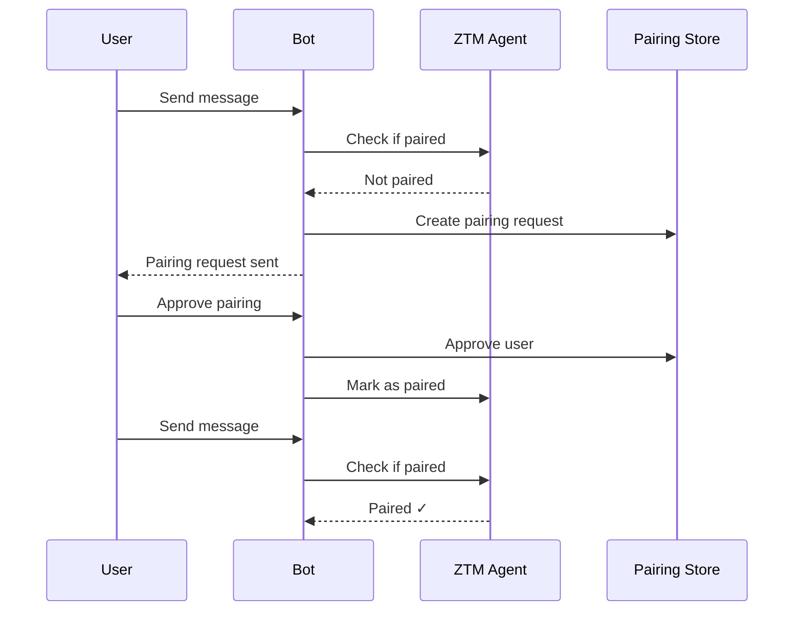

**Pairing Expiry**: After `PAIRING_MAX_AGE_MS` (1 hour), users require re-approval.

---

## Data Flow

### Message Receive Flow

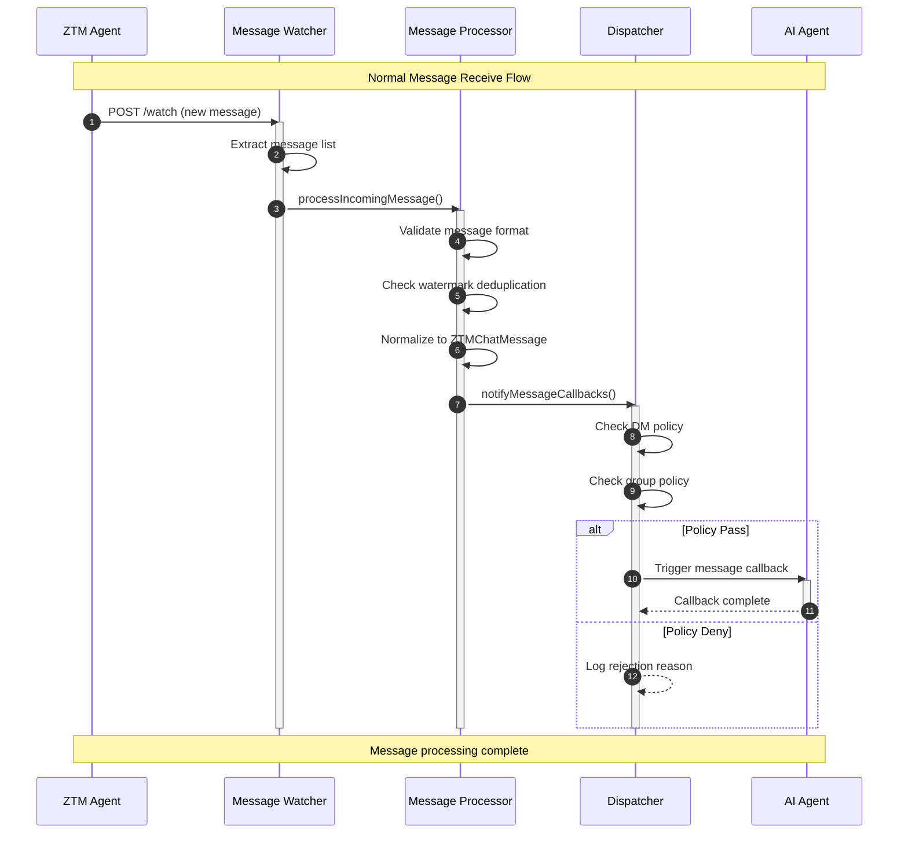

### Message Send Flow

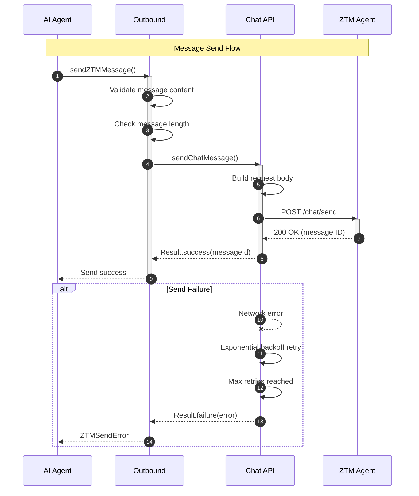

### Watch + Polling Mode Switching

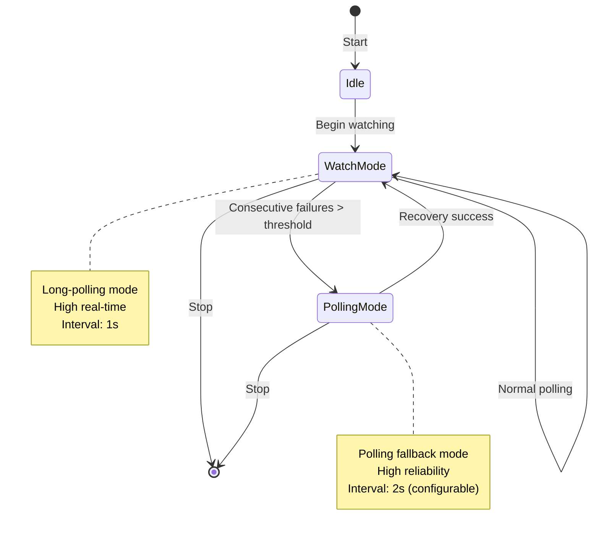

---

## Message Processing Pipeline

The Message Processing Pipeline transforms raw ZTM messages into normalized, policy-checked messages ready for AI agent consumption.

### Strategy Pattern Implementation

The messaging layer uses the **Strategy Pattern** to handle different message types (peer vs group) through a unified interface.

**Strategy Interface** (`MessageProcessingStrategy`):
```typescript
interface MessageProcessingStrategy {
  normalize(msg: RawMessage, ctx: ProcessingContext): ZTMChatMessage | null;
  getGroupInfo(chat: ZTMChat): GroupInfo | null;
}
```

**Concrete Strategies**:
| Strategy | Purpose | Implementation |
|----------|---------|----------------|
| **PeerMessageStrategy** | Handles 1-to-1 peer messages | Uses `processPeerMessage()` helper |
| **GroupMessageStrategy** | Handles group chat messages | Uses `processGroupMessage()` helper |

**Unified Entry Point** - `processAndNotify()`:
The `processAndNotify()` function in `strategies/message-strategies.ts` replaces the old split approach:

| Old Approach | New Approach |
|--------------|--------------|
| `processAndNotifyChat()` | `processAndNotify()` (unified) |
| `processAndNotifyPeerMessages()` | Strategy-based selection |
| `processAndNotifyGroupMessages()` | Context-aware normalization |

**Processing Flow**:
1. Validate chat structure
2. Select strategy based on chat type (`isGroupChat()`)
3. Build processing context
4. Normalize message using selected strategy
5. Notify callbacks
6. Handle peer policy checks

**Benefits**:
- Single entry point for all message types
- Easy to add new message types (extend strategy)
- Clear separation of concerns
- Testable with mock strategies

### Processing Stages Detail

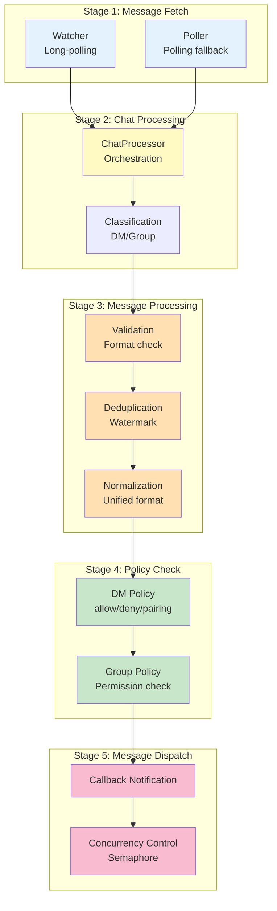

### Stage 1: Message Fetch

**Watch Mode** (Primary):
- Uses ZTM's Watch API for real-time change notifications
- Polls `/apps/ztm/chat/shared/` every 1 second
- Returns list of changed peers/groups since last check
- Falls back to polling after 5 consecutive errors

**Polling Mode** (Fallback):
- Queries all chats periodically every 2 seconds
- Higher reliability but lower latency
- Automatically switches back to watch mode on recovery

**Initial Sync** (First Start):
- Fetches all existing messages from all chats
- Limited to recent messages (5 minutes) to avoid overload
- Processes pairing requests from existing peers

### Stage 2: Chat Processing

**Classification**: Messages are classified by source:
- **Peer messages**: Direct 1-to-1 messages from a user
- **Group messages**: Messages from a group chat

Each classification routes to different processing paths:
- Peer messages use `peer:username` as watermark key
- Group messages use `group:creator/groupId` as watermark key

### Stage 3: Message Processing

| Check | Description | Failure Action |
|-------|-------------|----------------|
| **Empty check** | Rejects whitespace-only messages | Skip with debug log |
| **Length check** | Rejects messages > 10KB | Skip with warning |
| **Self-message check** | Filters messages from bot itself | Skip with debug log |
| **Watermark check** | Compares timestamp vs last processed | Skip if `time ≤ watermark` |

**Watermark Key Format**:
```
Peer messages:  peer:{username}
Group messages: group:{creator}/{groupId}
```

**Normalization** produces `ZTMChatMessage`:
```typescript
{
  id: "{timestamp}-{sender}",
  content: "<HTML-escaped message>",
  sender: "<HTML-escaped username>",
  senderId: "<HTML-escaped username>",
  timestamp: Date(timestamp),
  peer: "<HTML-escaped username>"
}
```

### Stage 4: Policy Check

#### DM Policy Enforcement

| Policy Mode | Whitelisted | Not Whitelisted | Description |
|-------------|-------------|-----------------|-------------|
| **allow** | Process | Process | Open policy - accept all messages |
| **deny** | Process | Ignore | Closed policy - block unknown users |
| **pairing** | Process | Request pairing | Secure mode - require approval |

**Whitelist Sources** (checked in order):
1. Static `config.allowFrom` array
2. Persistent `storeAllowFrom` from pairing approvals
3. DM policy default action

**Pairing Flow**:
1. Unknown user sends message → "pending" status
2. Pairing request created with timestamp
3. User can be approved via CLI: `openclaw pairing approve ztm-chat <username>`
4. Approval persists to store for future messages
5. Pairing expires after 1 hour (configurable)

#### Group Policy Enforcement

| Policy Mode | Creator | Whitelisted User | Other Users | Description |
|-------------|---------|------------------|-------------|-------------|
| **open** | ✅ | ✅ | ✅ | Allow all messages |
| **allowlist** | ✅ | ✅ | ❌ | Whitelist only |
| **disabled** | ✅ | ❌ | ❌ | Block all non-creator |

**Mention Requirement** (applies to all users including creator):
- When `requireMention: true`, message must contain `@bot-username`
- Case-insensitive matching with pattern variations
- Creator bypass is not available for mention check

**Permission Sources** (per-group configuration):
1. Per-group `groupPermissions["creator/groupId"]` overrides
2. Global `groupPolicy` default
3. Global `requireMention` default
4. Per-group `allowFrom` whitelist

### Stage 5: Message Dispatch

**Callback Execution**:
- All registered callbacks receive the message
- Semaphore limits concurrent executions (default: 10)
- Errors are caught and logged without affecting other callbacks
- Callback statistics tracked (total, active, success, error counts)

**Watermark Update** (atomic):
- Only updates if at least one callback succeeded
- Uses async version with semaphore for race-condition safety
- Watermark only advances forward (monotonically increasing)
- Debounced write to disk (1s delay, 5s max)

**Dispatch Flow**:
```
Message → Callback 1 ─┐
           → Callback 2 ├─ Semaphore (max 10) ──→ Update Watermark
           → Callback N ┘
```

---

## State Management

The State Management layer provides persistent storage, in-memory caching, and account lifecycle management using the AccountStateManager pattern.

### State Hierarchy

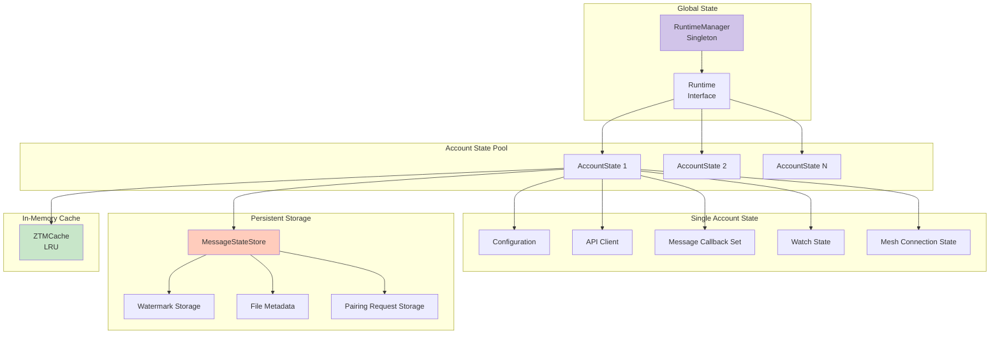

### Watermark Mechanism

The watermark system prevents duplicate message processing by tracking the last processed message timestamp for each message source.

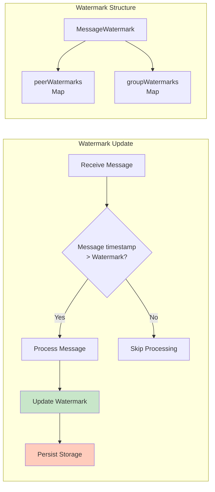

**Watermark Key Format**:
- Peer messages: `peer:{username}`
- Group messages: `group:{creator}/{groupId}`

**Watermark Update Behavior**:
- Watermark only advances forward (monotonically increasing)
- Atomic update prevents race conditions in concurrent scenarios
- Async version uses semaphore for check-and-update atomicity
- Update only occurs if at least one callback succeeds
- Debounced write to disk (1s default, 5s max delay)

**Storage Details**:
- Per-account state files in JSON format
- File location: `{stateDir}/ztm-chat-{accountId}.json`
- Structure: `{ accounts: { accountId: { watermarkKey: timestamp } } }`
- Automatic cleanup when peer count exceeds 1000 (keeps most recent)
- Async loading prevents blocking startup

### Account Isolation Pattern

Each account maintains completely isolated state to ensure security and prevent cross-account interference:

**State Components**:

| Component | Isolation Method | Purpose |
|-----------|------------------|---------|
| **Configuration** | Per-account config object | Separate mesh names, usernames, policies |
| **API Clients** | Isolated HTTP clients | Separate connections, auth tokens |
| **Callbacks** | Independent callback Sets | Different AI agents per account |
| **Watermarks** | Per-account storage | Prevents cross-account message replay |
| **Watch State** | Separate abort controllers | Independent watch/polling control |
| **Cache** | Isolated LRU caches | Separate permission caching |

**Isolation Guarantees**:

1. **Message Callbacks**: Each account has its own callback set, preventing cross-account message leakage
2. **Watermarks**: Per-account watermark storage prevents message replay across accounts
3. **API Clients**: Isolated HTTP clients prevent credential leakage between accounts
4. **Watch/Polling State**: Independent watch controllers per account allow different watch modes
5. **Caches**: Separate allowFrom and group permission caches per account

### Cache Management

The system uses multiple cache layers with different TTLs and strategies:

| Cache Type | Purpose | TTL | Max Size | Cleanup Strategy |
|------------|---------|-----|----------|------------------|
| **allowFromCache** | Approved users list | 30 seconds | N/A | Request coalescing |
| **groupPermissionCache** | Group permissions | 60 seconds | 500 entries | LRU eviction |
| **pendingPairings** | Pairing requests | 1 hour expiry | 100 entries | Time + size limit |

**Request Coalescing**:
When cache expires and multiple concurrent requests occur:
1. First request creates fetch promise and stores it
2. Subsequent requests detect in-flight request and await same promise
3. All requests receive the same result
4. Promise is removed after completion

This prevents "cache stampede" where cache expiration triggers many simultaneous fetch operations.

### Repository Pattern

The messaging layer depends on **repository interfaces** rather than concrete implementations, following the Repository pattern for clean separation of concerns.

**Repository Interfaces** (`src/runtime/repository.ts`):

| Interface | Purpose | Methods |
|-----------|---------|---------|
| **IAllowFromRepository** | Abstracts pairing approval storage | `getAllowFrom()`, `clearCache()` |
| **IMessageStateRepository** | Abstracts watermark persistence | `getWatermark()`, `setWatermark()`, `flush()` |

**Benefits**:
- **Decoupling**: Messaging layer doesn't depend on runtime implementation details
- **Testability**: Easy to mock repositories for unit tests
- **Flexibility**: Storage implementation can change without affecting messaging
- **Clear Boundaries**: Explicit dependency contracts

**Usage Example**:
```typescript
// Messaging code depends on interface
async function processMessage(context: MessagingContext) {
  const allowFrom = await context.allowFromRepo.getAllowFrom(accountId, rt);
  // Process message...
}
```

### Messaging Context

The **MessagingContext** interface encapsulates dependencies needed by the messaging layer, eliminating direct DI container access.

**Context Structure** (`src/messaging/context.ts`):
```typescript
interface MessagingContext {
  allowFromRepo: IAllowFromRepository;
  messageStateRepo: IMessageStateRepository;
}
```

**Purpose**:
- Eliminates direct DI container access from messaging modules
- Enables dependency injection without coupling to container
- Simplifies testing with mock contexts
- Clear dependency declaration

**Factory Function**:
```typescript
const context = createMessagingContext(allowFromRepo, messageStateRepo);
await startMessageWatcher(state, context);
```

---

## Dependency Injection

The Dependency Injection (DI) Container provides centralized service management with lazy initialization, type-safe registration, and test-friendly design.

### DI Container Architecture

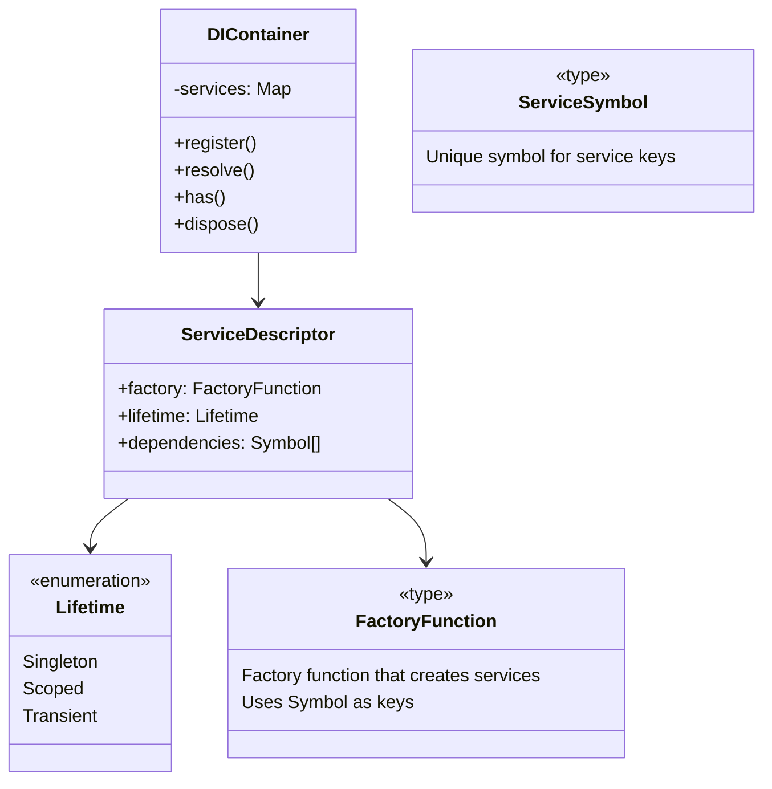

### Container Features

| Feature | Description | Benefit |
|----------|-------------|---------|
| **Lazy Initialization** | Services created on first access | Faster startup, memory efficiency |
| **Symbol-based Keys** | Unique symbols prevent naming conflicts | Type-safe service lookup |
| **Singleton Enforcement** | One instance per service lifetime | Shared state, resource efficiency |
| **Test-Friendly** | Reset method for test isolation | Clean test environment |

### Registered Services

| Symbol | Service Interface | Lifetime | Dependencies | Purpose |
|--------|------------------|----------|--------------|---------|
| `ZTM_RUNTIME` | `IRuntime` | Singleton | - | OpenClaw runtime access |
| `LOGGER` | `ILogger` | Singleton | - | Logging operations |
| `API_CLIENT_FACTORY` | `IApiClientFactory` | Singleton | - | Creates API clients per account |
| `ALLOW_FROM_REPO` | `IAllowFromRepository` | Scoped | - | Pairing approval storage |
| `MESSAGE_STATE_REPO` | `IMessageStateRepository` | Scoped | - | Watermark persistence |
| `ACCOUNT_STATE_MANAGER` | `AccountStateManager` | Singleton | - | Account lifecycle |
| `MESSAGING_CONTEXT` | `MessagingContext` | Singleton | - | Message processing context |

### Service Lifetimes

**Singleton Services** (one instance for entire plugin lifetime):
- `LOGGER` - Shared logger instance
- `ZTM_RUNTIME` - OpenClaw runtime reference
- `ACCOUNT_STATE_MANAGER` - Account state management
- `MESSAGING_CONTEXT` - Shared messaging dependencies

**Scoped Services** (per-account or per-operation):
- `API_CLIENT` - Isolated HTTP client per account
- `MESSAGE_STATE_STORE` - Isolated state store per account
- `ALLOW_FROM_REPO` - Repository for pairing data

### Usage Pattern

```typescript
// Register a service
container.register(DEPENDENCIES.LOGGER, () => ({
  info: (...args) => console.log('[INFO]', ...args),
  error: (...args) => console.error('[ERROR]', ...args),
}));

// Resolve a service (lazy initialization)
const logger = container.get(DEPENDENCIES.LOGGER);
logger.info('Service started');

// Check if service exists
if (container.isRegistered(DEPENDENCIES.LOGGER)) {
  // Service is available
}

// Reset container (for testing)
DIContainer.reset();
```

---

## Error Handling

The error handling system uses a hierarchical error type structure combined with the Result pattern for type-safe error handling.

### Error Type Hierarchy

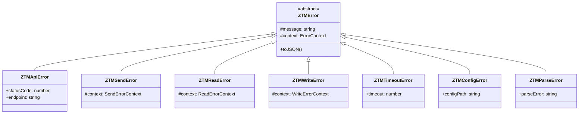

### Error Types by Category

| Error Type | Use Case | HTTP Status | Retryable |
|------------|----------|-------------|-----------|
| **ZTMApiError** | API request failures | 400-599 | If 5xx or timeout |
| **ZTMSendError** | Message send failures | Variable | If network error |
| **ZTMReadError** | Read operation failures | Variable | Yes |
| **ZTMWriteError** | Write operation failures | Variable | No |
| **ZTMTimeoutError** | Operation timeout | N/A | Yes |
| **ZTMConfigError** | Configuration invalid | N/A | No |
| **ZTMParseError** | Data parsing failed | N/A | No |

### Result Pattern

The Result pattern provides type-safe error handling without exceptions:

```typescript
// Success result
const success = success(data);

// Failure result
const failure = failure(new ZTMApiError("..."));

// Type guard
if (isSuccess(result)) {
  console.log(result.data);
} else {
  console.error(result.error);
}
```

**Benefits**:
- Compile-time type checking for success/failure paths
- Forced error handling (cannot access .data without checking)
- No stack unwinding overhead
- Consistent error propagation

### Message Retry Strategy

Messages that fail to dispatch can be automatically retried:

| Configuration | Value | Description |
|---------------|-------|-------------|
| `MESSAGE_RETRY_MAX_ATTEMPTS` | 3 | Maximum retry attempts per message |
| `MESSAGE_RETRY_DELAY_MS` | 2000 | Initial retry delay (2 seconds) |
| `backoff` | Exponential (2x) | Delay multiplier per attempt |

**Retry Sequence**:
- Attempt 1: Immediate execution
- Attempt 2: 2s delay
- Attempt 3: 4s delay
- Failure: Log error and discard message

**Retry Conditions**:
- Network errors (ECONNREFUSED, ETIMEDOUT)
- HTTP 5xx errors (server-side issues)
- HTTP 429 (rate limiting, with backoff)

**Non-Retryable**:
- HTTP 4xx errors (client errors)
- Configuration errors
- Permission errors

---

## Security Considerations

The plugin implements multiple layers of security to protect against common vulnerabilities.

### Input Validation

| Input Type | Validation Rules | Location | Threat Mitigated |
|------------|------------------|----------|-------------------|
| **Message content** | Length ≤ 10KB, HTML escape | `strategies/message-strategies.ts` | Memory exhaustion, XSS |
| **Peer ID** | Format validation, length limit | `validation.ts` | Injection attacks |
| **File paths** | Path traversal check | `paths.ts` | Directory traversal |
| **Config values** | Schema validation | `config/validation.ts` | Configuration tampering |
| **Username** | Pattern `^[a-zA-Z0-9_-]+$`, 1-64 chars | `config/schema.ts` | User enumeration |

### Content Security

**HTML Escaping** (XSS Prevention):
- Sender username is HTML-escaped before storage
- Message content is HTML-escaped before logging
- Prevents script injection in logs and UI

**Message Length Limits**:
- Maximum 10KB per message
- Prevents memory exhaustion attacks
- Rejects oversized messages with warning log

**Username Normalization**:
- Case-insensitive comparison for security
- Whitespace trimming
- Special character filtering

### Log Sanitization

Sensitive information is automatically redacted from logs:

```typescript
// Automatically redact sensitive information
sanitizeLog({
  token: "secret-123",  // → "[REDACTED]"
  message: "hello",     // → "hello"
  password: "pass123"   // → "[REDACTED]"
});
```

**Redacted Fields**:
- `token`, `authorization`, `password`
- `secret`, `apiKey`, `credential`
- Custom sensitive fields via configuration

### State Validation

**Prototype Pollution Prevention**:
- State file keys sanitized before loading
- Rejects `__proto__`, `constructor`, `prototype`
- Type validation for all parsed values

**Data Structure Validation**:
- Schema validation for state files
- Type checking before processing
- Graceful degradation on corrupt data

### Network Security

**HTTPS Enforcement**:
- Agent URL must use HTTP/HTTPS
- Config validates URL format
- Warning on insecure endpoints

**Timeout Protection**:
- API requests timeout after 30 seconds (configurable)
- Prevents indefinite hangs
- Semaphore limits concurrent requests

**Credential Isolation**:
- Per-account API clients
- No credential sharing between accounts
- Cleanup on account removal

---

**Related Documentation:**
- [Architecture Decision Records (ADR)](adr/README.md)
- [API Reference](api/README.md)
- [Developer Quick Start](developer-quickstart.md)
