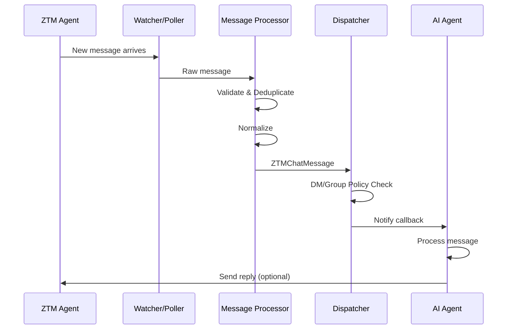

# Developer Quick Start Guide

Welcome to the ZTM Chat Channel Plugin project! This guide will help you get started with development quickly.

## Target Audience

- New developers joining the project
- Contributors who need to understand the architecture
- Developers who want to modify or extend the plugin

## Prerequisites

Before you begin, it's recommended to be familiar with:

| Technology | Importance | Learning Resources |
|------------|------------|-------------------|
| TypeScript (ES2022) | ⭐⭐⭐⭐⭐ | [TypeScript Handbook](https://www.typescriptlang.org/docs/) |
| Node.js (22.x+) | ⭐⭐⭐⭐ | [Node.js Documentation](https://nodejs.org/docs) |
| Vitest | ⭐⭐⭐ | [Vitest Guide](https://vitest.dev/guide/) |
| OpenClaw Framework | ⭐⭐⭐⭐ | [OpenClaw Docs](https://openclaw.dev) |
| ZTM Network | ⭐⭐⭐ | [ZTM Documentation](https://ztm.io) |

## 5-Minute Quick Setup

### 1. Clone and Install

```bash
# Clone the repository
git clone https://github.com/flomesh-io/openclaw-channel-plugin-ztm.git
cd openclaw-channel-plugin-ztm

# Install dependencies
npm install

# Verify installation
npm run build
npm run typecheck
```

### 2. Run Tests

```bash
# Run all tests
npm test

# Run specific test
npm test -- src/messaging/processor.test.ts

# Watch mode (recommended for development)
npm run test:watch

# View coverage report
npm run test:coverage
open coverage/index.html
```

### 3. Start Development Environment

```bash
# Start file watcher (auto-rebuild)
npm run dev

# In another terminal, run test watcher
npm run test:watch
```

## Core Concepts

### Message Processing Flow



### Key Design Patterns

| Pattern | Use Case | Location |
|---------|----------|----------|
| **Dependency Injection** | Service decoupling, testability | `src/di/` |
| **Watch with Fibonacci Backoff** | Message fetching with error recovery | `src/messaging/watcher.ts` |
| **Watermark Deduplication** | Message idempotency | `src/runtime/store.ts` |
| **Result Type** | Error handling | `src/utils/result.ts` |
| **Singleton Pattern** | Runtime state management | `src/runtime/runtime.ts` |

## Development Workflow

### 1. Create a Feature Branch

```bash
git checkout -b feature/your-feature-name
# or
git checkout -b fix/your-bug-fix
```

### 2. Develop and Test

```bash
# Edit code
vim src/your-module/your-file.ts

# Run related tests
npm test -- src/your-module/

# Type check
npm run typecheck

# Format code
npm run format
```

### 3. Commit Changes

```bash
git add .
git commit -m "feat: add your feature description"
# or
git commit -m "fix: resolve the bug description"
```

### 4. Push and Create PR

```bash
git push origin feature/your-feature-name
# Then create a Pull Request on GitHub
```

## Common Development Tasks

### Adding a New API Endpoint

1. **Define Types** (`src/types/api.ts`):
```typescript
export interface NewAPIRequest {
  // Request parameters
}

export interface NewAPIResponse {
  // Response data
}
```

2. **Implement API Method** (`src/api/your-api.ts`):
```typescript
export async function newAPIMethod(
  client: ZTMApiClient,
  params: NewAPIRequest
): Promise<Result<NewAPIResponse, ZTMApiError>> {
  // Implementation
}
```

3. **Add Tests** (`src/api/your-api.test.ts`):
```typescript
describe('newAPIMethod', () => {
  it('should handle successful response', async () => {
    // Test logic
  });
});
```

### Modifying Message Processing Logic

1. **Edit Processor** (`src/messaging/processor.ts`)
2. **Update Policies** (`src/core/dm-policy.ts` or `src/core/group-policy.ts`)
3. **Add Tests** (`src/messaging/processor.test.ts`)

### Adding New Configuration Options

1. **Update Schema** (`src/config/schema.ts`)
2. **Add Defaults** (`src/config/defaults.ts`)
3. **Update Documentation** (`docs/user-guide.md`)

## Debugging Tips

### Logging

```typescript
import { logger } from "./utils/logger.js";

// Different log levels
logger.debug("Detailed debug information");
logger.info("General information");
logger.warn("Warning information");
logger.error("Error information", { error: err });
```

### Test Debugging

```bash
# Run tests once (disable parallelism)
npm test -- --run --no-coverage src/messaging/processor.test.ts

# Debug specific test
npm test -- src/messaging/processor.test.ts -t "should process messages"

# Vitest UI (optional)
npm run test:ui
```

### VS Code Debug Configuration

Add to `.vscode/launch.json`:

```json
{
  "version": "0.2.0",
  "configurations": [
    {
      "type": "node",
      "request": "launch",
      "name": "Vitest: Debug Current File",
      "program": "${workspaceFolder}/node_modules/vitest/vitest.mjs",
      "args": ["run", "${relativeFile}"],
      "console": "integratedTerminal",
      "internalConsoleOptions": "neverOpen"
    }
  ]
}
```

## Project Structure Quick Reference

```
src/
├── api/              # ZTM Agent API clients
│   ├── ztm-api.ts    # API client factory
│   ├── chat-api.ts   # Chat API
│   └── request.ts    # HTTP request utilities
├── channel/          # OpenClaw plugin entry point
│   ├── plugin.ts     # Plugin definition
│   └── gateway.ts    # Account lifecycle management
├── messaging/        # Message processing pipeline
│   ├── watcher.ts    # Message watcher with backoff
│   ├── processor.ts  # Message processing
│   └── dispatcher.ts # Message dispatch
├── runtime/          # Runtime state
│   ├── runtime.ts    # Runtime manager
│   └── state.ts      # Account state
├── config/           # Configuration
├── core/             # Business logic
├── di/               # Dependency injection
└── types/            # Type definitions
```

## Next Steps

- 📖 Read [Architecture Decision Records (ADR)](adr/README.md)
- 🔍 Check [API Documentation](api/README.md)
- 🧪 Run [E2E Tests](../e2e/README.md)
- 🤝 Contribute: See [Contributing Guide](../CONTRIBUTING.md)

## Getting Help

- 📮 Email: support@flomesh.io
- 💬 Discussions: [GitHub Discussions](https://github.com/flomesh-io/openclaw-channel-plugin-ztm/discussions)
- 🐛 Bug Reports: [GitHub Issues](https://github.com/flomesh-io/openclaw-channel-plugin-ztm/issues)

---

**Happy Coding!** 🚀
