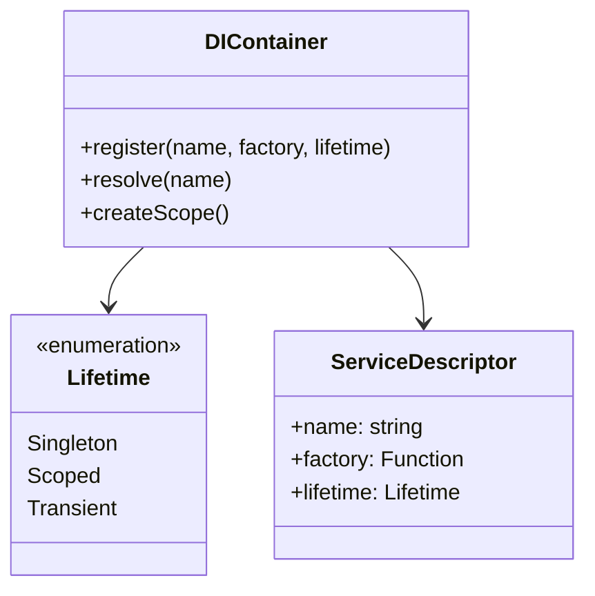

# Dependency Injection Guide

This guide explains the DI Container architecture used in the ZTM Chat plugin.

## Purpose

The DI Container provides centralized service management with lazy initialization, ensuring:
- Loose coupling between components
- Easy testing through dependency replacement
- Single source of truth for service instances

## Core Concepts

### Service Lifetime

| Lifetime | Description | Use Case |
|----------|-------------|----------|
| **Singleton** | One instance for entire application | Runtime, Logger, API Factory |
| **Scoped** | One instance per request/context | Message State Repository |
| **Transient** | New instance each time | Short-lived operations |

### Container Architecture



## Registered Services

| Symbol | Service | Lifetime | Description |
|--------|---------|----------|-------------|
| `ZTM_RUNTIME` | Runtime Manager | Singleton | Global runtime state |
| `LOGGER` | Logging Service | Singleton | Structured logging |
| `API_CLIENT_FACTORY` | API Client Factory | Singleton | Creates ZTM API clients |
| `MESSAGE_STATE_REPO` | Message State Repository | Scoped | Watermark persistence |

## Usage Patterns

### Registering a Service

```typescript
container.register('MY_SERVICE', MyServiceClass, Lifetime.Singleton);
```

### Resolving a Service

```typescript
const service = container.resolve('MY_SERVICE');
```

### Scoped Resolution

```typescript
const scope = container.createScope();
const repo = scope.resolve('MESSAGE_STATE_REPO');
// When done:
scope.dispose();
```

### Lazy Initialization

Services are only created when first resolved, improving startup time.

```typescript
// Not created until resolve() is called
container.register('EXPENSIVE_SERVICE', ExpensiveService, Lifetime.Singleton);
```

## Best Practices

1. **Use interfaces** - Register against symbols, not concrete classes
2. **Match lifetime to scope** - Singleton for shared state, Scoped for request-scoped
3. **Avoid circular dependencies** - Resolve in constructor or use lazy resolution
4. **Dispose scoped services** - Always call `scope.dispose()` when done

## Testing with DI

The DI container makes testing straightforward:

```typescript
// Replace real service with mock
container.register('LOGGER', mockLogger, Lifetime.Singleton);

// Now all dependent services use the mock
const service = container.resolve('MY_SERVICE');
```

## Integration with OpenClaw

The plugin integrates with OpenClaw's DI system:

```typescript
import { ZTMChatPlugin } from './channel/plugin.js';

// Plugin services are registered during plugin initialization
openclaw.register(ZTMChatPlugin);
```

---

## Related Documentation

- [Architecture - DI Section](../architecture.md#dependency-injection)
- [ADR-001 - DI Container](adr/ADR-001-dependency-injection-container.md)
