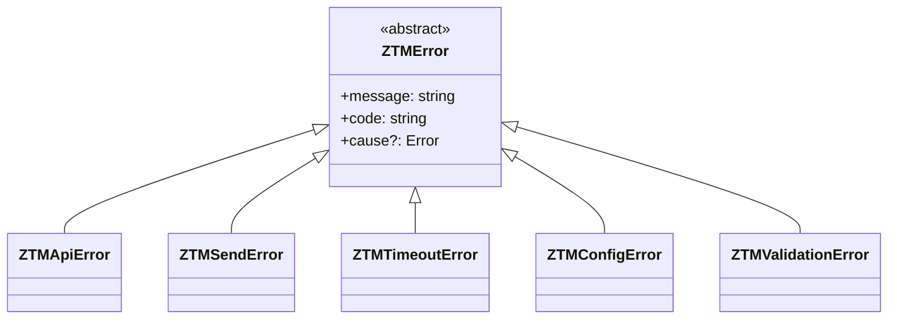
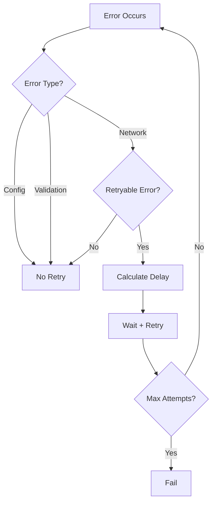

# Error Handling Guide

This guide covers the error handling patterns used in the ZTM Chat plugin.

## Error Type Hierarchy

The plugin uses a hierarchical error type structure:



## Error Types

| Type | Use Case | Retryable | Example |
|------|----------|-----------|---------|
| **ZTMApiError** | API failures | If 5xx | Invalid response |
| **ZTMSendError** | Send failures | If network | Connection lost |
| **ZTMTimeoutError** | Timeout | Yes | Request timeout |
| **ZTMConfigError** | Invalid config | No | Missing required field |
| **ZTMValidationError** | Input validation | No | Invalid format |

## Result Pattern

The plugin uses the Result pattern for error handling:

```typescript
type Result<T, E = Error> =
  | { success: true; data: T }
  | { success: false; error: E };

function divide(a: number, b: number): Result<number> {
  if (b === 0) {
    return { success: false, error: new Error('Division by zero') };
  }
  return { success: true, data: a / b };
}

// Usage
const result = divide(10, 2);
if (result.success) {
  console.log(result.data); // 5
} else {
  console.error(result.error);
}
```

## Retry Strategy

### Exponential Backoff

The plugin implements exponential backoff with jitter:

```typescript
interface RetryConfig {
  maxAttempts: number;
  initialDelayMs: number;
  maxDelayMs: number;
  backoffMultiplier: number;
}

// Default retry config
const DEFAULT_RETRY: RetryConfig = {
  maxAttempts: 3,
  initialDelayMs: 1000,
  maxDelayMs: 10000,
  backoffMultiplier: 2
};
```

### Retry Decision Logic



### Error Classification

**Retryable Errors:**
- Network timeouts (`ETIMEDOUT`, `ECONNREFUSED`)
- Server errors (5xx HTTP status)
- Temporary unavailability

**Non-Retryable Errors:**
- Configuration errors
- Validation failures
- Authentication errors (401, 403)
- Invalid input format

## API Error Handling

### Try-Catch Pattern

```typescript
async function fetchWithRetry<T>(
  fn: () => Promise<T>,
  config: RetryConfig
): Promise<T> {
  let lastError: Error | undefined;

  for (let attempt = 1; attempt <= config.maxAttempts; attempt++) {
    try {
      return await fn();
    } catch (error) {
      lastError = error as Error;

      if (!isRetryable(error)) {
        throw error;
      }

      if (attempt < config.maxAttempts) {
        const delay = calculateDelay(attempt, config);
        await sleep(delay);
      }
    }
  }

  throw lastError;
}
```

### Error Context

```typescript
interface ErrorContext {
  accountId?: string;
  operation: string;
  timestamp: number;
  retryCount: number;
  metadata?: Record<string, unknown>;
}

function enrichError(error: Error, context: ErrorContext): ZTMError {
  return {
    ...error,
    context,
    code: getErrorCode(error)
  };
}
```

## Logging Errors

### Structured Logging

```typescript
logger.error('Operation failed', {
  operation: 'sendMessage',
  accountId: 'acc-123',
  error: error.message,
  code: error.code,
  retryCount: 2,
  // Never log sensitive data
});
```

### Error Sanitization

```typescript
function sanitizeError(error: Error): object {
  return {
    message: error.message,
    code: error.code,
    // Remove sensitive fields
    stack: process.env.NODE_ENV === 'development' ? error.stack : undefined
  };
}
```

## Best Practices

1. **Use Result types** - Avoid throwing exceptions for expected errors
2. **Classify errors** - Distinguish retryable from non-retryable
3. **Add context** - Include operation, account, timestamp in errors
4. **Sanitize logs** - Never log passwords, tokens, or PII
5. **Fail fast on config** - Validate config early, don't retry invalid setup

---

## Related Documentation

- [Architecture - Error Handling](../architecture.md#error-handling)
- [ADR-004 - Result Error Handling](adr/ADR-004-result-error-handling.md)
- [API Errors Reference](api/errors.md)
