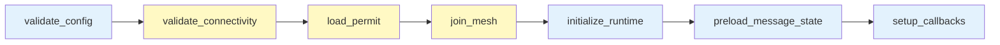
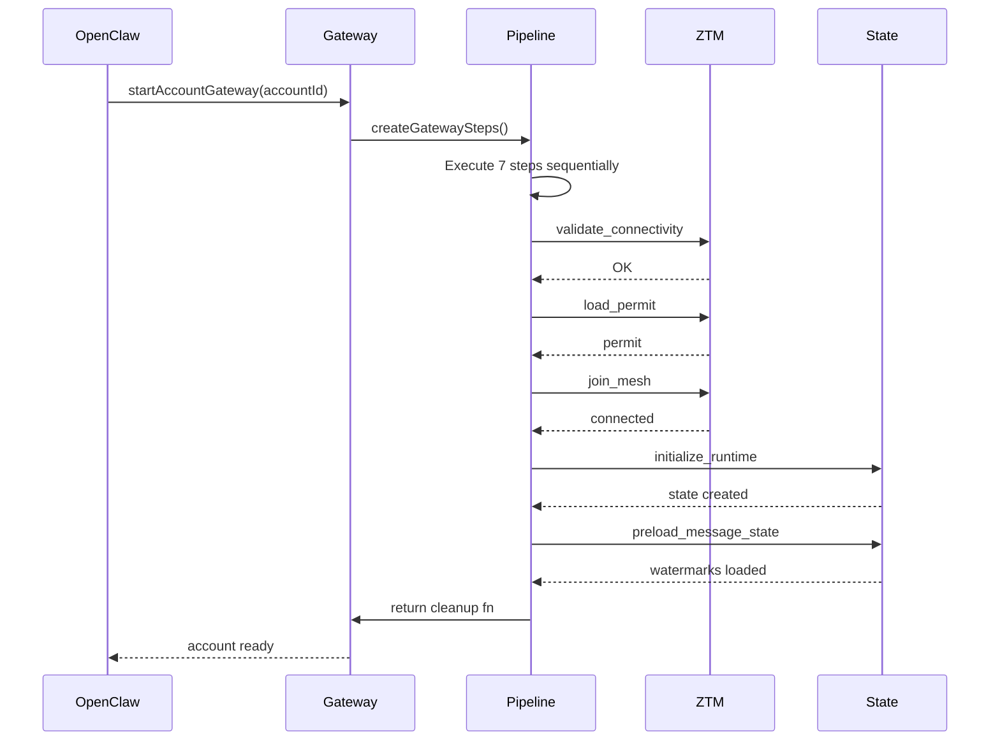
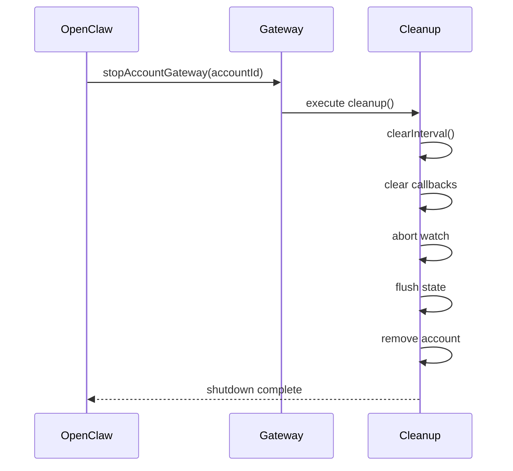

# Channel Module

The Channel module provides the OpenClaw plugin entry point and account lifecycle management for the ZTM Chat plugin.

## Purpose

- Register the ZTM Chat channel plugin with OpenClaw
- Manage account lifecycle (login, logout, pairing)
- Provide channel configuration resolution

## Key Exports

| Export | Description |
|--------|-------------|
| `ztmChatPlugin` | Main OpenClaw plugin entry point |
| `startAccountGateway` | Initialize account gateway for messaging |
| `logoutAccountGateway` | Clean up account gateway resources |
| `listZTMChatAccountIds` | List all registered ZTM Chat account IDs |
| `resolveZTMChatAccount` | Resolve account ID to account details |
| `getEffectiveChannelConfig` | Get effective channel configuration |
| `buildChannelConfigSchemaWithHints` | Build configuration schema with hints |
| `buildMessageCallback` | Build message callback handler |
| `buildAccountSnapshot` | Build account state snapshot |
| `disposeMessageStateStore` | Dispose message state store |

## Source Files

- `src/channel/plugin.ts` - Plugin registration
- `src/channel/gateway.ts` - Account gateway
- `src/channel/gateway-pipeline.ts` - Pipeline orchestration
- `src/channel/gateway-steps.ts` - Pipeline step definitions
- `src/channel/gateway-retry.ts` - Retry policies
- `src/channel/config.ts` - Account configuration
- `src/channel/state.ts` - Account state utilities

---

## Gateway Pipeline

The Gateway Pipeline orchestrates account initialization using the Pipeline pattern with 7 sequential steps.

### Pipeline Steps

| Step | Description | Retryable | Failure Impact |
|------|-------------|-----------|----------------|
| `validate_config` | Validates required fields (agentUrl, username, meshName) | No | Blocks startup - configuration error |
| `validate_connectivity` | Tests HTTP connection to ZTM Agent | Yes (3x) | Temporary - retry with backoff |
| `load_permit` | Loads permit from file or requests from server | Yes (3x) | Temporary - retry with backoff |
| `join_mesh` | Connects to ZTM mesh network | Yes (3x) | Temporary - retry with backoff |
| `initialize_runtime` | Creates API client and initializes state | No | Blocks startup - initialization failure |
| `preload_message_state` | Loads watermarks from persistent storage | No | Non-blocking - starts fresh if missing |
| `setup_callbacks` | Registers message callbacks and starts watch | No | Delays message reception - can be recovered |

### Pipeline Flow



---

## Retry Policies

The Gateway Pipeline uses predefined retry policies for different step types.

### Policy Types

| Policy | Steps Using It | Max Attempts | Initial Delay | Max Delay | Backoff |
|--------|---------------|--------------|---------------|-----------|---------|
| **NO_RETRY** | `validate_config`, `preload_message_state` | 1 | 0ms | 0ms | N/A |
| **NETWORK** | `validate_connectivity`, `join_mesh` | 3 | 1000ms | 10000ms | 2x (exponential) |
| **API** | `load_permit`, `initialize_runtime` | 2 | 1000ms | 2000ms | 1x (linear) |
| **WATCHER** | `setup_callbacks` | 2 | 500ms | 1000ms | 1x (linear) |

### Backoff Calculation

```
delay = min(initialDelayMs × (backoffMultiplier ^ (attempt - 1)), maxDelayMs)
```

**Example - NETWORK Policy** (exponential backoff):
- Attempt 1: `min(1000 × 2^0, 10000)` = **1000ms** (1s)
- Attempt 2: `min(1000 × 2^1, 10000)` = **2000ms** (2s)
- Attempt 3: `min(1000 × 2^2, 10000)` = **4000ms** (4s)

### Error Classification

**NETWORK Policy Errors** (retryable):
- `ECONNREFUSED` - Connection refused
- `ETIMEDOUT` - Connection timeout
- `ECONNRESET` - Connection reset
- `connect timeout` - Unable to establish connection

**API Policy Errors** (retryable):
- Error messages containing `api`
- Error messages containing `failed to`

**Non-Retryable** (immediate failure):
- Configuration validation failures
- Invalid credentials
- Permission denied errors

---

## Step Implementations

### validate_config

Uses TypeBox schema validation to ensure:
- `agentUrl` is a valid HTTP/HTTPS URL
- `meshName` matches pattern `^[a-zA-Z0-9_-]+$` (1-64 chars)
- `username` matches pattern `^[a-zA-Z0-9_-]+$` (1-64 chars)
- `permitSource` is either 'server' or 'file'

### validate_connectivity

Probes ZTM Agent health endpoint:
- Sends GET request to `{agentUrl}/health`
- Timeout: 10 seconds (configurable)
- Success: Agent is reachable and responding
- Failure: Retry with backoff or fail if non-retryable

### load_permit

Acquires mesh permit based on `permitSource`:
- **file mode**: Reads JSON from `permitFilePath`
- **server mode**: Requests from `permitUrl` with mesh name
- Permit contains authentication token for mesh access
- Failure to load permit blocks mesh connection

### join_mesh

Connects to the ZTM mesh network:
- Uses permit to authenticate with mesh
- Waits for connection state to be "connected"
- Retries up to 3 times with 1s delay between attempts
- Mesh connection enables P2P messaging

### initialize_runtime

Creates the account runtime state:
- Instantiates ZTMApiClient with config
- Creates AccountRuntimeState with empty state
- Initializes semaphore for concurrency control
- Sets up cache structures (allowFrom, group permissions)

### preload_message_state

Loads persisted watermarks:
- Reads from `{stateDir}/ztm-chat-{accountId}.json`
- If file missing or corrupt, starts fresh (no history)
- Async loading prevents blocking startup
- Watermarks prevent duplicate message processing

### setup_callbacks

Completes initialization:
- Creates message callback function
- Registers callback with messageCallbacks Set
- Starts message watcher (watch mode)
- Sets up periodic cleanup interval (5 minutes)
- Returns cleanup function for shutdown

---

## Cleanup on Shutdown

The pipeline returns a cleanup function that releases resources in order:

| Resource | Cleanup Action | Purpose |
|----------|----------------|---------|
| Cleanup interval | `clearInterval()` | Stops periodic pairing cleanup |
| Message callbacks | `clear()` | Removes all callback references |
| Watch abort controller | `abort()` | Signals watch loop to stop |
| Watch timer | `clearTimeout()` | Stops scheduled watch iterations |
| Runtime state | `flush()` | Persists pending watermark updates |
| Account state | `remove()` | Removes account from memory |

---

## Account Lifecycle

### Startup Flow



### Shutdown Flow



---

## Usage Example

```typescript
import { ztmChatPlugin, startAccountGateway } from './channel/index.js';

// Register the plugin
openclaw.register(ztmChatPlugin);

// Start gateway for account
await startAccountGateway(accountId, options);
```

---

## Related Documentation

- [Architecture - Gateway Pipeline](../architecture.md#gateway-pipeline)
- [Architecture - OpenClaw Integration](../architecture.md#openclaw-integration)
- [ADR-016 - Gateway Pipeline Architecture](../adr/ADR-016-gateway-pipeline-architecture.md)
- [ADR-018 - Connectivity Recovery Strategy](../adr/ADR-018-connectivity-recovery-strategy.md)
