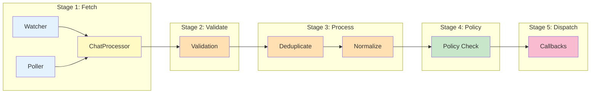

# Messaging Module

The Messaging module handles the complete message processing pipeline for ZTM Chat.

## Purpose

- Long-poll ZTM API for incoming messages
- Process, validate, and deduplicate messages
- Dispatch messages to registered callbacks
- Send outbound messages

## Key Exports

| Export | Description |
|--------|-------------|
| `watchMessages` | Start watching for messages via Watch API |
| `processMessage` | Process a single message |
| `dispatchMessage` | Dispatch message to callbacks |
| `sendOutboundMessage` | Send outbound message to ZTM |
| `startWatcher` | Start the message watcher |
| `stopWatcher` | Stop the message watcher |
| `MessageContext` | Message processing context |
| `MessageProcessor` | Message processor interface |
| `notifyMessageCallbacks` | Message dispatcher interface |
| `ZTMChatMessage` | Message type definition |

## Message Pipeline

```
watcher.ts → processor.ts → dispatcher.ts → callbacks (AI Agent)
                      ↓
                   outbound.ts
```

## Source Files

- `src/messaging/watcher.ts` - Long-poll ZTM API
- `src/messaging/processor.ts` - Message validation/deduplication
- `src/messaging/dispatcher.ts` - Callback notification
- `src/messaging/outbound.ts` - Send replies
- `src/messaging/watcher.ts` - Message watcher with Fibonacci backoff
- `src/messaging/context.ts` - Dependency injection context
- `src/messaging/chat-processor.ts` - Chat orchestration
- `src/messaging/strategies/message-strategies.ts` - Strategy pattern implementation
- `src/messaging/message-processor-helpers.ts` - Message processing helpers

---

## Processing Stages

The message processing pipeline has 5 stages:



### Stage 1: Message Fetch

**Watch Mode**
- Uses ZTM's Watch API for real-time change notifications
- Polls `/apps/ztm/chat/shared/` every 1 second
- Returns list of changed peers/groups since last check
- Uses Fibonacci backoff for error recovery (1s, 1s, 2s, 3s, 5s... capped at 30s)

**Initial Sync**
- Fetches all existing messages from all chats on first start
- Limited to recent messages (5 minutes) to avoid overload
- Processes pairing requests from existing peers

### Stage 2: Validation

Messages are validated for:

| Check | Description | Failure Action |
|-------|-------------|----------------|
| **Empty check** | Rejects whitespace-only messages | Skip with debug log |
| **Length check** | Rejects messages > 10KB | Skip with warning |
| **Self-message check** | Filters messages from bot itself | Skip with debug log |
| **Required fields** | Validates time, message, sender exist | Skip with error log |

### Stage 3: Deduplication & Normalization

**Watermark Deduplication**
- **Key format**: `peer:{username}` or `group:{creator}/{groupId}`
- **Behavior**: Skip messages with timestamp ≤ watermark
- **Update**: Atomic, monotonically increasing, debounced write

**Message Normalization**

Produces `ZTMChatMessage`:
```typescript
{
  id: "{timestamp}-{sender}",
  content: "<HTML-escaped message>",
  sender: "<HTML-escaped username>",
  senderId: "<HTML-escaped username>",
  timestamp: Date(timestamp),
  peer: "<HTML-escaped username>"
}
```

HTML escaping prevents XSS attacks.

### Stage 4: Policy Check

**DM Policy Enforcement**

| Policy Mode | Whitelisted | Not Whitelisted | Description |
|-------------|-------------|-----------------|-------------|
| **allow** | Process | Process | Open policy - accept all messages |
| **deny** | Process | Ignore | Closed policy - block unknown users |
| **pairing** | Process | Request pairing | Secure mode - require approval |

**Whitelist Sources** (checked in order):
1. Static `config.allowFrom` array
2. Persistent `storeAllowFrom` from pairing approvals
3. DM policy default action

**Group Policy Enforcement**

| Policy Mode | Creator | Whitelisted User | Other Users | Description |
|-------------|---------|------------------|-------------|-------------|
| **open** | ✅ | ✅ | ✅ | Allow all messages |
| **allowlist** | ✅ | ✅ | ❌ | Whitelist only |
| **disabled** | ✅ | ❌ | ❌ | Block all non-creator |

**Mention Requirement**:
- When `requireMention: true`, message must contain `@bot-username`
- Case-insensitive matching
- Creator bypass not available for mention check

### Stage 5: Callback Dispatch

- All registered callbacks receive the message
- Semaphore limits concurrent executions (default: 10 permits)
- Errors caught and logged without affecting other callbacks
- Callback statistics tracked (total, active, success, error counts)
- Watermark updates only if at least one callback succeeds

---

## Strategy Pattern

The messaging layer uses the **Strategy Pattern** to handle different message types through a unified interface.

### Strategy Interface

```typescript
interface MessageProcessingStrategy {
  normalize(msg: RawMessage, ctx: ProcessingContext): ZTMChatMessage | null;
  getGroupInfo(chat: ZTMChat): GroupInfo | null;
}
```

### Concrete Strategies

| Strategy | Purpose | Implementation |
|----------|---------|----------------|
| **PeerMessageStrategy** | Handles 1-to-1 peer messages | Uses `processPeerMessage()` helper |
| **GroupMessageStrategy** | Handles group chat messages | Uses `processGroupMessage()` helper |

### Unified Entry Point

`processAndNotify()` in `strategies/message-strategies.ts` provides a unified entry point:

```typescript
// Instead of separate functions:
processAndNotifyChat()
processAndNotifyPeerMessages()
processAndNotifyGroupMessages()

// Use unified:
await processAndNotify(chat, context);
```

---

## Concurrency Control

Two distinct semaphores for different purposes:

| Semaphore | Purpose | Permits | Location |
|-----------|---------|---------|----------|
| **MESSAGE_SEMAPHORE** | Limits concurrent message processing operations | 5 | Watcher/Poller message processing |
| **CALLBACK_SEMAPHORE** | Limits concurrent callback executions | 10 | Message dispatcher |

**Why Two Semaphores?**
- Message processing involves I/O (fetching from ZTM API) - limited to prevent overwhelming the API
- Callback execution involves AI agent processing - limited to prevent resource exhaustion
- Different limits allow tuning based on each operation's resource characteristics

---

## Usage Example

```typescript
import { watchMessages, processMessage } from './messaging/index.js';

// Start watching messages
const stopWatch = await watchMessages(accountId, {
  onMessage: async (msg) => {
    // Process message
    await processMessage(msg, accountId);
  }
});
```

---

## Related Documentation

- [Architecture - Message Pipeline](../architecture.md#message-processing-pipeline)
- [ADR-010 - Multi-layer Message Pipeline](../adr/ADR-010-multi-layer-message-pipeline.md)
- [ADR-002 - Watch Mode with Fibonacci Backoff](../adr/ADR-002-watch-mode-fibonacci-backoff.md)
- [ADR-007 - Dual Semaphore Concurrency](../adr/ADR-007-dual-semaphore-concurrency.md)
- [ADR-019 - Message Ordering & Sequencing](../adr/ADR-019-message-ordering-sequencing.md)
