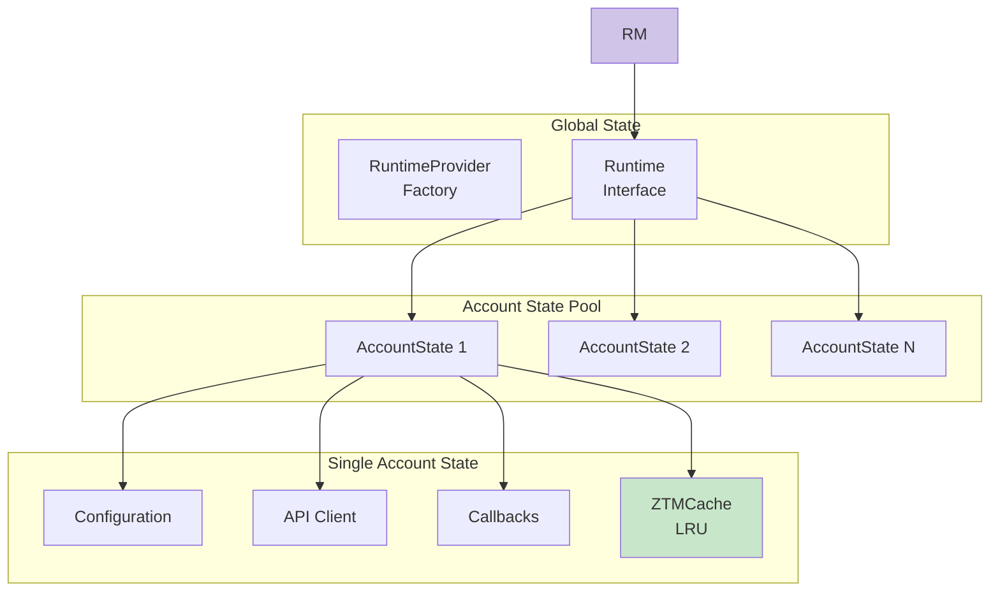

# Runtime Module

The Runtime module manages runtime state and persistence for the ZTM Chat plugin.

## Purpose

- Manage account runtime state
- Persist message watermarks
- Cache frequently accessed data
- Provide repository pattern for data access

## Key Exports

| Export | Description |
|--------|-------------|
| `RuntimeProvider` | Runtime provider with lazy initialization |
| `AccountStateManager` | Manages per-account state |
| `MessageStateStore` | Stores message processing state |
| `createRuntimeProvider` | Factory for creating runtime provider |
| `AccountRuntimeState` | Account runtime state type |
| `LRUCache` | LRU cache implementation |
| `Repository` | Repository interface |
| `AccountRepository` | Account persistence |
| `MessageRepository` | Message persistence |

## Features

- **Runtime State Management**: Track active accounts and their states
- **Persistence**: Store runtime data across restarts
- **Caching**: LRU cache with TTL support
- **Repository Pattern**: Abstract data access layer

## Source Files

- `src/runtime/runtime.ts` - Runtime manager
- `src/runtime/state.ts` - State management
- `src/runtime/cache.ts` - Cache utilities
- `src/runtime/store.ts` - Persistent storage
- `src/runtime/repository.ts` - Repository interfaces
- `src/runtime/repository-impl.ts` - Repository implementations

---

## State Hierarchy



---

## Account State Management

### AccountRuntimeState Structure

Each account maintains a comprehensive state object:

| Field | Type | Description | Lifecycle |
|-------|------|-------------|-----------|
| `accountId` | string | Unique account identifier | Immutable |
| `config` | ZTMChatConfig | Account configuration | Set during initialization |
| `chatReader` / `chatSender` | API interfaces | ZTM API client interfaces | Created on start, cleared on stop |
| `messageCallbacks` | Set | Registered message handlers | Cleared on stop |
| `callbackSemaphore` | Semaphore | Controls callback concurrency | 10 permits, prevents overload |
| `watchInterval` | Interval | Watch loop timer | Cleared on stop |
| `watchAbortController` | AbortController | Signals watch shutdown | Created per start |
| `watchErrorCount` | number | Consecutive watch errors | Reset on success, triggers polling |
| `allowFromCache` | Cached value | Approved users cache | 30s TTL, request coalescing |
| `groupPermissionCache` | LRU Cache | Group permissions cache | 60s TTL, max 500 entries |
| `messageRetries` | Map | Scheduled retry timers | Cleared on stop |

### Account Isolation Pattern

Each account maintains completely isolated state:

| Component | Isolation Method | Purpose |
|-----------|----------------|---------|
| **Configuration** | Per-account config object | Separate mesh names, usernames, policies |
| **API Clients** | Isolated HTTP clients | Separate connections, auth tokens |
| **Callbacks** | Independent callback Sets | Different AI agents per account |
| **Watermarks** | Per-account storage | Prevents cross-account message replay |
| **Watch State** | Separate abort controllers | Independent watch/polling control |
| **Cache** | Isolated LRU caches | Separate permission caching |

---

## Persistence Layer

### Watermark Storage

The watermark system prevents duplicate message processing by tracking the last processed message timestamp for each message source.

**Watermark Key Format**:
- Peer messages: `peer:{username}`
- Group messages: `group:{creator}/{groupId}`

**Storage Details**:
- Per-account state files in JSON format
- File location: `{stateDir}/ztm-chat-{accountId}.json`
- Structure: `{ accounts: { accountId: { watermarkKey: timestamp } } }`

**Watermark Update Behavior**:
- Watermark only advances forward (monotonically increasing)
- Atomic update prevents race conditions in concurrent scenarios
- Async version uses semaphore for check-and-update atomicity
- Update only occurs if at least one callback succeeds
- Debounced write to disk (1s default, 5s max delay)

**Automatic Cleanup**:
- When peer count exceeds 1000, keeps most recent entries
- Async loading prevents blocking startup

### Dual Timer Persistence Strategy

| Timer | Purpose | Trigger |
|-------|---------|---------|
| **Debounce Timer** | Batch rapid updates | 1 second after first change |
| **Max-Delay Timer** | Prevent data loss | 5 seconds regardless of changes |

This ensures:
1. Normal operation: Updates batched for I/O efficiency
2. Crash protection: No more than 5s of unsaved data

---

## Caching Layer

### Cache Types

| Cache | Purpose | TTL | Max Size | Strategy |
|-------|---------|-----|----------|----------|
| **allowFromCache** | Approved users list | 30s | N/A | Request coalescing |
| **groupPermissionCache** | Group permissions | 60s | 500 entries | LRU eviction |

### Request Coalescing

When cache expires and multiple concurrent requests occur:
1. First request creates fetch promise and stores it
2. Subsequent requests detect in-flight request and await same promise
3. All requests receive the same result
4. Promise is removed after completion

This prevents "cache stampede" where cache expiration triggers many simultaneous fetch operations.

### LRU + TTL Hybrid Strategy

```typescript
interface CacheEntry<T> {
  value: T;
  expiresAt: number;      // TTL expiration
  lastAccessed: number;  // For LRU eviction
}

// Eviction order:
// 1. Expired entries (TTL)
// 2. Least recently accessed (LRU)
```

---

## Repository Pattern

The messaging layer depends on **repository interfaces** rather than concrete implementations.

### Repository Interfaces

| Interface | Purpose | Methods |
|-----------|---------|---------|
| **IAllowFromRepository** | Abstracts pairing approval storage | `getAllowFrom()`, `clearCache()` |
| **IMessageStateRepository** | Abstracts watermark persistence | `getWatermark()`, `setWatermark()`, `flush()` |

### Benefits

- **Decoupling**: Messaging layer doesn't depend on runtime implementation details
- **Testability**: Easy to mock repositories for unit tests
- **Flexibility**: Storage implementation can change without affecting messaging
- **Clear Boundaries**: Explicit dependency contracts

### Usage Example

```typescript
// Messaging code depends on interface
async function processMessage(context: MessagingContext) {
  const allowFrom = await context.allowFromRepo.getAllowFrom(accountId, rt);
  // Process message...
}
```

---

## Usage Example

```typescript
import { createRuntimeProvider, initializeRuntime, getAccountStateManager } from './runtime/index.js';

// Create runtime provider
const provider = createRuntimeProvider();

// Initialize account
await initializeRuntime(accountId, config);

// Get account state
const stateManager = getAccountStateManager();
const state = stateManager.getState(accountId);
```

---

## Related Documentation

- [Architecture - State Management](../architecture.md#state-management)
- [ADR-017 - Repository Persistence Layer](../adr/ADR-017-repository-persistence-layer.md)
- [ADR-011 - Dual Timer Persistence](../adr/ADR-011-dual-timer-persistence.md)
- [ADR-012 - LRU TTL Hybrid Caching](../adr/ADR-012-lru-ttl-hybrid-caching.md)
- [ADR-014 - Multi-Account Isolation Pattern](../adr/ADR-014-multi-account-isolation-pattern.md)
- [ADR-003 - Watermark LRU Cache](../adr/ADR-003-watermark-lru-cache.md)
