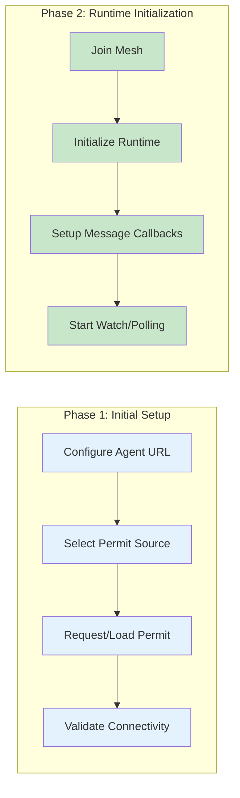
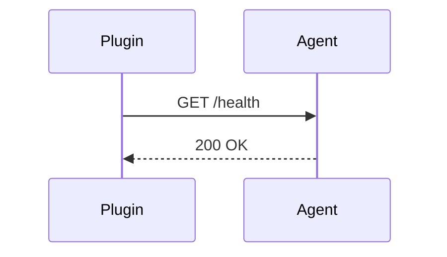
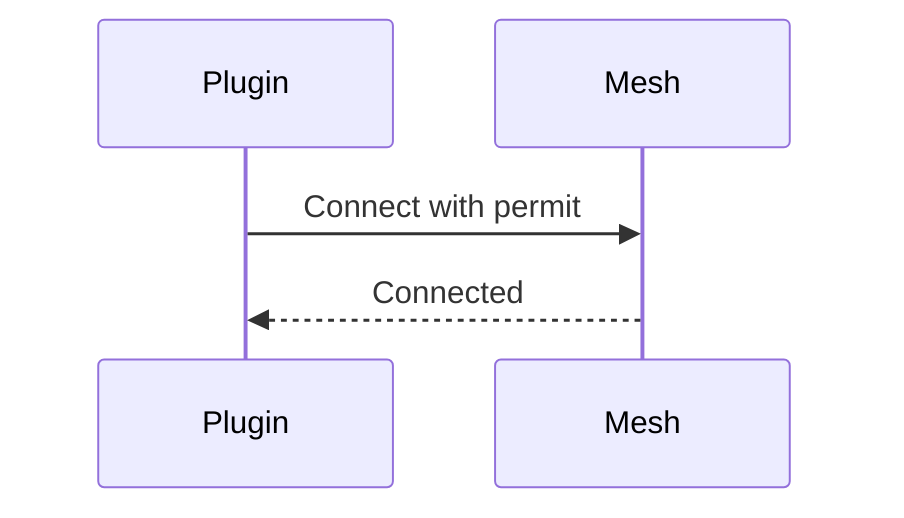
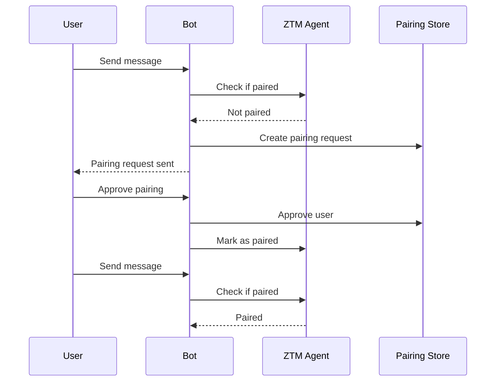

# Onboarding Flow Guide

This guide explains the onboarding process for the ZTM Chat plugin.

## Overview

The ZTM Chat plugin requires a multi-step onboarding process to establish connectivity with the ZTM network. This ensures proper configuration before message processing begins.

## Two-Phase Onboarding



## Phase 1: Initial Setup

### Step 1: Configure Agent URL

The ZTM Agent URL is the entry point for all ZTM operations:

```
http://<agent-host>:<agent-port>
```

**Requirements:**
- Must be HTTP or HTTPS
- Must be reachable from the plugin
- Default port: 8080

### Step 2: Select Permit Source

The permit is authentication for the ZTM mesh network:

| Mode | Description | Use Case |
|------|-------------|----------|
| file | Load permit from local JSON file | Offline/direct transfer |
| server | Request permit from permit server | Automated deployment |

### Step 3: Request/Load Permit

**File Mode:**
```json
{
  "permit": "eyJhbGciOiJIUzI1NiIs...",
  "expiresAt": "2026-02-28T12:00:00Z"
}
```

**Server Mode:**
```
POST {permitUrl}?meshName={meshName}
```

### Step 4: Validate Connectivity



Verifies the ZTM Agent is reachable before proceeding.

## Phase 2: Runtime Initialization

### Step 5: Join Mesh



Connects to the ZTM mesh network using the acquired permit.

### Step 6: Initialize Runtime

Creates the runtime state:
- API client instantiation
- State manager setup
- Cache initialization

### Step 7: Setup Message Callbacks

Registers message handlers:
```typescript
const cleanup = setupMessageCallbacks(accountId, {
  onMessage: handleMessage,
  onPairing: handlePairing
});
```

### Step 8: Start Watch/Polling

Begins message monitoring:
- **Watch Mode** (primary): Real-time change notifications
- **Polling Mode** (fallback): Periodic API polling

## Interactive Wizard

The plugin provides a CLI wizard for guided configuration:

```typescript
import { ZTMChatWizard } from './config/wizard.js';

const wizard = new ZTMChatWizard();
const config = await wizard.run();
```

### Wizard Steps

| Step | Function | Description |
|------|----------|-------------|
| 1 | stepAgentUrl | Configure ZTM Agent URL |
| 2 | stepPermitSource | Select permit source |
| 3 | stepUserSelection | Choose bot username |
| 4 | stepMeshName | Enter mesh name |
| 5 | stepSecuritySettings | Configure DM policy |
| 6 | stepGroupSettings | Configure group policy |

### Configuration Schema

```typescript
interface ZTMChatConfig {
  agentUrl: string;           // ZTM Agent URL
  username: string;           // Bot username
  meshName: string;           // Mesh network name
  permitSource: 'file' | 'server';
  permitFilePath?: string;     // For file mode
  permitUrl?: string;          // For server mode
  dmPolicy: 'allow' | 'deny' | 'pairing';
  groupPolicy: 'open' | 'allowlist' | 'disabled';
  requireMention?: boolean;
}
```

## Pairing Mode

When DM policy is set to `pairing`, users must be approved before sending messages.

### Pairing Flow



### Pairing Configuration

```typescript
interface PairingConfig {
  policy: 'pairing';
  maxAgeMs: number;      // Pairing expiry (default: 1 hour)
  autoApprove?: string[]; // Auto-approved users
}
```

### Pairing Expiry

**Important:** Pairings expire after `PAIRING_MAX_AGE_MS` (1 hour).

```typescript
const PAIRING_MAX_AGE_MS = 60 * 60 * 1000; // 1 hour
```

After expiry:
- User must re-approve
- Previous messages are blocked until re-approved

## Configuration Files

### Example Configuration

```json
{
  "agentUrl": "http://localhost:8080",
  "username": "my-bot",
  "meshName": "my-mesh",
  "permitSource": "file",
  "permitFilePath": "./permits/my-mesh.json",
  "dmPolicy": "pairing",
  "groupPolicy": "allowlist"
}
```

### Environment Variables

| Variable | Description | Default |
|----------|-------------|---------|
| `ZTM_AGENT_URL` | ZTM Agent URL | - |
| `ZTM_MESH_NAME` | Mesh name | - |
| `ZTM_USERNAME` | Bot username | - |

## Error Handling

| Error | Cause | Solution |
|-------|-------|----------|
| Connection refused | Agent not running | Start ZTM Agent |
| Invalid permit | Permit expired/invalid | Request new permit |
| Mesh not found | Wrong mesh name | Check mesh configuration |
| Timeout | Network issue | Check connectivity |

---

## Related Documentation

- [Architecture - Onboarding](../architecture.md#onboarding--configuration)
- [ADR-015 - Onboarding Flow](adr/ADR-015-onboarding-flow.md)
- [Configuration Reference](configuration/reference.md)
